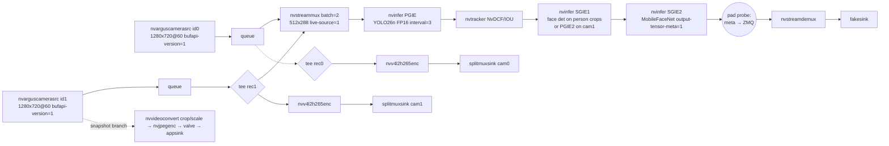
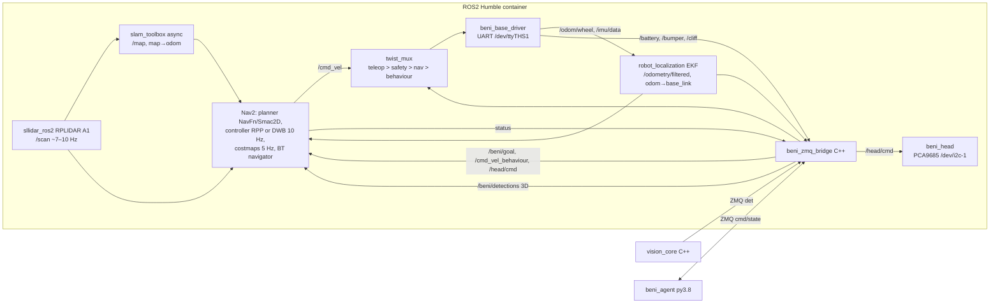
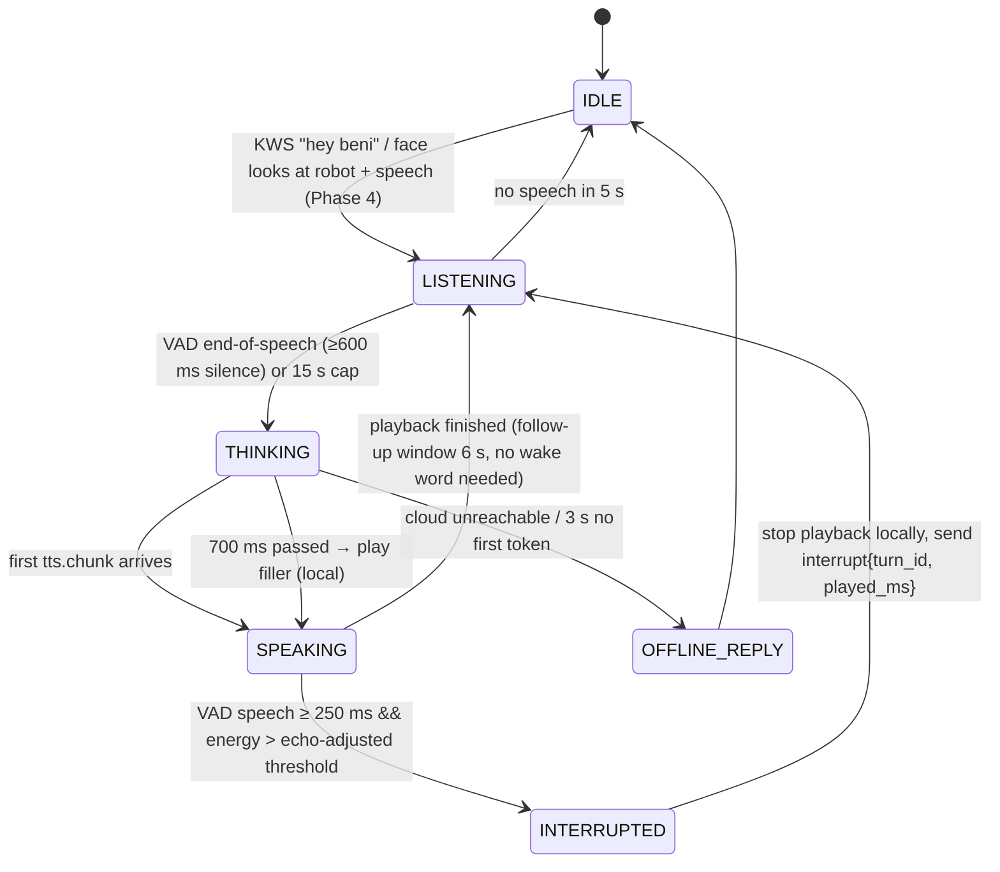
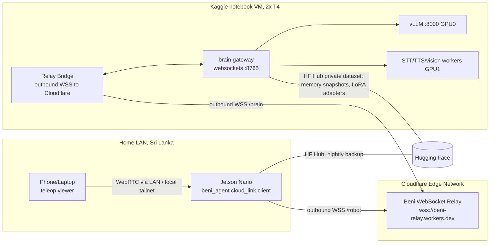

# Beni-Style Lifelong-Learning Companion Robot — Engineering Blueprint

**Edge:** NVIDIA Jetson Nano 4GB (Tegra X1 / T210), JetPack 4.6.6 = L4T R32.7.6, Ubuntu 18.04, Python 3.6.9
**Cloud brain:** Kaggle Notebook, 2× Tesla T4 (16 GB each, sm_75)
**Real-time I/O:** ESP32 microcontroller (motors, encoders, IMU, range sensors, servos, eye displays)

> This is a build document. Every section ends in something you can implement: a pipeline string, a config file, a schema, a code skeleton, or an acceptance test. Numbers marked **(est.)** are engineering estimates drawn from datasheets and community benchmarks. Numbers marked **(verified)** were checked against a source during this research. Measure everything on your own unit using the tools in §14.

> **Revision 2 (full-utilisation, headless, Sri Lankan BOM).** This revision changes the design point in five ways:
> 1. **Headless operation** is assumed. The RAM budgets in §2.2 and §7.1 are re-derived for this.
> 2. **Every usable engine and board feature has a job.** The target is not "most". §3.17 is the new engine-by-engine assignment and §4 has no `[skip]` except for hardware the Nano does not have.
> 3. **Cameras are 2× IMX219 at 1280×720 @ 60 fps.** These are the cheapest cameras that are natively supported (§5).
> 4. **Audio is I2S through the APE/AHUB**, not USB (§3.14, §8). The **face is an HDMI LCD driven by the display controller + NVDEC** (§3.11).
> 5. **The BOM is sourced from Sri Lankan shops** (Tronic.lk, Duino.lk, RoboClub) with prices checked in Sept 2026 (§13).
>
> "Full advantage" is defined in §3.17 as **every engine doing useful work, with idle capacity filled by a background job scheduler**, not as 100 % load at all times. The reason is given there.

---

## Table of Contents

0. [How to use this document with Claude Code](#0-how-to-use-this-document-with-claude-code)
1. [Reality check: corrections to the earlier research plan](#1-reality-check-corrections-to-the-earlier-research-plan)
2. [Platform constraints: JetPack 4.6.6 / L4T 32.7.6 / Python 3.6.9](#2-platform-constraints-jetpack-466--l4t-3276--python-369)
3. [Tegra X1 hardware architecture and per-engine deep dive](#3-tegra-x1-hardware-architecture-and-per-engine-deep-dive)
4. [Every exploitable Tegra X1 feature (master list)](#4-every-exploitable-tegra-x1-feature-master-list)
5. [Dual CSI camera zero-copy pipeline](#5-dual-csi-camera-zero-copy-pipeline)
6. [TensorRT on the Nano: model zoo, build and inference](#6-tensorrt-on-the-nano-model-zoo-build-and-inference)
7. [Jetson software architecture, ROS 2 and the ESP32 base](#7-jetson-software-architecture-ros-2-and-the-esp32-base)
8. [Robot voice system (edge + cloud)](#8-robot-voice-system-edge--cloud)
9. [Jetson ↔ Kaggle network architecture](#9-jetson--kaggle-network-architecture)
10. [Kaggle dual-T4 cloud brain](#10-kaggle-dual-t4-cloud-brain)
11. [Learning and memory system (highest priority)](#11-learning-and-memory-system-highest-priority)
12. [Personalized companion behaviours](#12-personalized-companion-behaviours)
13. [Sri Lankan hardware BOM, power budget and wiring](#13-sri-lankan-hardware-bom-power-budget-and-wiring)
14. [Latency budgets, utilisation benchmarks and measurement tooling](#14-latency-budgets-utilisation-benchmarks-and-measurement-tooling)
15. [Power optimisation guide](#15-power-optimisation-guide)
16. [Implementation roadmap with acceptance tests](#16-implementation-roadmap-with-acceptance-tests)
17. [Repository layout and CLAUDE.md](#17-repository-layout-and-claudemd)
18. [Curated resources (GitHub, Hugging Face, papers)](#18-curated-resources-github-hugging-face-papers)

---

## 0. How to use this document with Claude Code

1. Create the monorepo from §17 and copy §17.2 into `CLAUDE.md` at its root. Claude Code reads that file every session, so the platform constraints (Python 3.6 on the host, TensorRT 8.2, no INT8, glibc 2.27, and the rest) are enforced automatically.
2. Build in the order given in §16. Each phase has acceptance tests; don't start the next phase until they pass.
3. Code that runs on the Jetson host must be written for **Python 3.6** (host tools and DeepStream probes), **Python 3.8** (the `beni_agent` venv), or **C++14** (GCC 7.5). Kaggle code targets **Python 3.12**. §2.4 lists the exact version pins.
4. When you ask Claude Code for a component, reference the section, for example: *"Implement §8.3 `audio_io` launcher and §8.4 voice state machine in `jetson/agent/voice/`"*.

---

## 1. Reality check: corrections to the earlier research plan

The earlier plan (`Jetson AI Robot Research Plan.md`) had several claims that would break the build. They are corrected here and the rest of this document follows the corrections.

| # | Earlier claim | Reality | Consequence |
|---|---|---|---|
| 1 | Two IMX219 cameras capture 1080p60 | IMX219 on Jetson: max **1920×1080 @ 30** and **1280×720 @ 60** (verified, Tronic listing and NVIDIA modes). | **Revision 2 choice: 2× IMX219 at 720p60** (V2 colour + NoIR, ~LKR 17,800 locally, §5.1). The IMX477 (1080p60) is an import-only upgrade and not needed; the detector runs at 512×288 anyway. |
| 2 | NVENC encodes "4×1080p30" on top of everything else | NVENC total is about **4K30 ≈ 250 Mpix/s** (= 2×1080p60 = 4×1080p30 = 9×720p30). | Dual 1080p60 recording alone **saturates NVENC**. Record at 1080p30 and stream at 720p to stay under ~75% (§5.3). |
| 3 | VPI can use the PVA | The Nano has **no PVA and no DLA**. VPI 1.2 on the Nano runs on CPU, CUDA and (for some algorithms) VIC. | Plan classical CV on CUDA/VIC only. |
| 4 | TensorRT INT8 for speed | Maxwell sm_53 has **no fast INT8 path** (no DP4A); TensorRT reports `platformHasFastInt8 = false`. | Use **FP16 everywhere** on the Nano. |
| 5 | `NvBufSurface` APIs in the Multimedia API | On L4T 32.x the Multimedia API uses **`nvbuf_utils` (`NvBuffer*`, `NvBufferTransform`)**. `NvBufSurface` exists there **only inside DeepStream 6.0.1**; the general API arrived with JetPack 5. | Code samples in §5 use the correct API for 32.7. |
| 6 | `nvoverlaysink` for display | Deprecated in L4T 32.x. | Use `nvdrmvideosink` (no X) or `nv3dsink`/`nveglglessink` (with X). |
| 7 | ArcFace runs in 2.86 ms on the Nano | That figure fits a MobileFaceNet-class model. ArcFace-R100 is ~24 GFLOPs, i.e. tens of ms on the Nano. | Use **MobileFaceNet (w600k_mbf, 512-D)** at 112×112 in FP16, ~2–5 ms (est.). |
| 8 | Tronic MD0586-style "5V 5A, input max 70 V" buck powers the Nano from 3S | That module needs **20–70 V input** (verified); a 3S pack only gives 9.0–12.6 V. | Use a buck rated for a 4–36 V input and 8 A, derated to 5 A. The Tronic **XL4016 8 A module MD0676 (Rs 850)** fits (§13). |
| 17 | "Headless = all 4 GB free" | The 4 GB is shared with the GPU, and firmware and kernel carve-outs take some of it. `free -m` reports **~3.9 GB total**. Headless idle leaves **~3.4–3.5 GB available** (est.; measure on your unit). | §2.2 and §7.1 budget **3.4 GB** for all processes, TensorRT engines and camera buffers together. |
| 9 | Tensor parallel (TP=2) across both T4s for speed | On Kaggle dual T4, **TP=2 gave lower throughput than TP=1** (verified, kaggle-vllm benchmarks). T4 has no FlashAttention-2 and no BF16. | Run **one model per GPU** (§10.2). |
| 10 | Sri Lanka → cloud RTT 80–120 ms | Kaggle VMs run in US GCP regions. Colombo → US RTT is typically **~220–300 ms (est.)**, more through a relay. | A realistic end-of-speech → first-audio target is **1.2–2.0 s**, with local fillers masking the gap (§8.7). |
| 11 | Isaac ROS / NITROS / Riva on the Nano | Isaac ROS and NITROS need JetPack 5+. Riva embedded needs Orin. Kaggle has no Docker, so no Riva server there either. | Use DeepStream 6.0.1, MMAPI, sherpa-onnx, faster-whisper and open TTS instead. |
| 12 | OpenVLA 7B drives the robot at 10 Hz | OpenVLA outputs 7-DoF **arm** actions and runs at a few Hz on big GPUs. | For a wheeled companion, the planner calls **navigation and behaviour tools**. VLAs are only relevant if you add an arm (§11.12). |
| 13 | sqlite-vec with IVF-PQ at 1.19 ms on Jetson | sqlite-vec is primarily brute-force. Ubuntu 18.04 also ships SQLite 3.22, and Chroma needs ≥3.35. | Edge memory = **SQLite + FTS5 + numpy/hnswlib index** (§11.5). |
| 14 | HC-SR04 / motor PWM / encoders on Jetson GPIO | Linux userspace GPIO timing jitters by milliseconds. | All hard real-time I/O goes to an **ESP32** (§7.5). |
| 15 | Kaggle is an always-on brain | Sessions are **≤12 h** with a **~30 h/week** GPU quota (verified), and roughly 20 minutes of idle disconnect kills interactive sessions. | The robot must be **fully functional offline**. Kaggle is an accelerator that comes and goes (§9.5, §10.9). |
| 16 | Conversational RTT ~600 ms | Not achievable given #10. | See the realistic budget in §14.1. |

---

## 2. Platform constraints: JetPack 4.6.6 / L4T 32.7.6 / Python 3.6.9

### 2.1 Fixed software stack (what's on the SD card)

| Component | Version on JetPack 4.6.6 | Notes |
|---|---|---|
| L4T | R32.7.6 | Final JetPack 4 release; no further feature updates. |
| Ubuntu | 18.04.6 LTS (bionic) | **glibc 2.27**. Many modern aarch64 wheels need ≥2.28 (`manylinux_2_28`). |
| Kernel | 4.9.x-tegra | No io_uring, old cgroups, v4l2 from 2016. |
| Python (system) | **3.6.9** | TensorRT, PyGObject (GStreamer), `pyds` (DeepStream) and `jetson.*` bindings exist **only for 3.6** here. |
| CUDA | 10.2 | sm_53. C++14 only in nvcc 10.2 (no C++17 in `.cu` files). |
| cuDNN | 8.2.1 | |
| TensorRT | 8.2.1 | ONNX parser: opsets 7–13 are safe. Build engines **on the Nano**. |
| VPI | 1.2 | Backends: CPU, CUDA, VIC (algorithm-dependent). No PVA. |
| OpenCV | 4.1.1 (**no CUDA**) | Fine for tiny CPU math. **Never** use it for per-frame pixel work. |
| GStreamer | 1.14.5 | `nvarguscamerasrc`, `nvvidconv`, `nvv4l2h264enc/h265enc`, `nvv4l2decoder`, `nvjpegenc/dec`, `nvcompositor`, `nvivafilter`, `nvdrmvideosink`. |
| Multimedia API | 32.7 (`/usr/src/jetson_multimedia_api`) | `libargus`, `NvBuffer` (`nvbuf_utils.h`), `NvVideoEncoder`, `NvVideoDecoder`, `NvJPEGEncoder`, `NvEglRenderer`. |
| DeepStream | **6.0.1** (last release for Nano) | `nvstreammux`, `nvinfer`, `nvtracker`, `nvmultistreamtiler`, `NvBufSurface`, Python `pyds` 1.1.1 on Python 3.6. |
| Docker | nvidia-docker2 with `--runtime nvidia` | The runtime bind-mounts host CUDA/TensorRT/multimedia libs into L4T containers. |
| GCC / CMake | 7.5 / 3.10.2 | `pip3 install cmake` for a newer CMake when a project needs one. |

### 2.2 Hardware limits you design around

| Resource | Limit | Design rule |
|---|---|---|
| CPU | 4× Cortex-A57 @ up to 1.479 GHz, 2 MB L2 | Budget ≤60% total. No per-pixel CPU work. Python only for control and glue. |
| GPU | 128 Maxwell cores @ 921.6 MHz; ~472 GFLOPS FP16 / ~236 FP32 | One TensorRT context per model, all FP16. Run detectors at interval N with tracking in between. |
| RAM | 4 GB LPDDR4 **shared** by CPU, GPU and every engine. Headless: ~3.9 GB visible, **~3.4–3.5 GB available** at idle (est.) | Headless is assumed (it saves ~0.5–0.8 GB versus the desktop). GPU tensors, NVMM camera pools and every process all come out of the **same** 3.4 GB. Swap goes on the USB SSD for cold pages only. Budget in §7.1. |
| Memory bandwidth | 25.6 GB/s theoretical, ~10–14 GB/s practical (est.) | Each full-HD NV12 copy at 60 fps costs ~370 MB/s (read+write). Zero-copy is mandatory. |
| CSI | B01 dev kit: 2× 15-pin connectors, **2 lanes each**, 1.5 Gbps/lane | IMX219 720p60 RAW10 ≈ 0.55 Gbps per camera (plenty of margin). The default B01 device tree is already "IMX219 dual", so no `jetson-io` change is needed. |
| USB | 4× USB 3.0 behind **one** shared 5 Gbps hub | SSD (UAS), lidar (CP2102 adapter) and optional Wi-Fi dongle. Audio is on I2S and cameras are on CSI, so the hub carries almost nothing time-critical. |
| Storage | microSD (UHS-I) | Boot from microSD, **rootfs + recordings + Docker + swap on the USB SSD** (§2.5 step 9). The SD card then only holds `/boot`. |
| Power | 5 W and 10 W (MAXN) nvpmodel modes; 5 V 4 A barrel jack with J48 jumper | Micro-USB power will brown out under load. |
| No | DLA, PVA, NVENC B-frames at low latency, INT8, BF16, FP8 | — |

### 2.3 Consequences for the software architecture

- **Python 3.6 island (host):** DeepStream app with `pyds` probes, TensorRT Python tools, and GStreamer via PyGObject.
- **Python 3.8 island (host venv `beni_agent`):** voice, cloud link, memory, behaviour. Install with `sudo apt install python3.8 python3.8-venv python3.8-dev` (bionic universe has 3.8). This process does **no** GPU work.
- **C++ island (primary vision from Phase 3):** the MMAPI/libargus `vision_core` (§5.5), which is the only way to reach Argus AE regions, per-frame metadata, NVENC motion vectors, CUDA Graphs and stream priorities. ROS 2 nodes are also C++. The DeepStream/pyds pipeline (§5.4) is the **Phase 1–2 bring-up path** and the fallback.
- **ROS 2 Humble in a container:** `dustynv/ros:humble-ros-base-l4t-r32.7.1` (prebuilt image; building it yourself on 32.7.6 fails because of Python version problems, per jetson-containers issue #780). Run `python3 --version` inside the container and write ROS 2 nodes in **C++ (rclcpp)** so the container's Python version doesn't matter.
- **IPC between islands:** ZeroMQ + msgpack on `ipc:///tmp/beni/*.sock`. Every island has a working pyzmq or cppzmq build: pyzmq 22.3 for py3.6, latest for py3.8, cppzmq header-only for C++.

### 2.4 Version pin tables

**Host Python 3.6.9** (`jetson/requirements-py36.txt`):

```text
numpy==1.19.5            # last for py3.6; TensorRT/pyds built against 1.x
pyzmq==22.3.0            # last with py3.6 wheels / builds cleanly
msgpack==1.0.4
pycuda==2021.1           # build: export CPATH=/usr/local/cuda/include; export PATH=/usr/local/cuda/bin:$PATH
dataclasses==0.8         # backport
protobuf==3.19.6         # 3.20+/4.x drop 3.6
websockets==9.1          # 10.0 dropped 3.6 (only if you need it here)
Jetson.GPIO==2.0.17
smbus2==0.4.3
pyserial==3.5
# system packages (apt): python3-gi gir1.2-gst-rtsp-server-1.0 python3-libnvinfer (via JetPack)
# pyds 1.1.1: build from NVIDIA-AI-IOT/deepstream_python_apps tag v1.1.1 (DeepStream 6.0.1)
```

**Host Python 3.8 venv `beni_agent`** (`jetson/agent/requirements.txt`):

```text
numpy==1.24.4
pyzmq>=25
msgpack>=1.0.7
websockets==13.1          # asyncio client with auto-reconnect loop
aiohttp==3.9.5
sherpa-onnx>=1.10         # KWS, VAD, local ASR, local TTS, speaker-ID (CPU). If the wheel fails on glibc 2.27, build from source (§8.2)
onnxruntime==1.16.3       # CPU EP; last line with broad aarch64 manylinux2014 wheels (verify)
hnswlib==0.8.0            # optional ANN; builds from source
opuslib==3.0.1            # needs apt libopus0
sounddevice==0.4.7        # only if not using the GStreamer audio_io bridge
pydantic==2.8.2
python-dateutil
uvloop==0.19.0            # optional
```

> If a wheel on Python 3.8 aarch64 needs glibc ≥2.28, the pip resolver will fall back to building from source or fail. The standard fallback is `pip install --no-binary :all: <pkg>` with `pip install cmake ninja` first. If that also fails, run that one component inside an L4T container based on Ubuntu 20.04.

**Kaggle (Python 3.12, CUDA 12.8, torch 2.10 as observed in Aug 2026; check at runtime):** see §10.3.

### 2.5 First-boot system tuning script

`jetson/setup/01_system_tune.sh` (run once, reboot afterwards):

```bash
#!/usr/bin/env bash
set -euo pipefail

# 1. Headless: frees ~0.5-0.8 GB RAM and CPU used by gdm/Xorg/compiz
sudo systemctl set-default multi-user.target

# 2. Remove services a robot doesn't need
# bluetooth stays on: phone presence (§4 item 56, BENI_PHONES) pings paired phones; bluetoothd is ~3 MB
for s in cups cups-browsed ModemManager whoopsie apport snapd avahi-daemon; do
  sudo systemctl disable --now "$s" 2>/dev/null || true
done

# 3. Free UART1 (40-pin header pins 8/10 -> /dev/ttyTHS1) for the ESP32 link
sudo systemctl disable --now nvgetty 2>/dev/null || true
sudo usermod -aG dialout,video,i2c,gpio,audio "$USER"

# 4. Power mode MAXN + persistent clock lock at boot
sudo nvpmodel -m 0
cat <<'EOF' | sudo tee /etc/systemd/system/jetson-clocks.service
[Unit]
Description=Lock Jetson clocks
After=nvpmodel.service
[Service]
Type=oneshot
ExecStart=/usr/bin/jetson_clocks
[Install]
WantedBy=multi-user.target
EOF
sudo systemctl enable jetson-clocks.service

# 5. Swap on the USB SSD (mounted at /ssd) instead of zram-only
sudo systemctl disable nvzramconfig || true
sudo fallocate -l 6G /ssd/swapfile && sudo chmod 600 /ssd/swapfile
sudo mkswap /ssd/swapfile && echo '/ssd/swapfile none swap sw 0 0' | sudo tee -a /etc/fstab
echo 'vm.swappiness=10' | sudo tee /etc/sysctl.d/99-robot.conf

# 6. Real-time-ish scheduling for audio/control processes
cat <<'EOF' | sudo tee /etc/security/limits.d/99-robot.conf
@audio - rtprio 90
@audio - memlock unlimited
EOF

# 7. Python 3.8 for the agent island
sudo apt-get update
sudo apt-get install -y python3.8 python3.8-venv python3.8-dev libopus0 libopus-dev \
     gstreamer1.0-plugins-bad libzmq3-dev libsqlite3-dev
python3.8 -m venv ~/beni_agent_venv

# 8. Camera daemon robustness
sudo mkdir -p /etc/systemd/system/nvargus-daemon.service.d
cat <<'EOF' | sudo tee /etc/systemd/system/nvargus-daemon.service.d/override.conf
[Service]
Environment=enableCamInfiniteTimeout=1
Restart=always
RestartSec=2
EOF

# 9. Rootfs on the USB SSD (boot stays on microSD). Faster I/O, no SD wear.
#    Use JetsonHacks rootOnUSB (github.com/jetsonhacks/rootOnUSB): copy rootfs to /dev/sda1,
#    then set root=/dev/sda1 (or root=UUID=...) in /boot/extlinux/extlinux.conf.
#    Keep a second extlinux LABEL pointing at the SD rootfs as a recovery entry.

# 10. CPU partitioning (see §7.1 table). Keep IRQs and the kernel on core 0,
#     audio pinned + SCHED_FIFO, vision core pinned to core 1, ROS/agent float on 2-3.
for svc in beni-audio beni-vision beni-ros beni-agent; do sudo mkdir -p /etc/systemd/system/$svc.service.d; done
printf '[Service]\nCPUAffinity=0\nCPUSchedulingPolicy=fifo\nCPUSchedulingPriority=70\n' | sudo tee /etc/systemd/system/beni-audio.service.d/cpu.conf
printf '[Service]\nCPUAffinity=1\nNice=-5\n'  | sudo tee /etc/systemd/system/beni-vision.service.d/cpu.conf
printf '[Service]\nCPUAffinity=2 3\n'         | sudo tee /etc/systemd/system/beni-ros.service.d/cpu.conf
printf '[Service]\nCPUAffinity=2 3\nNice=5\n' | sudo tee /etc/systemd/system/beni-agent.service.d/cpu.conf

# 11. 40-pin header functions: I2S (audio, §8.2), PWM (IR LEDs), SPI1 (optional touch).
#     Interactive tool, run once:  sudo /opt/nvidia/jetson-io/jetson-io.py
#     → Configure 40-pin expansion header → enable i2s4, pwm0 (pin 32), spi1 → Save & reboot.

# 12. gcc-9 for building llama.cpp (optional offline LLM, §8.3); GCC 7.5 is too old for it.
sudo add-apt-repository -y ppa:ubuntu-toolchain-r/test && sudo apt-get update
sudo apt-get install -y gcc-9 g++-9

# 13. Hardware watchdog → systemd (reboots on a hard hang)
sudo sed -i 's/^#\?RuntimeWatchdogSec=.*/RuntimeWatchdogSec=30/' /etc/systemd/system.conf

sudo systemctl daemon-reload
echo "Reboot now."
```

**Acceptance test:** after the reboot, `free -m` should show **≥3.3 GB available** with nothing running (headless). `sudo tegrastats` should show `CPU [x%@1479,...]`, `GR3D_FREQ x%@921` and `EMC_FREQ x%@1600`.


---

## 3. Tegra X1 hardware architecture and per-engine deep dive

### 3.1 Architecture diagram (T210 as used on the Jetson Nano)

```text
                         ┌──────────────────────────── Tegra X1 (T210) SoC ─────────────────────────────┐
  IMX477/IMX219 #0 ─CSI─►│ CSI/NVCSI ─► VI (Video Input) ─► RAW Bayer ─┐                                   │
  IMX477/IMX219 #1 ─CSI─►│  (12 lanes on module; 2×2 lanes on B01)     │                                   │
                         │                                              ▼                                   │
                         │                                   ┌──── ISP (1.4 Gpix/s) ────┐                  │
                         │                                   │ debayer, AE/AWB/AF stats,│                  │
                         │                                   │ LSC, NR, TNR, EE, 3A     │                  │
                         │                                   └───────────┬──────────────┘                  │
                         │                                               │ NV12 (YUV420) block-linear/pitch │
                         │   ┌──────────────┐  ┌───────────┐  ┌──────────▼─────────┐  ┌──────────────┐     │
                         │   │ NVENC        │  │ NVDEC     │  │ VIC (2D engine)    │  │ NVJPG        │     │
                         │   │ H.264/H.265  │  │ H.264/265 │  │ scale/crop/CSC/    │  │ JPEG enc/dec │     │
                         │   │ ~4K30 total  │  │ VP8/VP9   │  │ composite/TNR/     │  │              │     │
                         │   └──────┬───────┘  │ ~4K60     │  │ deinterlace/rotate │  └──────┬───────┘     │
                         │          │          └─────┬─────┘  └─────────┬──────────┘         │             │
                         │  ┌───────┴─────────────────┴──────────────────┴───────────────────┴──────────┐ │
                         │  │           host1x (channel DMA + sync points) + SMMU (IOMMU)               │ │
                         │  └───────┬──────────────────────────────────────────────────────────────────┘ │
                         │          │                                                                     │
  4 GB LPDDR4 (64-bit) ◄─┼── EMC / MC (memory controller, 1600 MHz, 25.6 GB/s, arbitration + LA/PTSA) ◄──┤
                         │          ▲                   ▲                     ▲                           │
                         │  ┌───────┴─────┐   ┌─────────┴───────┐   ┌─────────┴────────┐                 │
                         │  │ 4× Cortex-  │   │ Maxwell GPU     │   │ Display Ctrl A/B │─► HDMI / DP    │
                         │  │ A57 + L2 2MB│   │ 128 cores, sm_53│   │ 3 windows (HW    │                 │
                         │  │ (NEON)      │   │ FP16 2× rate    │   │ overlay planes)  │                 │
                         │  └─────────────┘   └─────────────────┘   └──────────────────┘                 │
                         │  APE: ADSP + AHUB (I2S×5, SFC resampler, mixer, AMX/ADX, DMIC) ─► I2S on header │
                         │  SE (AES/SHA/RSA crypto), TSEC, GPCDMA/APB-DMA, PWM, I2C, SPI, UART, GPIO, WDT  │
                         └────────────────────────────────────────────────────────────────────────────────┘
```

**Key idea:** every engine except the CPU reads and writes DRAM through host1x/SMMU with **DMA-BUF file descriptors**. A frame lives in one physical buffer (NVMM) and engines pass **the fd**, never the pixels. Each engine-to-engine hop is either free (a shared fd) or one hardware DMA pass (VIC/ISP writing a new buffer). The CPU never touches pixels.

### 3.2 How to read each engine card

Each engine below has the same fields: **Capabilities · Limits · APIs · Latency · Throughput · Power (est.) · Common mistakes · Robot use**.

---

### 3.3 CSI + VI (Video Input)

| Field | Detail |
|---|---|
| Capabilities | Receives MIPI CSI-2 D-PHY 1.1 packets and writes RAW Bayer frames into DRAM via DMA. Handles virtual channels, embedded data lines and frame-start/end sync points. The module supports up to 12 lanes (3×4 or 4×2); the B01 dev kit exposes 2×2-lane connectors (CAM0 = `sensor-id=0`, CAM1 = `sensor-id=1`). |
| Limits | 1.5 Gbps per lane → 3 Gbps per 2-lane camera. No hardware frame sync across the two B01 connectors, so "sync" is software-level (same Argus session, timestamps). Rolling-shutter sensors only in the cheap range. |
| APIs | V4L2 (`/dev/video0`, `/dev/video1`, raw Bayer, **bypasses the ISP**), libargus (ISP path), `nvarguscamerasrc` (GStreamer wrapper around Argus via `nvargus-daemon`). |
| Latency | Exposure + readout ≈ 1 frame (16.7 ms at 60 fps), then about 1 frame of ISP. Argus internal queueing typically adds 1–3 frames. Glass-to-application ≈ **35–70 ms** at 60 fps (est.). The earlier "<1 ms" figure only counts the DMA hop. |
| Throughput | 2× 1080p60 RAW10 ≈ 2.5 Gbps total, well inside limits. 4K30 on IMX477 is also possible on one port. |
| Power (est.) | ~0.1–0.2 W per active port for VI/NVCSI, plus the sensor module itself (~0.2–0.35 W for IMX219/IMX477). |
| Common mistakes | Using `cv2.VideoCapture(0)` (V4L2 raw Bayer, CPU debayer, no ISP). Cheap flex cables longer than ~30 cm (CRC errors, `PXL_SOF syncpt timeout`). Not restarting `nvargus-daemon` after a crashed client. Hot-plugging cameras. |
| Robot use | Two independent 720p60 streams.<br>**CAM0 (head, colour IMX219 V2):** faces, VLM snapshots, teleop main view.<br>**CAM1 (body, IMX219 NoIR + 850 nm IR LEDs on header PWM):** people, objects, low-light and night patrol. |

Useful commands:

```bash
v4l2-ctl --list-devices
v4l2-ctl -d /dev/video0 --list-formats-ext       # sensor modes as RAW formats
sudo /opt/nvidia/jetson-io/jetson-io.py          # select "Camera IMX477 Dual" overlay for IMX477 on B01
gst-launch-1.0 nvarguscamerasrc sensor-id=0 num-buffers=300 ! 'video/x-raw(memory:NVMM),width=1920,height=1080,framerate=60/1' ! fakesink -v
sudo journalctl -u nvargus-daemon -f             # camera errors live here
```

---

### 3.4 ISP (Image Signal Processor)

| Field | Detail |
|---|---|
| Capabilities | Debayer, black level, lens shading correction, AE/AWB/AF statistics and control loops (3A), noise reduction, temporal noise reduction (TNR), edge enhancement, colour correction, gamma, tone mapping, and scaled outputs (Argus can request multiple output streams per session at different resolutions from **one** ISP pass). |
| Limits | ~1.4 Gpix/s aggregate. Dual 1080p60 ≈ 0.25 Gpix/s, so there's lots of headroom. Custom ISP tuning (the `.isp` overrides file) is effectively undocumented, and NVIDIA supplies tuning only for supported sensors (IMX219/IMX477 are supported). |
| APIs | libargus: `ICaptureSession`, `IAutoControlSettings` (AE lock, AE regions, exposure compensation, AWB mode/lock, anti-banding), `IDenoiseSettings`, `IEdgeEnhanceSettings`, `ISourceSettings` (exposure time range, gain range, frame duration). GStreamer: the matching `nvarguscamerasrc` properties. |
| Latency | ~1 frame. 3A converges over ~5–30 frames after lighting changes. |
| Throughput | 1.4 Gpix/s. |
| Power (est.) | ~0.2–0.4 W per 1080p60 stream. |
| Common mistakes | Leaving anti-banding on Auto under **Sri Lankan 50 Hz mains lighting**; set 50 Hz explicitly to kill flicker bands. Using one Argus session for both cameras when you want **independent** AE/AWB (use two sessions). Setting TNR to HQ at 60 fps on moving robots (ghosting); use Fast. |
| Robot use | Independent AE per eye (window vs. dark room), AE regions weighted to the **face ROI** (Argus `setAeRegions`) so faces stay exposed when backlit, and locked AWB during VLM snapshots for colour-consistent object memory. |

`nvarguscamerasrc` ISP-related properties (L4T 32.7):

```text
sensor-id=0|1  sensor-mode=N        # pick the exact sensor mode (see v4l2-ctl list)
wbmode=0..9          (0 off, 1 auto, 2 incandescent, 3 fluorescent, 5 daylight ...)
aeantibanding=0..3   (0 off, 1 auto, 2 50Hz, 3 60Hz)   → use 2 in Sri Lanka
exposuretimerange="100000 16000000"  # ns; cap exposure to reduce motion blur while driving
gainrange="1 10"   ispdigitalgainrange="1 4"
exposurecompensation=-2..2  aelock=true|false  awblock=true|false
tnr-mode=0..2 (off/fast/HQ)  tnr-strength=-1..1
ee-mode=0..2  ee-strength=-1..1
saturation=0..2
bufapi-version=true   # REQUIRED when feeding DeepStream 6.0 (outputs NvBufSurface)
```

Advanced/undocumented:

- `/var/nvidia/nvcam/settings/camera_overrides.isp` overrides ISP tuning parameters. It's used by camera vendors; keep a backup and change one parameter at a time.
- `export enableCamPclLogs=5` / `enableCamScfLogs=5` before starting `nvargus-daemon` in the foreground gives verbose camera-core logs for debugging.
- Argus can emit **per-frame metadata** (`ICaptureMetadata`: exposure time, analog gain, scene lux estimate, AWB CCT, sharpness). **Free light sensor:** the robot can use scene lux to switch "night mode" behaviours without an extra sensor.

---

### 3.5 VIC (Video Image Compositor)

| Field | Detail |
|---|---|
| Capabilities | Scaling (up/down, filter selectable), cropping, colour-space conversion (NV12↔I420↔RGBA↔BGRx…), block-linear↔pitch-linear conversion, rotation/flip (90/180/270, mirror), **alpha compositing of multiple surfaces** (mosaic), deinterlacing, and a temporal noise reduction path. |
| Limits | **No arbitrary affine/perspective warp** (use CUDA or VPI for face alignment or undistortion). Minimum/maximum scale ratios per pass are about 1/16×–16× (est.); chain two passes beyond that. Width alignment requirements exist for some formats. |
| APIs | GStreamer `nvvidconv` (flip-method, crop `left/right/top/bottom`, `interpolation-method`), `nvcompositor`; DeepStream `nvvideoconvert` (`compute-hw=2` selects VIC), `nvstreammux` scaling, `nvmultistreamtiler`; MMAPI `NvBufferTransform()`, `NvBufferComposite()`, `NvBufferSessionCreate()` (per-thread VIC session for parallelism); VPI with the VIC backend (`VPI_BACKEND_VIC`, algorithm-dependent). |
| Latency | ~1–3 ms for 1080p→640×360 NV12→RGBA (est.); compositing 2×720p ≈ 2–4 ms. |
| Throughput | Several hundred Mpix/s; comfortably handles all resizes for 2×1080p60. |
| Power (est.) | ~0.1–0.3 W when busy; far cheaper than the GPU for the same resize. |
| Common mistakes | Doing `cv2.resize` / `cvtColor` on the CPU after mapping NVMM to system memory. Putting `nvvidconv` **without** `(memory:NVMM)` on its output caps (forces a copy to system RAM). Using the GPU (`nvvideoconvert compute-hw=1`) when VIC is idle. Expecting VIC to do face alignment. |
| Robot use | (a) 720p → detector input (512×288 RGBA; in `vision_core` the ISP produces it directly as a second output stream, so VIC only converts the colour format). (b) **Side-by-side composite of both cameras** into one 1280×360 frame, so teleop needs **one** encoder session. (c) Crop the head camera's face ROI to 1024×576 for VLM snapshots. (d) 90° rotation if a camera is mounted sideways in the head. |

---

### 3.6 NVENC (hardware encoder)

| Field | Detail |
|---|---|
| Capabilities | H.264 (Baseline/Main/High) and H.265 (Main/Main10) encoding. CBR/VBR, two-pass CBR, configurable I/IDR interval, SPS/PPS insertion, slice mode (`slice-header-spacing`), ROI/QP ranges, `maxperf-enable`. Encodes directly from NVMM buffers (V4L2 `DMABUF` memory on the output plane). |
| Limits | Total ≈ **4K30 (~250 Mpix/s)** shared across all sessions: 2×1080p60 **or** 4×1080p30 **or** 9×720p30 (verified in the Nano datasheet). No B-frames at low latency (use `num-B-Frames=0`, the default). |
| APIs | GStreamer `nvv4l2h264enc` / `nvv4l2h265enc` (prefer these over the legacy `omxh264enc`); MMAPI `NvVideoEncoder` (V4L2 M2M `/dev/nvhost-msenc`), sample `01_video_encode`, `10_camera_recording`. |
| Latency | Per-frame encode ~3–8 ms at 1080p with `maxperf-enable=1` (est.). Pipeline latency ≈ 1 frame. |
| Throughput | See Limits. |
| Power (est.) | ~0.3–0.7 W at 1080p30; scales roughly with pixel rate. |
| Common mistakes | Leaving the default `iframeinterval` of 30 with a 60 fps source and then losing a packet (use `idrinterval=30`, `insert-sps-pps=1`, and decoder-side keyframe requests). Feeding system-memory frames (the CPU converts and copies). Oversubscribing NVENC with dual 1080p60 record plus two live streams. Using `control-rate=0` (VBR) for live streams (bitrate spikes → Wi-Fi jitter). |
| Robot use | Live teleop (H.264, low latency), local episodic recording (H.265 at half the bitrate for the same quality), and a low-rate stream to Kaggle for "look at the scene" requests. |

Low-latency live H.264 recipe (L4T 32.7 property names):

```text
nvv4l2h264enc control-rate=1 bitrate=2500000 peak-bitrate=3000000 \
  preset-level=1 profile=0 insert-sps-pps=true insert-vui=true \
  idrinterval=30 iframeinterval=30 maxperf-enable=true poc-type=2 \
  EnableTwopassCBR=false vbv-size=100000
```

Recording H.265 recipe:

```text
nvv4l2h265enc control-rate=0 bitrate=6000000 preset-level=2 \
  iframeinterval=60 idrinterval=60 insert-sps-pps=true maxperf-enable=false
```

(`preset-level`: 0 = Disable, 1 = UltraFast, 2 = Fast, 3 = Medium, 4 = Slow. `profile` for H.264: 0 = Baseline, 2 = Main, 4 = High. Confirm with `gst-inspect-1.0 nvv4l2h264enc` on your unit.)

---

### 3.7 NVDEC (hardware decoder)

| Field | Detail |
|---|---|
| Capabilities | H.264, H.265, VP8, VP9 and MPEG-2/4 decode into NVMM. |
| Limits | ~4K60 total (2×4K30, 4×1080p60, 8×1080p30). |
| APIs | `nvv4l2decoder` (GStreamer, `enable-max-performance=1`, `disable-dpb=1` for low latency when the stream has no B-frames), MMAPI `NvVideoDecoder`; samples `00_video_decode`, `02_video_dec_cuda`, `04_video_dec_trt` (decode → TensorRT without CPU copies). |
| Latency | ~2–6 ms per 1080p frame (est.). |
| Power (est.) | ~0.2–0.5 W at 1080p30. |
| Common mistakes | Software decode with `avdec_h264` or OpenCV/FFmpeg on the CPU. |
| Robot use | (a) **Replay recorded episodes through the same TensorRT pipeline** during idle/charging time. This is the "sleep replay" that re-scans the day's video for faces and objects the robot missed live (§11.9). (b) Decoding a video call or remote camera. (c) Playing expressive video clips on the face display. |

---

### 3.8 NVJPG (hardware JPEG encoder/decoder)

| Field | Detail |
|---|---|
| Capabilities | Baseline JPEG encode and decode from and to NVMM (YUV420/I420). |
| Limits | Accepts I420/NV12 NVMM. Feeding `video/x-raw` (system memory) falls back to CPU conversion (verified on NVIDIA forums: CPU load spikes). |
| APIs | GStreamer `nvjpegenc` / `nvjpegdec`; MMAPI `NvJPEGEncoder::encodeFromFd(fd, JCS_YCbCr, &buf, size, quality)`, `NvJPEGDecoder::decodeToFd`; samples `05_jpeg_encode`, `06_jpeg_decode`, `09_camera_jpeg_capture`. |
| Latency | ~3–8 ms for a 1080p frame (est.). |
| Power (est.) | ~0.1–0.3 W while encoding. |
| Common mistakes | Using `cv2.imencode` (CPU, ~40–80 ms for 1080p on an A57). |
| Robot use | **VLM snapshots to Kaggle** (1024×576 JPEG at q=85 ≈ 60–120 KB), face-exemplar thumbnails for the memory DB, "take a photo" skill, and episodic memory keyframes. |

---

### 3.9 NVMM, DMA-BUF and the zero-copy model

| Field | Detail |
|---|---|
| Concept | NVMM = buffers allocated by `nvbuf_utils` / DeepStream in physically contiguous (or SMMU-mapped) carve-outs, exported as **DMA-BUF fds**. In GStreamer, caps carry `memory:NVMM`; the mapped `GstBuffer` data is a small struct (an `NvBuffer` handle, or `NvBufSurface` under DeepStream), **not pixels**. |
| APIs (L4T 32.7) | `nvbuf_utils.h`: `NvBufferCreateEx`, `NvBufferGetParams`, `ExtractFdFromNvBuffer`, `NvBufferTransform`, `NvBufferComposite`, `NvBufferMemMap/SyncForCpu` (CPU access, avoid), `NvEGLImageFromFd` / `NvDestroyEGLImage`. CUDA interop: `cuGraphicsEGLRegisterImage` → `cuGraphicsResourceGetMappedEglFrame` → device pointer to the pixels. DeepStream: `NvBufSurface`, `NvBufSurfaceMapEglImage`, `NvBufSurfTransform`. |
| Zero-copy hop types | **Free:** `tee`, `queue`, passing the fd to NVENC, registering it as an EGLImage for CUDA. **One hardware pass:** VIC transform, ISP output, NVENC reconstruction. **Avoid:** `NvBufferMemMap` + CPU memcpy, `videoconvert`, `appsink` with system-memory caps. |
| Common mistakes | (1) Any GStreamer element without an NVMM pad (e.g. `videoconvert`, `videoscale`, `x264enc`) silently inserts a copy. (2) Calling `cuGraphicsEGLRegisterImage` **every frame** for a new EGLImage costs ~0.3–1 ms; cache registrations per fd, since buffer pools recycle a fixed set of fds. (3) Holding buffers too long in a probe and starving the camera pool (the camera stalls). |
| Cross-process | DMA-BUF fds can be sent to another process over a Unix socket (`SCM_RIGHTS`). This is advanced and poorly documented on L4T 32.x; it's the only way to get true zero-copy between processes. Prefer **one process owns all pixels** (§5.4) and publish only metadata, crops-as-JPEG, or encoded bitstreams. |

---

### 3.10 DMA engines

| Engine | What it does | How you exploit it |
|---|---|---|
| host1x channel DMA | Feeds command buffers to VI, ISP, VIC, NVENC, NVDEC, NVJPG and the GPU; syncpoints signal completion without CPU polling. | Automatic when you use the multimedia engines. Keep the CPU out by chaining engines in one pipeline. |
| GPCDMA / APB-DMA | Peripheral DMA for UART, SPI and I2C. | High-baud UART (921600) to the ESP32 with DMA-backed `ttyTHS1` (Tegra high-speed UART driver) gives low CPU at 50–100 Hz telemetry. |
| ADMA (in APE) | Audio DMA between the AHUB and memory. | Used by ALSA when you use I2S or the APE path (§3.14). |
| GPU copy engines | Async memcpy in CUDA. | Rarely needed on the unified-memory Nano; the goal is **no memcpy at all**. |

---

### 3.11 Display controller (DC)

| Field | Detail |
|---|---|
| Capabilities | Two heads (HDMI 2.0 and DP 1.2/eDP on the B01) with **3 hardware windows (planes) per head**, scaling and alpha blending in the DC itself. |
| APIs | DRM/KMS (`nvdrmvideosink` with `plane-id`, `set-mode`), `NvDrmRenderer` in MMAPI (sample `08_video_dec_drm` decodes straight to a DRM plane), EGL/GLES on DRM for UI. |
| Headless compatibility | "Headless" here means **no X/desktop**, not "no display". DRM/KMS drives HDMI directly from a console system. That is exactly the state `nvdrmvideosink` needs, since it fails when X owns the display. |
| Robot use (**primary face**) | **Tronic MD0340 5" 800×480 HDMI LCD (Rs 10,450).** It sits on the robot's head as Beni's face and replaces the ESP32-S3 + 2× GC9A01 eyes. It is cheaper and frees an MCU. Details below. |

**Face pipeline (DC + NVDEC, ~0 % CPU and GPU):**

- **Plane 0 (base plane): expression clips.** Each expression (`idle_blink`, `happy`, `listening`, `thinking`, `sleepy`, `surprised`, …) is a short **H.264 800×480 clip**. They are pre-rendered on a PC (Blender, After Effects, or procedurally in Python) and stored in `/ssd/face/`. A C++ `beni_face` process built on `NvVideoDecoder` + `NvDrmRenderer` (from `08_video_dec_drm`) loops the current clip. When the agent sends `expression(name)` over ZMQ, it cross-cuts to the next clip at its first IDR frame.
- **Plane 1 (overlay plane):** status icons and a small state glyph (mic muted, Wi-Fi, battery, "cloud offline"). These are pre-baked ARGB PNG sprites blitted into one NvBuffer with `NvBufferComposite` (VIC), and alpha-blended by the DC.
- **Plane 2 (optional):** a picture-in-picture camera preview in "show me what you see" mode. The NVMM frame from `vision_core` goes straight to the plane, with no copy.
- **Gaze:** a separate "pupil" sprite layer on plane 1, moved each frame toward the tracked face bearing from `vision_core`. It only updates a plane position register, which costs ~0 CPU.
- **Touch (optional, Phase 5):** the MD0340's resistive touch controller (XPT2046/ADS7846-compatible) connects to the Jetson **SPI1** on header pins 19/21/23/24 plus a GPIO for PENIRQ. This needs a device-tree overlay for the `ads7846` driver. It gives you "pet Beni's face" as an input.
- **Power:** feed the LCD's 5 V micro-USB from **buck B** (§13.3), not from the Jetson's USB ports. The backlight draws ~0.5–0.8 A.

```bash
# Smoke test: play one expression clip on the HDMI LCD, no X, no GPU
gst-launch-1.0 filesrc location=/ssd/face/idle_blink.mp4 ! qtdemux ! h264parse ! \
  nvv4l2decoder enable-max-performance=1 ! nvdrmvideosink conn-id=0 plane-id=0 set-mode=1 -e
```

---

### 3.12 Memory controller (EMC/MC) and bandwidth optimisation

| Item | Detail |
|---|---|
| Theory | 64-bit LPDDR4 at 1600 MHz → 25.6 GB/s. Practical sustained throughput is ~50–60% of that (est.). |
| Observability | `tegrastats` → `EMC_FREQ x%@1600` (x = utilisation); `/sys/kernel/debug/clk/emc/clk_rate`; `cat /sys/kernel/actmon_avg_activity/mc_all` (activity monitor, if present). |
| Controls | `jetson_clocks` locks EMC at max. The actmon-driven governor otherwise lowers EMC under light load (saves ~0.3–0.6 W, but adds latency jitter). |
| Budget math | **Revision 2 (2× 720p60):** roughly half of the 1080p60 figures below, so **~1.8–2.5 GB/s for the whole design (est.)**. For reference at 1080p: 1080p NV12 = 3.11 MB. RAW10 in memory ≈ 4.15 MB (16 bpp). Per camera at 60 fps: VI write 249 MB/s, ISP read 249 + write 187 ≈ **0.69 GB/s**. NVENC 1080p30 with reference-frame traffic ≈ 0.3–0.4 GB/s. VIC 1080p→640×384 RGBA ≈ 0.25 GB/s at 60 fps. TensorRT YOLOv8n at 15 Hz ≈ 0.3–0.6 GB/s (weights plus activations). **Whole dual-camera design ≈ 3–4 GB/s (est.)**, comfortable. One CPU copy of a 1080p60 stream adds ~0.37 GB/s **and** ~25% of a core. |
| Rules | (1) Never allocate per-frame; use pools. (2) Keep NV12 as long as possible and only convert to RGBA at small resolutions. (3) Downscale **before** any GPU work. (4) Run detectors at an interval with a tracker in between. (5) Use FP16 engines (halves weight bandwidth). |

---

### 3.13 GPU + TensorRT (Maxwell sm_53)

| Field | Detail |
|---|---|
| Capabilities | 128 CUDA cores, native FP16 at 2× FP32 throughput, CUDA 10.2, TensorRT 8.2.1 (FP16, dynamic shapes, plugins like `EfficientNMS_TRT`, CUDA Graph capture via `enqueueV2` inside `cudaStreamBeginCapture`). |
| Limits | No INT8 speedup, no Tensor Cores, no DLA. ~2 GB is practically usable for engines and activations. Engine files are **device- and version-specific**, so build them on the Nano. |
| Memory model | Unified physical memory **without I/O coherency** on T210: `cudaHostAlloc`/pinned memory is **uncached for the CPU** (fast for the GPU, slow for CPU reads). `cudaMallocManaged` works but has migration and coherency costs. Rule: device buffers for tensors, EGLImage interop for camera frames, small pinned buffers for final outputs (boxes, embeddings) that the CPU reads once. |
| APIs | TensorRT C++ (`IRuntime`, `ICudaEngine`, `IExecutionContext::enqueueV2`), `trtexec`, `nvinfer` (DeepStream), jetson-inference, tensorrtx. |
| Latency / throughput | See §6.1 model table. |
| Power (est.) | GPU rail 0.5 W idle → 3–5 W full load at 921 MHz. |
| Common mistakes | Running PyTorch on the Nano for inference (5–10× slower than TensorRT and 1 GB+ RAM). Exporting ONNX with opset ≥17 (TRT 8.2 parser fails). Leaving NMS in Python over 8,400 candidates. Building engines with `--workspace` too large (OOM with the camera pipeline running). |
| Robot use | Person/object detection, face detection + embedding, ReID for person following, optional depth/pose. **Nothing else.** |

---

### 3.14 APE — Audio Processing Engine (primary audio path)

| Field | Detail |
|---|---|
| Capabilities | Audio DSP (ADSP) plus the **AHUB** crossbar: 5× I2S, 4× **SFC (hardware sample-rate converter)**, 2× MVC (volume), a **hardware mixer** (10 in / 5 out), AMX/ADX (TDM mux/demux), and DMIC inputs. ADMA moves audio to and from memory. |
| Exposed on B01 | I2S on the 40-pin header: pin 12 SCLK, pin 35 FS/LRCK, pin 38 DIN (capture), pin 40 DOUT (playback). Enable it once with `jetson-io` (§2.5 step 11). |
| APIs | ALSA card `tegrasndt210ref` (check with `aplay -l`). The header I2S is exposed through a dummy codec, with the Jetson as **clock master**. Routing is done with `amixer` controls. |
| Why it's primary now | 1. It is the cheapest audio front end: 2× INMP441 (Duino Rs 840 each) + MAX98357A (Duino Rs 460) + a 4 Ω 3 W speaker (Tronic Rs 160), about **Rs 2,300** in total, versus ~Rs 25,000 for an imported ReSpeaker.<br>2. **Capture and playback share one I2S clock.** Mic and speaker samples are therefore locked with zero drift, and software AEC (`webrtcdsp`) converges better than with separate USB devices.<br>3. **SFC** does 48 kHz ↔ 16 kHz and 24 kHz → 48 kHz in hardware instead of on the A57.<br>4. **MVC** gives hardware volume ramps, so ducking during barge-in costs no CPU.<br>5. It frees a USB port and USB bandwidth. |

**Wiring (one I2S bus, both directions):**

```text
Jetson pin 12 (I2S4_SCLK) ──┬── INMP441 #1 SCK ── INMP441 #2 SCK ── MAX98357A BCLK
Jetson pin 35 (I2S4_FS)   ──┼── INMP441 #1 WS  ── INMP441 #2 WS  ── MAX98357A LRC
Jetson pin 38 (I2S4_DIN)  ◄─┴── INMP441 #1 SD  ── INMP441 #2 SD      (shared line, tri-stated per slot)
Jetson pin 40 (I2S4_DOUT) ──────────────────────────────────────── MAX98357A DIN
INMP441 #1 L/R → GND (left slot)   INMP441 #2 L/R → 3V3 (right slot)   → one stereo capture = 2-mic array
INMP441 VDD → Jetson pin 1 (3V3), GND → pin 6.  MAX98357A VIN → buck B 5 V (not the header 5 V), GAIN pin per volume need
MAX98357A OUT+/OUT− → 4 Ω 3 W speaker (bridge-tied; never ground either output)
```

**AHUB routing (run at boot from `beni-audio.service` `ExecStartPre`; control names differ slightly between L4T builds, so list them first with `amixer -c tegrasndt210ref controls | grep -Ei 'mux|i2s4|sfc'`):**

```bash
C="-c tegrasndt210ref"
# Playback: ADMAIF1 → SFC1 (24 kHz TTS → 48 kHz) → I2S4 → MAX98357A
amixer $C cset name="SFC1 Mux" "ADMAIF1"
amixer $C cset name="SFC1 input rate" 24000
amixer $C cset name="SFC1 output rate" 48000
amixer $C cset name="I2S4 Mux" "SFC1"
# Capture: I2S4 (48 kHz, 2 ch, 32-bit slots for INMP441) → ADMAIF2
amixer $C cset name="ADMAIF2 Mux" "I2S4"
amixer $C cset name="I2S4 codec bit format" "32"      # INMP441 needs 64 BCLK/frame
amixer $C cset name="I2S4 Sample Rate" 48000         # capture and playback share this clock
```

**Fallback:** if the I2S route fights you in Phase 2, a USB sound card (~Rs 1,000–2,000) with an electret mic unblocks voice work. Return to I2S by Phase 3. Everything above `alsasrc`/`alsasink` in §8.2 stays the same.

---

### 3.15 Power management and DVFS

| Field | Detail |
|---|---|
| Modes | `nvpmodel -m 0` = MAXN 10 W (4 cores at 1479 MHz, GPU 921.6 MHz). `-m 1` = 5 W (2 cores at 918 MHz, GPU 640 MHz). **Custom modes** can be defined in `/etc/nvpmodel.conf` (e.g. 4 cores at 1.2 GHz + GPU 768 MHz ≈ 90% of perf at noticeably lower heat). |
| DVFS | CPU cpufreq governor (schedutil/interactive), GPU devfreq (`/sys/devices/57000000.gpu/devfreq/57000000.gpu/`), EMC actmon. `jetson_clocks` pins all three at max. `jetson_clocks --store/--restore` saves and restores the state. |
| Engine clocks | `tegrastats` shows `NVENC`, `NVDEC`, `VIC_FREQ` and `APE` when active. Debugfs: `/sys/kernel/debug/clk/{vic03,nvenc,nvdec,nvjpg,isp,vi}/clk_rate` (read-only unless you know what you're doing). The encoder's `maxperf-enable=1` and the decoder's `enable-max-performance=1` pin those engines at max clock. |
| Power telemetry | INA3221 on-module: `/sys/bus/i2c/drivers/ina3221x/6-0040/iio:device0/in_power0_input` (POM_5V_IN, total mW), `in_power1_input` (POM_5V_GPU), `in_power2_input` (POM_5V_CPU). |
| Thermal | Zones in `/sys/class/thermal/thermal_zone*/`; throttling starts ~80–97 °C depending on zone. Fan PWM: `/sys/devices/pwm-fan/target_pwm` (0–255). **A fan is mandatory** in an enclosed robot head or body. |
| Over-current | The Nano throttles or shuts down if the input sags. The `soctherm` OC alarm appears in `dmesg` as "over-current". Use a 5.1 V setpoint and short, thick (18 AWG) wires to the barrel jack. |
| Robot use | Dynamic modes: **Docked/idle** → 5 W mode, cameras at 15 fps, detector interval 10. **Active** → MAXN. **Sleep-replay while charging** → MAXN plus NVDEC replay. Switch with `sudo nvpmodel -m N` (takes effect immediately, no reboot for these two modes). |


### 3.16 Per-engine summary table

| Engine | Use it for | Never do this instead | Est. latency | Est. power |
|---|---|---|---|---|
| CSI/VI | Raw capture | USB webcams for primary vision (CPU MJPEG decode, USB bandwidth) | ~1 frame | 0.1–0.2 W/port |
| ISP | Debayer, 3A, NR | `v4l2` raw + CPU/OpenCV debayer | ~1 frame | 0.2–0.4 W/stream |
| VIC | Resize, CSC, crop, composite, rotate | `cv2.resize`, `cvtColor`, `videoconvert` | 1–4 ms | 0.1–0.3 W |
| NVENC | H.264/H.265 live and record | `x264enc`, FFmpeg libx264 | 3–8 ms | 0.3–0.7 W |
| NVDEC | Replay, remote streams | `avdec_h264`, OpenCV decode | 2–6 ms | 0.2–0.5 W |
| NVJPG | Snapshots, thumbnails | `cv2.imencode`, PIL | 3–8 ms | 0.1–0.3 W |
| DC | HDMI face overlays | X11 + compositor | 0 (scan-out) | ~0.2 W |
| GPU/TRT | DNN inference, custom kernels | PyTorch on Nano, CPU inference | model-dependent | 0.5–5 W |
| APE/AHUB | I2S, HW resample/mix | CPU resampling at 48 kHz (small but measurable) | <1 ms | ~0.05 W |
| host1x/DMA | Engine chaining, UART DMA | CPU polling loops | — | — |
| SE | AES/SHA (dm-crypt/kernel crypto) | CPU-only encryption of biometric data | — | — |

### 3.17 Full-utilisation plan: every engine and board feature has a job

**Why not "100 % all the time":**
- A robot that talks and moves has **latency-critical** work: glass-to-detection, barge-in, obstacle stop. Any engine pinned at 100 % queues that work behind itself. Past ~85 % GPU, p99 latency roughly doubles (est.).
- At full load the Nano sits at its 10 W cap and throttles in an enclosed head.
- **Full advantage** is therefore defined as **two tiers**:
  - **Foreground tier:** real-time work gets guaranteed headroom, with the ceilings given in the table.
  - **Background tier:** useful work with no deadline absorbs the idle capacity. It is pre-emptible (low-priority CUDA stream, `nice 19`, `SCHED_IDLE`, NVDEC queue depth 1).
- Averaged over a day, every engine is busy most of the time and none is ever the bottleneck.

| Engine / board feature | Foreground job (real-time) | Background job (fills idle) | Target average use |
|---|---|---|---|
| **CSI/VI ×2** | 2× IMX219 at 1280×720@60 | — (always on while awake) | 100 % of both ports while awake |
| **ISP** | Two Argus sessions, independent AE/AWB, **AE regions on the face ROI**, 50 Hz anti-banding, per-frame lux metadata | A second ISP output stream at 1280×720 for recording plus a 512×288 stream for DNN, from **one** ISP pass | ~0.11 of 1.4 Gpix/s. The ISP is over-provisioned; you cannot "fill" it usefully. |
| **VIC** | NV12 → RGBA 512×288 DNN input, face crops, teleop tile composite, face-display sprite compositing | Thumbnail generation for the memory DB, resizing sleep-replay frames | 20–40 % |
| **NVENC** | Teleop H.264 (only while someone watches) | Continuous H.265 recording of both cameras at 30 fps; a **tiny 320×180 H.264 encode of CAM1 used only for its motion vectors** (idle motion detection) | 35–55 % |
| **NVDEC** | Face-expression clips on the HDMI LCD (800×480@30) | **Sleep replay:** decode the day's recordings through TensorRT at night (§11.9) | 3 % by day, 30–60 % while charging |
| **NVJPG** | VLM snapshots for Kaggle, "take a photo" | Keyframe and face thumbnails for episodic memory (one every 2–5 s of interesting activity) | 2–5 % |
| **GPU (TensorRT)** | YOLO26n (fallback YOLOv8n, §6.4) 512×288 batch-2 at 15 Hz, face detection + MobileFaceNet on crops, CUDA face-alignment warp, preprocessing (all in a **high-priority stream**) | **Low-priority stream:** OSNet ReID gallery refresh, TRT-Pose on demand, re-embedding stored faces with better crops, sleep-replay inference, Depth-Anything snapshots for the semantic map | 55–70 % foreground ceiling; 75–85 % including background |
| **DC (display)** | Beni's face on the 5" HDMI LCD: 3 planes (clip, overlay/pupils, PiP) | — | Always on while awake |
| **APE/AHUB** | I2S capture (2 mics) + playback, SFC resampling, MVC volume ramps | — | Always on |
| **EMC** | — | — | 25–45 % (watch it; it is the shared resource) |
| **CPU core 0** | IRQs, `beni_audio` (SCHED_FIFO): AEC/NS/AGC | — | 40–60 % |
| **CPU core 1** | `vision_core` threads (Argus, ByteTrack, ZMQ publishing), `beni_face` | — | 40–60 % |
| **CPU cores 2–3** | ROS 2 (slam_toolbox, Nav2, EKF), agent (KWS, VAD, memory, cloud link) | `SCHED_IDLE` jobs: local memory consolidation, FTS index merging, hnswlib rebuilds, log compression; **offline LLM (Qwen2.5-0.5B Q4, llama.cpp) only when Kaggle is down** | 50–75 % |
| **INA3221 + thermal + fan PWM** | Power- and thermal-aware mode switching (§15) | — | Always on |
| **40-pin: UART1 (`ttyTHS1`)** | ESP32 base link at 921600 baud | — | — |
| **40-pin: I2S4** | Audio (above) | — | — |
| **40-pin: I2C bus 1 (pins 3/5)** | PCA9685 → head pan/tilt servos, driven directly by the Jetson (no second MCU) | — | — |
| **40-pin: PWM (pin 32)** | 850 nm IR LED ring for the NoIR camera, dimmed by the lux estimate | — | — |
| **40-pin: SPI1** | (Phase 5) touch controller of the HDMI LCD | — | — |
| **40-pin: GPIO** | E-stop / bump interrupt line from the ESP32; a "mute mic" button | — | — |
| **Fan header (4-pin PWM)** | Temperature-driven fan curve | — | — |
| **J40 button header** | Front-panel power and reset buttons. Keep auto-power-on so the robot boots when the pack is switched on. | — | — |
| **Gigabit Ethernet** | Bench development and flashing | **Bulk sync on the bench:** recordings → NAS/HF backup, model/engine pushes | — |
| **M.2 Key E** | Wi-Fi/BT (Intel AC8265 if you can source it; §13) | BT: optional phone presence detection ("the owner's phone is home") | — |
| **USB 3.0 hub** | SSD (rootfs, swap, recordings), lidar | — | — |
| **Watchdog (tegra WDT)** | systemd `RuntimeWatchdogSec=30` plus per-service `WatchdogSec` | — | — |
| **SE (crypto engine)** | dm-crypt/LUKS on the SSD partition holding faces, voices and memory (`aes-xts-plain64`; the tegra crypto driver offloads what it supports) | — | — |
| **Not present on the Nano** | DLA, PVA, INT8 tensor math, hardware multi-camera sync on B01 | — | — |

**The background scheduler (`jetson/agent/bg/scheduler.py`)** is a small py3.8 daemon. Every 2 s it reads `tegrastats` (GR3D, NVDEC, EMC, RAM, temperature, `POM_5V_IN`) and admits or pauses background jobs from a priority queue:

```python
# Admission rule (sketch). Jobs declare which engines they need.
ADMIT_IF = {
    "gpu":   lambda s: s.gr3d_avg_10s < 60 and s.temp_gpu < 72,
    "nvdec": lambda s: s.nvdec < 50,
    "cpu":   lambda s: s.cpu_avg_10s < 55,
    "ram":   lambda s: s.ram_avail_mb > 600,
    "power": lambda s: s.on_charger or s.batt_pct > 40,
}
PAUSE_IF = lambda s: s.gr3d_avg_2s > 85 or s.temp_gpu > 78 or s.ram_avail_mb < 400 or s.voice_active
# GPU jobs run inside vision_core's low-priority CUDA stream (requested over ZMQ),
# so a foreground frame always pre-empts them at kernel boundaries.
```

---

## 4. Every exploitable Tegra X1 feature (master list)

Tags give the phase in which each item is **switched on**:
- **[P1]** Phase 0–1
- **[P2]** Phase 2
- **[P3]** Phase 3
- **[P4]** Phase 4
- **[P5]** Phase 5

Every item is used by the end of Phase 5. The only exclusions are hardware the Nano does not have (listed at the end).

**Capture / ISP**
1. [P1] Two independent Argus sessions (separate AE/AWB per camera), both IMX219 at **1280×720@60**.
2. [P1] Anti-banding at 50 Hz (`aeantibanding=2` / `AE_ANTIBANDING_MODE_50HZ`).
3. [P1] Exposure cap at 1/120 s to limit motion blur while the base moves. At 60 fps the frame period is 16.7 ms, so an 8 ms cap still leaves AE room.
4. [P1] TNR fast mode for DNN input. Edge enhancement off on the DNN stream and on for the teleop stream.
5. [P3] Argus **AE regions** weighted to the tracked face bbox. This keeps faces exposed when backlit by windows.
6. [P3] Argus **per-frame metadata** → scene lux → `lights_off` / `night` events, and IR LED PWM duty.
7. [P3] **Multiple ISP output streams per session:** 1280×720 NV12 (recording, snapshots) plus 512×288 (DNN), from one ISP pass.
8. [P3] Separate AWB treatment for the NoIR camera: manual CCT, plus a greyscale DNN input at night.
9. [P5] ISP override tuning (`camera_overrides.isp`), only if a lighting problem shows up in the logs.

**VIC**
10. [P1] `nvvideoconvert compute-hw=2` / `NvBufferTransform` for every resize and CSC.
11. [P1] Tile both cameras into one 1280×360 teleop frame (one encoder session).
12. [P1] Crop + scale for VLM snapshots and face thumbnails.
13. [P3] One `NvBufferSessionCreate` per thread in `vision_core`, so both cameras' transforms run in parallel.
14. [P3] `NvBufferComposite` for the face-display overlay sprites (§3.11).
15. [P4] Downscale 720p → 320×180 for the motion-vector encoder (item 22).

**NVENC / NVDEC / NVJPG**
16. [P1] H.265 recording at 30 fps (every other frame of the 60 fps stream), 3 Mbps per camera.
17. [P1] H.264 low-latency teleop (`poc-type=2`, `insert-sps-pps`, CBR).
18. [P1] NVJPG snapshots and thumbnails.
19. [P2] Runtime bitrate changes driven by the measured link quality.
20. [P2] Forced IDR when a new WebRTC viewer joins.
21. [P4] ROI QP to spend the teleop bits on faces.
22. [P4] **NVENC motion vectors** from a 320×180 CAM1 encode, via `NvVideoEncoder` MV metadata (the MMAPI `01_video_encode` sample has an MV dump option; check `--help`). This gives cheap "something moved" wake-ups while the detector sleeps in idle mode.
23. [P2] **NVDEC face clips** to the HDMI LCD (§3.11).
24. [P5] NVDEC **sleep replay** of recordings through TensorRT (§11.9).

**Display controller**
25. [P2] DRM/KMS face on HDMI: plane 0 for clips, plane 1 for overlay/pupils, plane 2 for PiP.

**Memory / zero-copy**
26. [P1] NVMM caps everywhere. No `videoconvert`, and no system-memory `appsink` except for already-encoded JPEG.
27. [P3] EGLImage → CUDA with registrations cached per fd.
28. [P1] Fixed buffer pools sized to avoid camera starvation.
29. [P3] One process owns all pixels (`vision_core`) and publishes metadata only. `beni_face` receives the PiP frame as a DMA-BUF fd over a Unix socket (`SCM_RIGHTS`), which is the only cross-process pixel path.

**GPU / TensorRT**
30. [P1] FP16 engines built on the device, with fixed input shapes.
31. [P1] **RAM-lean engine builds:** `--tacticSources=-CUDNN,-CUBLAS,-CUBLAS_LT`. The runtime then doesn't load cuDNN/cuBLAS, which saves **~200–400 MB** of RAM per process (est.; verify with `tegrastats`).
32. [P1] Detector at 15 Hz per camera, with a tracker at the full 60 fps in between.
33. [P1] NMS-free detection: YOLO26n's end-to-end head does top-k inside the engine, so no NMS runs on the CPU (§6.4). Only the YOLOv8n fallback needs GPU-side NMS (`EfficientNMS_TRT`).
34. [P2] Face detection + MobileFaceNet on crops only.
35. [P3] **Batch 2** across both cameras (one engine, one launch per detector tick).
36. [P3] **CUDA Graphs:** capture preprocess → `enqueueV2` → postprocess once per engine, then replay it.
37. [P3] **Stream priorities:** `cudaStreamCreateWithPriority` gives a high-priority stream for foreground and a low-priority one for background jobs (§3.17).
38. [P3] **CUDA face-alignment warp:** a 5-point similarity transform to 112×112 (VIC can't do affine), which improves face-ID recall.
39. [P4] OSNet ReID for follow-me, and TRT-Pose for gestures (both on the low-priority stream, on demand).

**Audio (APE)**
40. [P2] I2S4 capture (2× INMP441 as a stereo pair) and I2S4 playback (MAX98357A) through the AHUB.
41. [P2] SFC hardware resampling (24 kHz TTS → 48 kHz) and MVC hardware volume ramps.
42. [P2] Shared-clock AEC with `webrtcdsp`: mic and speaker share the I2S clock, so there is no drift.

**CPU**
43. [P1] Core partitioning (§2.5 step 10): core 0 = IRQs + audio (SCHED_FIFO), core 1 = vision, cores 2–3 = ROS + agent.
44. [P3] NEON-optimised CPU inference where the CPU is the right place (sherpa-onnx KWS/VAD/ASR, onnxruntime with `intra_op_num_threads=1` per model to avoid thread storms).
45. [P4] Offline LLM on CPU when Kaggle is down: llama.cpp built with gcc-9 and NEON, running Qwen2.5-0.5B-Instruct Q4_K_M (~400 MB, est. 4–8 tok/s).

**I/O / system / board**
46. [P1] `ttyTHS1` high-speed UART to the ESP32 (with `nvgetty` disabled).
47. [P1] INA3221 power telemetry → the mode switcher.
48. [P1] `pwm-fan` curve tied to the thermal zones.
49. [P1] nvpmodel custom modes + `jetson_clocks` switching per robot state.
50. [P1] Rootfs on the USB SSD. microSD holds boot only.
51. [P2] I2C bus 1 → PCA9685 → head servos, driven directly from the Jetson.
52. [P2] GPIO interrupt from the ESP32 for e-stop/bump, via `Jetson.GPIO` edge callbacks.
53. [P2] Hardware watchdog + systemd `WatchdogSec`.
54. [P3] Header PWM (pin 32) → MOSFET → IR LED ring for the NoIR camera.
55. [P3] J40 front-panel power/reset buttons.
56. [P4] M.2 Wi-Fi/BT: BT LE scan for phone presence ("owner is home").
57. [P5] SPI1 → LCD touch controller.
58. [P5] SE/dm-crypt on the biometric partition.
59. [P5] Gigabit Ethernet bulk sync on the bench.

**Not available on the Nano (not a design choice):** DLA, PVA, fast INT8, BF16/FP8, and hardware frame sync across the B01's two CSI connectors (use timestamp alignment instead).

---

## 5. Dual CSI camera zero-copy pipeline

### 5.1 Camera choice (cost-efficient, 720p60, local stock)

The Jetson Nano B01 ships with the **IMX219 dual** device tree, so both IMX219 cameras work out of the box with no overlay changes and no driver work. On the Nano, the IMX219 exposes 1280×720 @ 60 as a native sensor mode, alongside 1920×1080 @ 30 and 3264×2464 @ 21.

| Camera | Sensor | Shop (Sept 2026) | LKR | Role |
|---|---|---|---|---|
| RPi Camera V2 (colour) | IMX219, 62° HFOV | [Duino.lk](https://duino.lk/Raspberry-Pi-Original-Camera-V2) | **7,950** (was out of stock when checked) | **CAM0, head.** Faces, VLM snapshots, teleop. |
| RPi Camera V2.1 (colour) MD0290 | IMX219 | [Tronic.lk](https://tronic.lk/product/raspberry-pi-camera-v2-1-sony-imx219-sensor-8-megapixel) | 12,850 (in stock) | CAM0 fallback if Duino is out of stock |
| RPi NoIR Camera V2 MD0144 | IMX219, no IR-cut filter | [Tronic.lk](https://tronic.lk/product/raspberry-pi-noir-camera-v2-sony-imx219-sensor-8-megapi) | **9,850** (in stock) | **CAM1, body.** People, objects, night patrol with IR LEDs. |
| IMX219-160 / IMX219-77 (Waveshare/Arducam) | IMX219, wide | not stocked locally (import) | ~USD 20–30 | Optional later upgrade for a wider body-camera FOV |

**Why this pair:** it is the cheapest locally stocked combination (**~LKR 17,800**), and it adds a capability rather than duplicating one.
- The **NoIR** camera plus a ring of 850 nm IR LEDs (~LKR 500–1,000) switched by header PWM pin 32 gives Beni **night vision** for dark-room patrol and for "is someone there?" checks.
- During the day the NoIR image looks slightly pink. It uses manual AWB, and the detector (trained on RGB) still finds people reliably (verify with your own footage). At night the detector gets a greyscale input.
- VLM snapshots and face enrolment always use **CAM0** (colour).

**Mounting:** CAM0 goes in the head, above the LCD face, on the pan/tilt servos. CAM1 goes on the body, facing forward and tilted 10° down. Keep the flex cables ≤ 30 cm (≤ 20 cm through the pan/tilt joint). The stock RPi 15 cm cable is ideal for CAM0.

### 5.2 Engine budget at 2× 720p60

| Stream | Resolution/rate | Engine | Load |
|---|---|---|---|
| Capture ×2 | 1280×720@60 NV12 | VI + ISP | 110 Mpix/s = **8 %** of the ISP's 1.4 Gpix/s |
| DNN input ×2 | 512×288 RGBA @ 15 Hz (second ISP output stream, or VIC) | ISP/VIC → GPU | trivial |
| Tracker | 60 fps, both cameras (ByteTrack in C++ on boxes) | CPU core 1 | ~5 % of a core |
| Record CAM0 | 1280×720@30 H.265 3 Mbps (every 2nd frame) | NVENC | 27.6 Mpix/s = 11 % |
| Record CAM1 | 1280×720@30 H.265 3 Mbps | NVENC | 27.6 Mpix/s = 11 % |
| Motion-vector encode | 320×180@15 H.264 (MV metadata only, bitstream discarded) | NVENC | 0.9 Mpix/s ≈ 0.4 % |
| Teleop (only while viewed) | 1280×360@30 H.264 2 Mbps (two tiles) | NVENC | 13.8 Mpix/s = 6 % |
| Optional 60 fps "slow-mo" episode clip of CAM0 | 1280×720@60 H.265, triggered for 10 s | NVENC | +22 % while active |
| **NVENC total** | | | **~29 % typical, ~51 % peak** |
| Face clips | 800×480@30 H.264 | NVDEC | ~3 % |
| Snapshots | 1024×576 JPEG, ≤1/s | NVJPG | ~1–3 % |

**GPU budget at 720p60** (FP16, MAXN, estimates; re-measure with §14.3):

| Job | Rate | Est. ms | GPU share |
|---|---|---|---|
| YOLO26n **512×288, batch 2** (both cameras in one launch) | 15 Hz | 22–30 (est., §6.4) | 33–45 % |
| *(fallback)* YOLOv8n 512×288, batch 2 | 15 Hz | 28–36 | 42–54 % |
| Face detection (SCRFD-500M) on head crops | ~10 Hz when people are present | 5–8 | 5–8 % |
| CUDA alignment warp + MobileFaceNet b≤8 | ~5 Hz per tracked face (until identity is stable) | 4–8 | 2–4 % |
| Preprocessing kernels (CUDA Graph) | 30/s | 0.3 | 1 % |
| **Foreground total** | | | **~50–67 %** |
| Background (low-priority stream): ReID, pose on demand, face re-embedding | admitted by the scheduler | — | up to ~80 % total |

**Why 512×288:** it matches the 16:9 aspect ratio of 720p with stride 32. It has ~40 % fewer pixels than 640×384, keeps people detectable to ~6–7 m with the V2 lens, and fits both cameras in one batch-2 launch at 15 Hz. Tracking at 60 fps between detections is what makes 720p60 worth having: smoother follow-me, smoother gaze, and less motion blur from the short exposures.

**Storage:** 6 Mbps total recording ≈ 2.7 GB/hour. Use `splitmuxsink`/MMAPI file segments of 300 s on the SSD, and a ring-buffer cleaner that keeps N days plus the episodes flagged as important (§11.9).

**Wi-Fi uplink budget (home Wi-Fi → Kaggle):**
- Teleop: 2 Mbps, only while someone is watching.
- Audio up: 24 kbps Opus.
- VLM snapshots: 0.1–1 Mbps bursts.
- Telemetry: a trickle.

Colombo home fibre/4G uplinks are typically 5–20 Mbps. **Never** stream continuous video to Kaggle.

### 5.3 First smoke tests (run these before writing any code)

```bash
# 1. Each camera on its own, to screen (only if a monitor is attached)
gst-launch-1.0 nvarguscamerasrc sensor-id=0 ! 'video/x-raw(memory:NVMM),width=1280,height=720,framerate=60/1' ! nvvidconv ! nvdrmvideosink -e

# 2. Both cameras, headless, measure fps
gst-launch-1.0 -v \
  nvarguscamerasrc sensor-id=0 aeantibanding=2 ! 'video/x-raw(memory:NVMM),width=1280,height=720,framerate=60/1' ! fpsdisplaysink video-sink=fakesink text-overlay=false sync=false \
  nvarguscamerasrc sensor-id=1 aeantibanding=2 ! 'video/x-raw(memory:NVMM),width=1280,height=720,framerate=60/1' ! fpsdisplaysink video-sink=fakesink text-overlay=false sync=false

# 3. Dual record H.265 to SSD from 60 fps capture, dropping to 30 fps (watch tegrastats: CPU should stay < 15%)
gst-launch-1.0 -e \
  nvarguscamerasrc sensor-id=0 aeantibanding=2 ! 'video/x-raw(memory:NVMM),width=1280,height=720,framerate=60/1' ! \
    videorate drop-only=true ! 'video/x-raw(memory:NVMM),framerate=30/1' ! \
    nvv4l2h265enc bitrate=3000000 iframeinterval=60 insert-sps-pps=1 ! h265parse ! \
    splitmuxsink location=/ssd/rec/cam0_%05d.mkv muxer=matroskamux max-size-time=300000000000 \
  nvarguscamerasrc sensor-id=1 aeantibanding=2 ! 'video/x-raw(memory:NVMM),width=1280,height=720,framerate=60/1' ! \
    videorate drop-only=true ! 'video/x-raw(memory:NVMM),framerate=30/1' ! \
    nvv4l2h265enc bitrate=3000000 iframeinterval=60 insert-sps-pps=1 ! h265parse ! \
    splitmuxsink location=/ssd/rec/cam1_%05d.mkv muxer=matroskamux max-size-time=300000000000

# 4. Tiled low-latency teleop → MediaMTX (MediaMTX runs on the Jetson, serves WebRTC)
gst-launch-1.0 \
  nvcompositor name=comp sink_0::xpos=0 sink_0::ypos=0 sink_0::width=640 sink_0::height=360 \
                         sink_1::xpos=640 sink_1::ypos=0 sink_1::width=640 sink_1::height=360 ! \
    'video/x-raw(memory:NVMM),format=RGBA,width=1280,height=360' ! nvvidconv ! 'video/x-raw(memory:NVMM),format=I420' ! \
    nvv4l2h264enc control-rate=1 bitrate=2500000 preset-level=1 profile=0 insert-sps-pps=1 idrinterval=30 maxperf-enable=1 poc-type=2 ! \
    h264parse config-interval=-1 ! mpegtsmux alignment=7 ! udpsink host=127.0.0.1 port=5000 sync=false \
  nvarguscamerasrc sensor-id=0 ! 'video/x-raw(memory:NVMM),width=1280,height=720,framerate=30/1' ! nvvidconv ! 'video/x-raw(memory:NVMM),format=RGBA' ! comp.sink_0 \
  nvarguscamerasrc sensor-id=1 ! 'video/x-raw(memory:NVMM),width=1280,height=720,framerate=30/1' ! nvvidconv ! 'video/x-raw(memory:NVMM),format=RGBA' ! comp.sink_1

# 5. Sensor-mode check: list the modes Argus sees (look for 1280 x 720 FR = 59.999999)
gst-launch-1.0 nvarguscamerasrc sensor-id=0 num-buffers=1 ! fakesink 2>&1 | grep -i "GST_ARGUS"
```

> **Note:** `videorate` on NVMM buffers only drops frames and never touches pixels. If your GStreamer build rejects NVMM caps on `videorate`, capture at `framerate=30/1` for the recording-only test. In production, `vision_core` (§5.5) encodes every second frame itself.

`mediamtx.yml` (MediaMTX arm64 binary; v1.x supports `udp://` sources and WebRTC/WHEP):

```yaml
logLevel: warn
webrtc: yes
webrtcAddress: :8889
webrtcICEServers2: []            # LAN/Tailscale only; add a TURN server if viewing via the Internet
paths:
  teleop:
    source: udp://127.0.0.1:5000
```

Open `http://<jetson-tailscale-ip>:8889/teleop` from a phone or laptop on the tailnet. Expected glass-to-glass latency on LAN is ~150–250 ms.

### 5.4 Bring-up vision process (DeepStream 6.0.1, Python/pyds): Phases 1–2, then kept as the fallback

> **Role in Revision 2:** DeepStream gets you working detection, tracking and face IDs in days, all from Python. From Phase 3, the C++ `vision_core` (§5.5) takes over as the primary path, because DeepStream 6.0.1 can't use AE regions, multiple ISP outputs, CUDA Graphs, stream priorities, an aligned-face warp or NVENC motion vectors. Keep this pipeline buildable as a fallback. Both paths publish the **same ZMQ `det` schema**, so nothing downstream changes.

**Why DeepStream on Python 3.6:** it runs `nvstreammux`/`nvinfer`/`nvtracker`/`nvdsosd` all in NVMM, supports batching both cameras, runs parsers in C++ (DeepStream-Yolo), and exposes metadata to Python probes **without touching pixels**. Python is only the glue.

**Process `beni_vision` graph:**



Implementation notes:

- Recording branches drop to 30 fps (`videorate drop-only=true` or `nvvideoconvert` + caps `framerate=30/1`) before `nvv4l2h265enc`.
- Both recording tees must sit **before** `nvstreammux`, because the mux scales frames to its output resolution.
- DeepStream 6.0 on L4T 32.7 requires `bufapi-version=1` on `nvarguscamerasrc` so the camera outputs `NvBufSurface`.
- Teleop can be taken either from the recording tees (via a compositor) or from `nvmultistreamtiler` after the mux with `nvdsosd` drawing boxes (debug view). Use `nvdsosd process-mode=1` (GPU); mode 0 is CPU.

#### 5.4.1 `configs/pgie_yolo26n.txt` (DeepStream-Yolo)

YOLO26n is the primary detector (§6.4). Its head is **NMS-free** (one-to-one assignment, top-300 inside the graph), so DeepStream must **not** cluster again: `cluster-mode=4` (none). The YOLOv8n fallback config differs only in the lines marked `# v8`.

```ini
[property]
gpu-id=0
net-scale-factor=0.0039215697906911373
model-color-format=0
onnx-file=yolo26n.onnx         # v8: yolov8n.onnx
model-engine-file=model_b2_gpu0_fp16.engine
labelfile-path=labels.txt
batch-size=2
network-mode=2                 # 0=FP32 1=INT8 2=FP16 (INT8 useless on sm_53)
num-detected-classes=80
interval=3                     # at 60 fps: infer every 4th frame = 15 Hz; tracker fills the gaps
gie-unique-id=1
process-mode=1
network-type=0
cluster-mode=4                 # NMS-free head → no clustering.  v8: cluster-mode=2 (NMS)
maintain-aspect-ratio=1
symmetric-padding=1
parse-bbox-func-name=NvDsInferParseYolo
custom-lib-path=nvdsinfer_custom_impl_Yolo/libnvdsinfer_custom_impl_Yolo.so
engine-create-func-name=NvDsInferYoloCudaEngineGet
workspace-size=1024
filter-out-class-ids=4;6;9;10;11;12;13;14;15;16;17;18;19;20;21;22;23;33;34;35;36;37;38;40;42;43;44;46;47;48;49;50;51;52;53;54;55;78;79

[class-attrs-all]
pre-cluster-threshold=0.35
topk=100
# v8 only: nms-iou-threshold=0.45
```

Build steps for DeepStream-Yolo on JetPack 4.6 (DeepStream 6.0.1):

```bash
# On a PC or a Kaggle notebook (NOT the Nano: Ultralytics needs Python >= 3.8):
git clone https://github.com/marcoslucianops/DeepStream-Yolo
pip install -U ultralytics onnx onnxslim onnxsim
# Follow docs/YOLO26.md in the repo; it ships the matching export script in utils/.
cp DeepStream-Yolo/utils/export_yolo26.py .      # name as in your pinned commit
python3 export_yolo26.py -w yolo26n.pt --opset 12 -s 288 512 --batch 2 --simplify   # H W = 288x512 (check order)
# If opset 12 fails to export (unsupported op), retry --opset 13. Never >13 (TRT 8.2).
# Fallback detector, same pattern:
#   cp DeepStream-Yolo/utils/export_yoloV8.py . && python3 export_yoloV8.py -w yolov8n.pt --opset 12 -s 288 512 --batch 2 --simplify
# Copy yolo26n.onnx + labels.txt to the Nano, then on the Nano:
cd DeepStream-Yolo
CUDA_VER=10.2 make -C nvdsinfer_custom_impl_Yolo
# The first run of the pipeline builds the engine (~5–15 min on the Nano); keep the .engine file.
# Better: build a lean engine with trtexec (§6.2) and point model-engine-file= at it.
```

> **Note:** DeepStream-Yolo still lists DeepStream 6.0.1 as supported and has YOLO26 docs, but pin a commit that has **both** (git submodule at a fixed SHA) and rebuild `nvdsinfer_custom_impl_Yolo` with `CUDA_VER=10.2`. If the YOLO26 parser at that commit fails to compile against DS 6.0.1 headers, use the YOLOv8n config for bring-up and move YOLO26n to `vision_core` (§5.5), which needs no DeepStream parser. Also check whether `-s` takes `H W` or `W H` in that commit.

#### 5.4.2 `configs/tracker_config.yml` + tracker element

```text
nvtracker ll-lib-file=/opt/nvidia/deepstream/deepstream-6.0/lib/libnvds_nvmultiobjecttracker.so \
          ll-config-file=configs/config_tracker_NvDCF_perf.yml tracker-width=512 tracker-height=288 \
          enable-batch-process=1 display-tracking-id=1
```

Start from `/opt/nvidia/deepstream/deepstream-6.0/samples/configs/deepstream-app/config_tracker_NvDCF_perf.yml`. For the lowest GPU use, switch to `config_tracker_IOU.yml` (nearly free; loses IDs on occlusion). **Recommendation:** NvDCF perf on the Nano at a 15 Hz effective detector rate.

#### 5.4.3 Face SGIE → embedding SGIE (`configs/sgie_face_embed.txt`)

```ini
[property]
gpu-id=0
onnx-file=mobilefacenet_112.onnx       # ArcFace-trained MobileFaceNet, input 1x3x112x112, output 128/512-d
model-engine-file=mobilefacenet_112_b8_fp16.engine
batch-size=8
network-mode=2
network-type=100                       # 100 = "other": no parsing, just tensor output
output-tensor-meta=1                   # attach raw output to object meta for the Python probe
process-mode=2                         # secondary: runs on object crops
operate-on-gie-id=2                    # id of the face detector GIE
operate-on-class-ids=0
gie-unique-id=3
input-object-min-width=40
input-object-min-height=40
net-scale-factor=0.0078125             # (x-127.5)/128
offsets=127.5;127.5;127.5
model-color-format=0
maintain-aspect-ratio=0
secondary-reinfer-interval=15          # re-embed a tracked face every 15 frames only
classifier-async-mode=0
```

**Face alignment caveat:** VIC crops aren't landmark-aligned. Unaligned ArcFace embeddings lose several % of accuracy. Two mitigations: (1) use a face detector that outputs 5 landmarks (YOLOv8-face or SCRFD) and do a similarity-transform warp in a small **custom CUDA preprocessing library** (`nvdspreprocess` isn't in DS 6.0.1 for SGIEs, so this means a C++ SGIE or the C++ vision_core path). (2) Accept unaligned crops, compensate by **storing more exemplars per person** (§11.8), and use a lower match threshold with a margin check. **Start with (2), and move to (1) in Phase 3 via `vision_core` (§5.5.4).**

#### 5.4.4 `jetson/vision/beni_vision.py` (skeleton, Python 3.6, pyds 1.1.1)

```python
#!/usr/bin/env python3
# Python 3.6 host interpreter. Do not use f-string '=' specifiers, dataclasses (3.7), or walrus (3.8).
import sys, time, ctypes, threading
import numpy as np
import gi
gi.require_version('Gst', '1.0')
from gi.repository import Gst, GLib
import pyds, zmq, msgpack

PUB_ADDR = "ipc:///tmp/beni/vision.sock"
CTRL_ADDR = "ipc:///tmp/beni/vision_ctrl.sock"
CLASS_NAMES = [l.strip() for l in open("configs/labels.txt")]

ctx = zmq.Context.instance()
pub = ctx.socket(zmq.PUB); pub.setsockopt(zmq.SNDHWM, 50); pub.bind(PUB_ADDR)

def embedding_from_obj(obj_meta):
    l_user = obj_meta.obj_user_meta_list
    while l_user is not None:
        um = pyds.NvDsUserMeta.cast(l_user.data)
        if um.base_meta.meta_type == pyds.NvDsMetaType.NVDSINFER_TENSOR_OUTPUT_META:
            tm = pyds.NvDsInferTensorMeta.cast(um.user_meta_data)
            layer = pyds.get_nvds_LayerInfo(tm, 0)
            n = layer.inferDims.numElements
            ptr = ctypes.cast(pyds.get_ptr(layer.buffer), ctypes.POINTER(ctypes.c_float))
            v = np.ctypeslib.as_array(ptr, shape=(n,)).copy()
            nrm = np.linalg.norm(v)
            return (v / nrm).astype(np.float16) if nrm > 0 else None
        l_user = l_user.next
    return None

def osd_probe(pad, info, _):
    buf = info.get_buffer()
    batch = pyds.gst_buffer_get_nvds_batch_meta(hash(buf))
    l_frame = batch.frame_meta_list
    out = []
    while l_frame is not None:
        fm = pyds.NvDsFrameMeta.cast(l_frame.data)
        objs = []
        l_obj = fm.obj_meta_list
        while l_obj is not None:
            om = pyds.NvDsObjectMeta.cast(l_obj.data)
            r = om.rect_params
            d = {"tid": int(om.object_id), "cls": int(om.class_id), "gie": int(om.unique_component_id),
                 "conf": round(float(om.confidence), 3),
                 "bbox": [round(r.left, 1), round(r.top, 1), round(r.width, 1), round(r.height, 1)]}
            if om.unique_component_id == 2:          # face detector
                e = embedding_from_obj(om)
                if e is not None:
                    d["emb"] = e.tobytes()
            objs.append(d)
            l_obj = l_obj.next
        out.append({"cam": int(fm.source_id), "fn": int(fm.frame_num),
                    "ts": int(fm.ntp_timestamp or fm.buf_pts), "objs": objs})
        l_frame = l_frame.next
    pub.send_multipart([b"det", msgpack.packb({"t": time.time(), "frames": out}, use_bin_type=True)],
                       flags=zmq.NOBLOCK)
    return Gst.PadProbeReturn.OK

# Snapshot branch: a valve that the agent opens for exactly one JPEG
snap_lock = threading.Lock()
def on_new_jpeg(sink):
    sample = sink.emit("pull-sample")
    buf = sample.get_buffer()
    ok, mi = buf.map(Gst.MapFlags.READ)
    if ok:
        pub.send_multipart([b"jpeg", bytes(mi.data)])
        buf.unmap(mi)
    valve.set_property("drop", True)             # close after one frame
    return Gst.FlowReturn.OK

def ctrl_loop():
    rep = ctx.socket(zmq.REP); rep.bind(CTRL_ADDR)
    while True:
        msg = msgpack.unpackb(rep.recv(), raw=False)
        if msg["op"] == "snapshot":
            GLib.idle_add(lambda: valve.set_property("drop", False))
            rep.send(msgpack.packb({"ok": True}))
        elif msg["op"] == "bitrate":
            GLib.idle_add(lambda: teleop_enc.set_property("bitrate", int(msg["bps"])))
            rep.send(msgpack.packb({"ok": True}))
        else:
            rep.send(msgpack.packb({"ok": False}))

def main():
    Gst.init(None)
    global valve, teleop_enc
    pipeline = Gst.parse_launch(open("configs/vision_pipeline.txt").read())
    valve = pipeline.get_by_name("snapvalve"); valve.set_property("drop", True)
    teleop_enc = pipeline.get_by_name("teleopenc")
    pipeline.get_by_name("snapsink").connect("new-sample", on_new_jpeg)
    pipeline.get_by_name("probe_here").get_static_pad("src").add_probe(Gst.PadProbeType.BUFFER, osd_probe, 0)
    threading.Thread(target=ctrl_loop, daemon=True).start()
    loop = GLib.MainLoop()
    bus = pipeline.get_bus(); bus.add_signal_watch()
    bus.connect("message::error", lambda b, m: (print(m.parse_error()), loop.quit()))
    pipeline.set_state(Gst.State.PLAYING)
    try:
        loop.run()
    finally:
        pipeline.send_event(Gst.Event.new_eos()); time.sleep(1)
        pipeline.set_state(Gst.State.NULL)

if __name__ == "__main__":
    main()
```

`configs/vision_pipeline.txt` (parse_launch string; edit resolutions and engine paths):

```text
nvstreammux name=mux batch-size=2 width=640 height=384 live-source=1 batched-push-timeout=40000 enable-padding=1 nvbuf-memory-type=0 !
  nvinfer config-file-path=configs/pgie_yolo26n.txt !
  nvtracker ll-lib-file=/opt/nvidia/deepstream/deepstream-6.0/lib/libnvds_nvmultiobjecttracker.so ll-config-file=configs/config_tracker_NvDCF_perf.yml tracker-width=512 tracker-height=288 enable-batch-process=1 !
  nvinfer config-file-path=configs/sgie_face_det.txt !
  nvinfer config-file-path=configs/sgie_face_embed.txt !
  identity name=probe_here ! fakesink sync=false
nvarguscamerasrc sensor-id=0 bufapi-version=1 aeantibanding=2 tnr-mode=1 ee-mode=0 exposuretimerange="100000 8000000" !
  video/x-raw(memory:NVMM),width=1280,height=720,framerate=30/1,format=NV12 ! tee name=t0
t0. ! queue max-size-buffers=4 leaky=2 ! mux.sink_0
t0. ! queue max-size-buffers=8 ! nvv4l2h265enc bitrate=4000000 iframeinterval=60 insert-sps-pps=1 ! h265parse ! splitmuxsink location=/ssd/rec/cam0_%05d.mkv muxer=matroskamux max-size-time=300000000000
nvarguscamerasrc sensor-id=1 bufapi-version=1 aeantibanding=2 tnr-mode=1 ee-mode=0 !
  video/x-raw(memory:NVMM),width=1920,height=1080,framerate=30/1,format=NV12 ! tee name=t1
t1. ! queue max-size-buffers=4 leaky=2 ! mux.sink_1
t1. ! queue max-size-buffers=8 ! nvv4l2h265enc bitrate=6000000 iframeinterval=60 insert-sps-pps=1 ! h265parse ! splitmuxsink location=/ssd/rec/cam1_%05d.mkv muxer=matroskamux max-size-time=300000000000
t1. ! queue max-size-buffers=2 leaky=2 ! valve name=snapvalve drop=true ! nvvideoconvert compute-hw=2 ! video/x-raw(memory:NVMM),format=I420,width=1024,height=576 ! nvjpegenc quality=85 ! appsink name=snapsink emit-signals=true max-buffers=1 drop=true sync=false
t1. ! queue max-size-buffers=2 leaky=2 ! nvvideoconvert compute-hw=2 ! video/x-raw(memory:NVMM),format=I420,width=960,height=540 ! nvv4l2h264enc name=teleopenc control-rate=1 bitrate=2000000 preset-level=1 profile=0 insert-sps-pps=1 idrinterval=30 maxperf-enable=1 poc-type=2 ! h264parse config-interval=-1 ! mpegtsmux alignment=7 ! udpsink host=127.0.0.1 port=5000 sync=false async=false
```

> The `valve` sits in NVMM before conversion, so a closed valve costs nothing. For snapshots with **fresh** exposure, keep that queue leaky with `max-size-buffers=2`.

**Where the face detector runs:** option A (cheapest) runs a person-only PGIE with a face SGIE on person crops (`operate-on-class-ids=0`). Option B runs YOLOv8n-face as a second PGIE only on CAM1 (not supported in one mux in DS 6.0.1 without a separate `nvinfer` + a `nvstreammux` split). **Recommendation: option A**, with the face detector at `input-object-min-height=120` so tiny far-away people are skipped.

### 5.5 PRIMARY path from Phase 3: C++ `vision_core` with MMAPI + Argus

This is where the Nano is used fully. DeepStream 6.0.1 (§5.4) can't use the following, and all of them are free performance or accuracy on this SoC:
- Argus **AE regions** and **per-frame metadata**;
- **multiple ISP output streams** from one capture;
- **CUDA Graphs** and **stream priorities**;
- a **landmark-aligned face warp**;
- **NVENC motion vectors**;
- a **~120–180 MB RSS** process, against ~350–500 MB for DeepStream Python. That saves ~250 MB of the 3.4 GB budget.

The structure follows the MMAPI samples `13_multi_camera`, `10_camera_recording`, `12_camera_v4l2_cuda` and `01_video_encode` in `/usr/src/jetson_multimedia_api/samples`. Build with CMake, CUDA 10.2 and gcc-7; the host gcc-7 is fine because this code needs no C++17.

```text
vision_core/
  CMakeLists.txt
  src/main.cpp            # threads: cam0, cam1, infer, enc, pub; SCHED_OTHER nice -5, pinned to CPU 1 (infer thread may float to 1-3)
  src/argus_cam.{hpp,cpp} # one CaptureSession per sensor, 2 OutputStreams each, AE regions, metadata
  src/egl_cuda_map.hpp    # fd → CUeglFrame cache (below)
  src/preprocess.cu       # RGBA → NCHW FP16 (below)
  src/face_align.cu       # 5-point similarity warp → 112x112 (below)
  src/trt_engine.{hpp,cpp}# TensorRT 8.2 runtime, CUDA-graph replay
  src/bytetrack.{hpp,cpp} # ByteTrack (port of the reference C++ impl, MIT) at 60 fps with Kalman prediction
  src/encoder.{hpp,cpp}   # NvVideoEncoder: rec0, rec1 (H.265), teleop (H.264), mv (H.264 320x180, MV only)
  src/publisher.{hpp,cpp} # ZMQ PUB (same 'det' msgpack schema as §5.4.4) + REP control socket
```

#### 5.5.1 Argus: two output streams per camera, AE regions, lux

```cpp
// argus_cam.cpp (abridged). One ISP pass produces both a 1280x720 stream and a 512x288 stream.
using namespace Argus;
UniqueObj<CaptureSession> session(iCameraProvider->createCaptureSession(devices[sensorId]));
auto* iSession = interface_cast<ICaptureSession>(session);

auto mkStream = [&](Size2D<uint32_t> sz) {
  UniqueObj<OutputStreamSettings> s(iSession->createOutputStreamSettings(STREAM_TYPE_EGL));
  auto* i = interface_cast<IEGLOutputStreamSettings>(s);
  i->setPixelFormat(PIXEL_FMT_YCbCr_420_888);
  i->setResolution(sz);
  i->setMetadataEnable(true);
  return UniqueObj<OutputStream>(iSession->createOutputStream(s.get()));
};
UniqueObj<OutputStream> full = mkStream({1280, 720});   // recording / snapshot / face crops
UniqueObj<OutputStream> dnn  = mkStream({512, 288});    // detector input: ISP scales it for free

UniqueObj<Request> req(iSession->createRequest());
auto* iReq = interface_cast<IRequest>(req);
iReq->enableOutputStream(full.get());
iReq->enableOutputStream(dnn.get());

auto* iSrc = interface_cast<ISourceSettings>(iReq->getSourceSettings());
iSrc->setSensorMode(modes[mode720p60]);                 // pick the 1280x720 @ 60 mode by iterating ISensorMode
iSrc->setFrameDurationRange(Range<uint64_t>(16666666));
iSrc->setExposureTimeRange(Range<uint64_t>(100000, 8000000));   // ≤ 8 ms: motion blur cap (§4 item 3)

auto* iAc = interface_cast<IAutoControlSettings>(iReq->getAutoControlSettings());
iAc->setAeAntibandingMode(AE_ANTIBANDING_MODE_50HZ);    // Sri Lanka mains = 50 Hz
if (isNoIR) { iAc->setAwbMode(AWB_MODE_MANUAL); /* + setWbGains(...) tuned once for 850 nm */ }

// Called from the tracker thread whenever the primary face bbox changes (normalised coordinates):
void setFaceAeRegion(IAutoControlSettings* ac, float l, float t, float r, float b) {
  std::vector<AcRegion> regs;
  regs.push_back(AcRegion(uint32_t(l*1280), uint32_t(t*720), uint32_t(r*1280), uint32_t(b*720), 1.0f));
  ac->setAeRegions(regs);                                 // then iSession->repeat(req) to apply
}

// Per frame: read the capture metadata for scene brightness → lux estimate → night / lights-off events
auto* iMeta = interface_cast<const ICaptureMetadata>(iEglFrame->getMetadata());   // via IArgusCaptureMetadata
float gain = iMeta->getSensorAnalogGain() * iMeta->getIspDigitalGain();
uint64_t expNs = iMeta->getSensorExposureTime();
float lux_proxy = 1e9f / (gain * float(expNs));   // monotonic brightness proxy; calibrate against a phone lux app once
```

**Night logic:** if the `lux_proxy` of CAM1 stays below a threshold for 5 s, turn the IR LEDs on (PWM duty ramp on pin 32) and switch the DNN input to greyscale→3ch. Also emit `scene.night=true`, which lowers the detector rate to 7.5 Hz and lets NVENC MV wake-ups (§5.5.5) take over.

#### 5.5.2 Zero-copy fd → CUDA (cached per fd)

```cpp
// vision_core/src/egl_cuda_map.hpp — zero-copy NvBuffer fd → CUDA pointer, cached per fd.
#pragma once
#include <unordered_map>
#include <cuda.h>
#include <cudaEGL.h>
#include "nvbuf_utils.h"
#include "EGL/egl.h"
#include "EGL/eglext.h"

struct MappedFrame { CUeglFrame frame; CUgraphicsResource res; EGLImageKHR img; };

class EglCudaMapper {
 public:
  explicit EglCudaMapper(EGLDisplay d) : dpy_(d) {}
  ~EglCudaMapper() {
    for (auto& kv : cache_) { cuGraphicsUnregisterResource(kv.second.res); NvDestroyEGLImage(dpy_, kv.second.img); }
  }
  // Buffer pools recycle a fixed set of fds → registration happens only once per fd.
  const CUeglFrame& map(int dmabuf_fd) {
    auto it = cache_.find(dmabuf_fd);
    if (it != cache_.end()) return it->second.frame;
    MappedFrame m{};
    m.img = NvEGLImageFromFd(dpy_, dmabuf_fd);
    cuGraphicsEGLRegisterImage(&m.res, m.img, CU_GRAPHICS_MAP_RESOURCE_FLAGS_NONE);
    cuGraphicsResourceGetMappedEglFrame(&m.frame, m.res, 0, 0);
    return cache_.emplace(dmabuf_fd, m).first->second.frame;
  }
 private:
  EGLDisplay dpy_;
  std::unordered_map<int, MappedFrame> cache_;
};
```

```cpp
// vision_core/src/preprocess.cu — RGBA pitch-linear (VIC output) → planar FP16 NCHW, normalised.
// The 512x288 ISP stream is NV12; one NvBufferTransform (VIC) converts it to RGBA 512x288 into a pooled fd first.
#include <cuda_fp16.h>
__global__ void rgba_to_nchw_fp16(const uchar4* __restrict__ src, int src_pitch_px,
                                  __half* __restrict__ dst, int W, int H, float scale) {
  int x = blockIdx.x * blockDim.x + threadIdx.x;
  int y = blockIdx.y * blockDim.y + threadIdx.y;
  if (x >= W || y >= H) return;
  uchar4 p = src[y * src_pitch_px + x];
  int plane = W * H, i = y * W + x;
  dst[i]             = __float2half(p.x * scale);
  dst[i + plane]     = __float2half(p.y * scale);
  dst[i + 2 * plane] = __float2half(p.z * scale);
}
void launch_preprocess(const CUeglFrame& f, __half* dst, int W, int H, cudaStream_t s) {
  dim3 b(32, 8), g((W + 31) / 32, (H + 7) / 8);
  const uchar4* src = reinterpret_cast<const uchar4*>(f.frame.pPitch[0]);
  rgba_to_nchw_fp16<<<g, b, 0, s>>>(src, f.pitch / 4, dst, W, H, 1.f / 255.f);
}
```

#### 5.5.3 Stream priorities + CUDA Graph replay

```cpp
// trt_engine.cpp (abridged). TensorRT 8.2: enqueueV2 is graph-capturable after one warm-up run
// (no shape changes, no dynamic allocations inside). Verify with cudaStreamIsCapturing if something fails.
int prLeast, prGreatest;
cudaDeviceGetStreamPriorityRange(&prLeast, &prGreatest);          // on the Nano typically 0 .. -1
cudaStream_t fg, bg;
cudaStreamCreateWithPriority(&fg, cudaStreamNonBlocking, prGreatest);  // detector, face — foreground
cudaStreamCreateWithPriority(&bg, cudaStreamNonBlocking, prLeast);     // ReID, pose, re-embedding, sleep replay (§3.17)

// Two input slots: cam0 = batch index 0, cam1 = batch index 1 (fixed device pointers → graph stays valid)
launch_preprocess(f0, d_input + 0,               512, 288, fg);
launch_preprocess(f1, d_input + 3 * 512 * 288,   512, 288, fg);
ctx->enqueueV2(bindings, fg, nullptr);                            // warm-up (not captured)
cudaStreamSynchronize(fg);

cudaGraph_t graph; cudaGraphExec_t exec;
cudaStreamBeginCapture(fg, cudaStreamCaptureModeThreadLocal);
  preprocess_from_staging(fg);   // copies/normalises from two fixed staging RGBA buffers → d_input
  ctx->enqueueV2(bindings, fg, nullptr);
  cudaMemcpyAsync(h_out_pinned, d_out, out_bytes, cudaMemcpyDeviceToHost, fg);
cudaStreamEndCapture(fg, &graph);
cudaGraphInstantiate(&exec, graph, nullptr, nullptr, 0);
// Every detector tick (15 Hz): VIC-blit both RGBA frames into the two fixed staging buffers, then:
cudaGraphLaunch(exec, fg);
```

Because the graph replays against **fixed** device pointers, the per-frame fds go through one VIC `NvBufferTransform` into two fixed staging buffers. This is a ~0.2 ms VIC blit, which keeps the GPU graph static. At ~30 kernel launches per detector pass, graph replay saves ~1–3 ms of CPU launch overhead per tick on the A57 (est.).

**Priorities are only a hint on Maxwell.** A high-priority stream is scheduled first at *block* boundaries; running blocks are not pre-empted. Keep background kernels small (batch 1, small inputs) so the foreground stream is never stuck behind a long kernel.

#### 5.5.4 CUDA face-alignment warp (5-point similarity → 112×112)

```cpp
// face_align.cu. Landmarks come from SCRFD-500M (5 points). The similarity matrix M (2x3) is estimated on the
// CPU (Umeyama, ~2 µs), mapping the canonical ArcFace template to the 1280x720 source.
// The kernel samples bilinearly from the full-res pitch-linear RGBA frame (EGL-mapped), and writes NCHW FP16 (x-127.5)/128.
__constant__ float kM[8][6];   // up to 8 faces per launch
__global__ void warp_faces(const uchar4* __restrict__ src, int pitch_px, int SW, int SH,
                           __half* __restrict__ dst, int nFaces) {
  int x = threadIdx.x + blockIdx.x * blockDim.x;   // 0..111
  int y = threadIdx.y + blockIdx.y * blockDim.y;   // 0..111
  int f = blockIdx.z;
  if (x >= 112 || y >= 112 || f >= nFaces) return;
  const float* m = kM[f];
  float sx = m[0] * x + m[1] * y + m[2];
  float sy = m[3] * x + m[4] * y + m[5];
  int x0 = floorf(sx), y0 = floorf(sy);
  float ax = sx - x0, ay = sy - y0;
  float4 acc = make_float4(0, 0, 0, 0);
  #pragma unroll
  for (int dy = 0; dy < 2; ++dy)
    #pragma unroll
    for (int dx = 0; dx < 2; ++dx) {
      int xx = min(max(x0 + dx, 0), SW - 1), yy = min(max(y0 + dy, 0), SH - 1);
      float w = (dx ? ax : 1 - ax) * (dy ? ay : 1 - ay);
      uchar4 p = src[yy * pitch_px + xx];
      acc.x += w * p.x; acc.y += w * p.y; acc.z += w * p.z;
    }
  int plane = 112 * 112, i = f * 3 * plane + y * 112 + x;
  dst[i]             = __float2half((acc.x - 127.5f) / 128.f);
  dst[i + plane]     = __float2half((acc.y - 127.5f) / 128.f);
  dst[i + 2 * plane] = __float2half((acc.z - 127.5f) / 128.f);
}
// Launch: dim3 block(16, 16), grid(7, 7, nFaces)
// ArcFace template (112x112): (38.29,51.70) (73.53,51.50) (56.03,71.74) (41.55,92.37) (70.73,92.20)
```

The source must be the **1280×720 RGBA** frame, not the 512×288 DNN stream, because faces 2–3 m away are only ~40 px tall at 720p. Convert the NV12 full-res frame to RGBA with VIC, but only on ticks where a face is being embedded.

#### 5.5.5 NVENC motion vectors for "something moved" wake-ups

```cpp
// encoder.cpp (abridged). A 320x180 H.264 encoder at 15 fps whose bitstream is discarded — we only read MVs.
// API names follow the MMAPI 01_video_encode sample (flag: --emv). Check NvVideoEncoder.h in your JetPack for the exact struct names.
enc_mv = NvVideoEncoder::createVideoEncoder("mv");
enc_mv->setCapturePlaneFormat(V4L2_PIX_FMT_H264, 320, 180, 1 << 20);
enc_mv->setOutputPlaneFormat(V4L2_PIX_FMT_YUV420M, 320, 180);
enc_mv->setBitrate(200000);
enc_mv->enableMotionVectorReporting();                  // v4l2 ctrl V4L2_CID_MPEG_VIDEOENC_ENABLE_METADATA_MV
// In the capture-plane dequeue callback:
v4l2_ctrl_videoenc_outputbuf_metadata_MV mv;
enc_mv->getMotionVectors(v4l2_buf.index, mv);
// mv.pMVInfo[] holds one (mv_x, mv_y, weight) per 16x16 macroblock → 20x12 = 240 blocks.
// motion_score = count of blocks with |mv| > 2 px; publish "motion" if score > N for 3 consecutive frames.
```

In **idle** mode (§15.1) the detector sleeps completely, and the MV encoder is the "eye that never blinks". It costs ~0.4 % of NVENC and almost no GPU. When it fires, the scheduler brings the detector back to 15 Hz within ~70 ms.

#### 5.5.6 Per-frame flow (primary path)

1. **cam threads (×2, CPU 1):** `acquireFrame()` on both output streams → the 512×288 NV12 fd goes to VIC → RGBA staging slot. Every other 1280×720 fd goes to `NvVideoEncoder rec{0,1}` output plane (`V4L2_MEMORY_DMABUF`), giving 30 fps recording from the 60 fps capture.
2. **infer thread:** every 4th frame pair (15 Hz), `cudaGraphLaunch`, then `cudaMemcpyAsync` the output to pinned memory. **YOLO26n** (end-to-end export) gives `[2, 300, 6]` = `x1, y1, x2, y2, score, class` in 512×288 letterbox space, already de-duplicated: keep rows with `score ≥ 0.35` and an allowed class, undo the letterbox (`(x − pad_x) / scale`), done (< 0.05 ms on the A57, no NMS). The whole engine has no plugins, so the full pass is graph-capturable. **YOLOv8n fallback:** decode the `EfficientNMS_TRT` outputs (`num_dets`, `boxes`, `scores`, `classes`) instead. Hide both behind one `Detector` interface selected by `detector.model` in the config.
3. **ByteTrack thread:** runs at **60 fps** per camera. It uses Kalman prediction between detector ticks and associates on detector ticks. It publishes `det` at 60 Hz (the agent subsamples), so gaze and follow-me get 60 Hz updates.
4. **faces (≤ 5 Hz per new track):** SCRFD on head crops (low-priority stream once the identity is stable). Then the Umeyama warp, `warp_faces`, MobileFaceNet b≤8, and the embedding is published.
5. **encoders:** rec0 and rec1 (H.265, 3 Mbps). Teleop is composited by VIC into 1280×360 and encoded H.264 only when a viewer is connected. The MV encoder runs at 320×180@15.
6. **publisher:** ZMQ `det`/`face`/`motion`/`scene` messages, the same msgpack schema as §5.4.4. A REP socket handles `snapshot` (NVJPG `NvJPEGEncoder::encodeFromFd` on a CAM0 full-res fd), `bitrate`, `ae_region`, `mode`.

**Acceptance for Phase 3 cut-over:**
- `vision_core` RSS ≤ 180 MB;
- both cameras at 59–60 fps sustained for 1 h;
- detector at 15.0 Hz;
- CPU for the whole process ≤ 60 % of one core;
- GPU ≤ 65 % average in `tegrastats`.

---

## 6. TensorRT on the Nano: model zoo, build and inference

### 6.1 Model table (FP16, TensorRT 8.2.1, MAXN, estimates, re-benchmark on your unit)

| Task | Model | Input | Est. latency | Est. FPS | RAM (engine + ctx) | Notes |
|---|---|---|---|---|---|---|
| Objects/people (**primary**) | **YOLO26n** (NMS-free, 40.9 mAP) | **512×288, batch 2** | 22–30 ms (b2, est.) | 15 Hz × 2 cams ≈ 40 % GPU | ~40–60 MB (lean build) | Both cameras in one launch (§5.5.3); pending the §6.4 bake-off |
| Objects/people (**fallback**) | YOLOv8n (37.3 mAP) | 512×288, batch 2 | 28–36 ms (b2) | 15 Hz × 2 cams = 52 % GPU | ~50–70 MB (lean build) | Use if YOLO26n fails to parse/build on TRT 8.2 or loses the bake-off |
| Objects/people (hi-res) | YOLO26n (or v8n) | 640×384 | 25–40 ms (b1) | 25–30 | ~60–90 MB | CAM0 only, on demand (e.g. object search); b2 ≈ 50–70 ms |
| Objects/people (light) | YOLO26n (or v8n) | 416×224 (b2) | 15–24 ms (b2) | — | ~45 MB | Power-save / hot mode |
| People only | PeopleNet-ResNet18 pruned (NGC TAO, .etlt) | 960×544 | 25–35 ms | ~30 | ~60 MB | Ships with DeepStream sample configs; people/bag/face classes |
| Face detect | SCRFD-500M (5 landmarks) | 320×320 head crops from 720p | 5–8 ms | — | ~20 MB | Landmarks drive the CUDA warp (§5.5.4) |
| Face embed | MobileFaceNet (ArcFace) | 112×112 ×8 batch | 4–8 ms | — | ~15 MB | 128/512-d |
| Person ReID | OSNet-x0.25 | 256×128 | 3–6 ms | — | ~15 MB | For follow-me across occlusion |
| Pose | TRT-Pose ResNet18 (NVIDIA-AI-IOT) | 224×224 | 15–25 ms | ~40 | ~50 MB | Gestures (wave, point); Phase 4 |
| Depth (mono) | Depth-Anything-V2-Small | 308×308 | 250–400 ms | 2–4 | ~200 MB | Only in on-demand mode; use lidar for navigation |
| Segmentation | — | — | — | — | — | **Offload to Kaggle** (SAM2/Florence-2) |
| Hand/gesture | MediaPipe → ONNX (palm + landmarks) | 192/224 | 15–30 ms | — | ~30 MB | Optional |
| Wake word/VAD/ASR | sherpa-onnx (CPU, onnxruntime) | audio | see §8 | — | ~100–250 MB | CPU, not GPU |

**GPU budget rule (Revision 2):** budget with the worst case, YOLOv8n 512×288 b2 ≈ 35 ms × 15 Hz ≈ **52 %** (YOLO26n should come in ~8–15 points lower; that headroom goes to the background tier, not to a higher detector rate). Add faces ≈ 7–12 % and preprocessing ≈ 1 %, for **~60–65 % foreground**. The background tier (§3.17) is admitted on the low-priority stream up to ~80 % total. It is paused when foreground p95 latency rises by >20 %, when the GPU passes 85 %, or when the SoC passes 72 °C. **Never exceed ~85 % sustained**, because the fan curve, the 10 W budget and the voice latency all suffer beyond that. If your measured b2 time is higher (e.g. 45 ms), use 416×224 or detector 12 Hz; don't drop the tracker below 60 fps.

**Lean engines (RAM):** build every engine with `--tacticSources=-CUDNN,-CUBLAS,-CUBLAS_LT`. The runtime then loads neither cuDNN (~250 MB of libraries mapped) nor cuBLAS/cuBLASLt. Pure TensorRT kernels cover YOLO26n, YOLOv8n, SCRFD, MobileFaceNet and OSNet fine on sm_53. Typical saving is **~200–400 MB RSS** per process (est.; compare `grep VmRSS /proc/<pid>/status` before and after). The latency cost is usually <5 %; benchmark both. Then check `ldd`/`/proc/<pid>/maps`: `libcudnn` must **not** appear.

### 6.2 Build commands

```bash
# Always on the Nano, with the camera pipeline STOPPED (the builder needs RAM).
sudo systemctl stop beni-vision
LEAN="--tacticSources=-CUDNN,-CUBLAS,-CUBLAS_LT"
# Primary detector (YOLO26n, end-to-end ONNX from §6.4.2):
/usr/src/tensorrt/bin/trtexec --onnx=yolo26n_512x288_b2.onnx --saveEngine=yolo26n_512x288_b2_fp16.engine \
  --fp16 --workspace=1024 $LEAN --verbose 2>&1 | tee build_yolo26n.log
# Fallback detector (YOLOv8n) — always build it too, so the bake-off (§6.4.3) and a quick swap are possible:
/usr/src/tensorrt/bin/trtexec --onnx=yolov8n_512x288_b2.onnx --saveEngine=yolov8n_512x288_b2_fp16.engine \
  --fp16 --workspace=1024 $LEAN --verbose 2>&1 | tee build_yolov8n.log
# Benchmark (run each; compare mean/p99 GPU compute time)
/usr/src/tensorrt/bin/trtexec --loadEngine=yolo26n_512x288_b2_fp16.engine --iterations=200 --avgRuns=50 --useSpinWait --useCudaGraph
/usr/src/tensorrt/bin/trtexec --loadEngine=yolov8n_512x288_b2_fp16.engine --iterations=200 --avgRuns=50 --useSpinWait --useCudaGraph
# Same pattern for the others (ONNX exported with a fixed batch):
/usr/src/tensorrt/bin/trtexec --onnx=scrfd_500m_320_b4.onnx      --saveEngine=scrfd_b4_fp16.engine        --fp16 --workspace=512 $LEAN
/usr/src/tensorrt/bin/trtexec --onnx=mobilefacenet_112_b8.onnx   --saveEngine=mobilefacenet_b8_fp16.engine --fp16 --workspace=256 $LEAN
/usr/src/tensorrt/bin/trtexec --onnx=osnet_x0_25_256x128_b4.onnx --saveEngine=osnet_b4_fp16.engine        --fp16 --workspace=256 $LEAN
# DeepStream (§5.4) builds its own engines; to get lean ones there, build with trtexec as above and point model-engine-file= at them.
```

### 6.3 ONNX export rules for TensorRT 8.2 on the Nano

1. **Opset 11–13** (use 12). Opset 17 LayerNorm and some newer ops fail to parse in TRT 8.2.
2. Run `onnxsim` (onnx-simplifier) on the PC before copying.
3. Use a fixed input shape (or an explicit `--minShapes/--optShapes/--maxShapes` profile).
4. Avoid `NonZero`, dynamic `Resize` with computed scales, `ScatterND`-heavy postprocessing, and Python-side ops. Remove NMS from the graph and use the DeepStream-Yolo parser or add `EfficientNMS_TRT` with `onnx-graphsurgeon`. (YOLO26n needs neither: its top-k is a plain `TopK` + `Gather`, which TRT 8.2 supports; see §6.4.)
5. Check the `trtexec --verbose` log for "Some tactics do not have sufficient workspace". Increase `--workspace` to 1536 if RAM allows.
6. **Engines are not portable** between TRT versions or GPUs. Build on the Nano and cache them in `/ssd/models/engines/` keyed by `{model}_{shape}_{trt8.2.1}_{sm53}.engine`.
7. Transformers (ViT/DINOv2/CLIP) run, but slowly (ViT-S/14 at 224 ≈ 100–200 ms). **Don't run CLIP/VLM encoders on the Nano**; that's Kaggle's job.

### 6.4 Detector choice: YOLO26n (primary) vs YOLOv8n (fallback)

#### 6.4.1 Why YOLO26n

| Model (COCO, 640) | mAP50-95 | Params | FLOPs | CPU ONNX | T4 TensorRT FP16 | Post-processing |
|---|---|---|---|---|---|---|
| YOLOv8n | 37.3 | 3.2 M | 8.7 G | ~80 ms | ~1.5 ms | NMS needed |
| YOLOv10n | 38.5 | 2.3 M | 6.7 G | — | ~1.8 ms | NMS-free |
| YOLO11n | 39.5 | 2.6 M | 6.5 G | 56.1 ms | 1.5 ms | NMS needed |
| **YOLO26n** | **40.9** | **2.4 M** | **5.4 G** | **38.9 ms** | 1.7 ms | **NMS-free, no DFL** |

(Ultralytics published figures; v8n/v10n numbers are from their earlier model pages.)

- **The "up to 43 % faster" claim is a CPU number.** On a big GPU with TensorRT, YOLO26n is on par with YOLO11n (1.7 vs 1.5 ms on a T4), because a T4 is limited by launch overhead and memory at this model size, not by FLOPs.
- **The Nano is different:** 128 Maxwell cores at ~0.47 TFLOPS FP16 make it compute-bound even for nano models. So FLOPs matter much more: YOLO26n has **~38 % fewer FLOPs than YOLOv8n**. Expected gain on the Nano is **~15–30 % lower latency (est., there are no published Nano benchmarks)**, plus **+3.6 mAP** and **no NMS**.
- **NMS-free** means a fixed-size `[B, 300, 6]` output, deterministic latency (no spike when a room is crowded), no `EfficientNMS_TRT` plugin, and a trivially decodable output for `vision_core` (§5.5.6).
- **DFL removed** means fewer reshape/softmax ops in the head and a cleaner ONNX graph for the old TRT 8.2 parser.

#### 6.4.2 Export (PC or Kaggle; Ultralytics needs Python ≥ 3.8)

```python
# export_yolo26n.py — run on a PC or a Kaggle notebook, never on the Nano
from ultralytics import YOLO
m = YOLO("yolo26n.pt")                    # or your fine-tuned best.pt (§11)
m.export(format="onnx",
         opset=12,                         # TRT 8.2.1: opsets 7–13 only. Try 13 if 12 fails.
         imgsz=(288, 512),                 # (H, W); both multiples of 32
         batch=2,                          # fixed batch: both cameras per launch
         dynamic=False,
         simplify=True,
         half=False,                       # keep FP32 weights in ONNX; TRT makes FP16
         nms=False)                        # end-to-end head is already NMS-free
# -> yolo26n.onnx, output "output0" shape [2, 300, 6] (x1,y1,x2,y2,score,class)
```

```bash
# Sanity checks before copying to the Nano:
python3 -c "import onnx; m=onnx.load('yolo26n.onnx'); print(m.opset_import); \
print(sorted({n.op_type for n in m.graph.node}))"
# Must show opset 12 (or 13). Red flags for TRT 8.2: NonZero, ScatterND, LayerNormalization, If/Loop,
# dynamic Resize with computed scales. TopK, GatherElements, Gather, MatMul, Softmax are fine.
mv yolo26n.onnx yolo26n_512x288_b2.onnx
```

For the DeepStream bring-up path use the DeepStream-Yolo export script instead (§5.4.1): it rewrites the output into the layout its parser expects. The Ultralytics end-to-end ONNX above is for `vision_core` and `trtexec`.

Alternative: the Ultralytics JetPack 4 Docker image (`ultralytics/ultralytics:latest-jetson-jetpack4`) can run `model.export(format="engine", half=True)` directly on the Nano. It works, but it pulls a multi-GB image and PyTorch into RAM, and it doesn't build lean engines. **Prefer ONNX from the PC + `trtexec` on the Nano (§6.2).**

#### 6.4.3 TensorRT 8.2 risks and the bake-off

YOLO26 is developed and tested against TensorRT 10. On TRT 8.2.1 / sm_53, these are the things that can go wrong, and what to do:

| Symptom | Likely cause | Fix |
|---|---|---|
| `Unsupported ONNX opset` / parser error on load | Exported with opset ≥ 14 | Re-export with `opset=12` (or 13) |
| Parser error on `TopK` / `GatherElements` in the head | Dynamic `k` or a shape op the old parser can't fold | Re-run `onnxsim`; if still failing, export with DeepStream-Yolo's script (raw head + its CUDA parser), or cut the graph before the top-k with `onnx-graphsurgeon` and do top-300 in a tiny CUDA kernel |
| Error or huge latency in the `C2PSA` attention block | `MatMul`/`Softmax` fallback kernels on Maxwell | Check per-layer time with `trtexec --dumpProfile --separateProfileRun`; if attention > 25 % of the total, YOLOv8n will win the bake-off |
| FP16 accuracy drop (boxes jitter, low scores) | Overflow in attention softmax | Force that layer to FP32: `--precisionConstraints=obey --layerPrecisions=<layer>:fp32` (TRT ≥ 8.4 only) — on 8.2 accept it or fall back to v8n |
| Build OOM | Camera pipeline running | Stop `beni-vision` first; `--workspace=768` |

**Bake-off (Phase 1, one evening):** build both engines lean at 512×288 b2 (§6.2), then:

1. `trtexec --useCudaGraph --dumpProfile` on both → mean and p99 GPU compute time, and RSS.
2. Run both on 500 frames of your own recorded footage (§5.4 recordings), compare person/pet/chair recall at score 0.35 against a quick hand-checked set, or use Kaggle to auto-label with a big model.
3. **Pick YOLO26n if** it parses, its p99 ≤ YOLOv8n's p99 + 10 %, and recall is ≥ v8n's. Otherwise keep YOLOv8n. Record the result in §14.3 and in `jetson/engines/README.md`.

Both models expose the same `det` schema (§5.4.4), so the choice is one line in `configs/vision.yaml` (`detector.model: yolo26n | yolov8n`).

---

## 7. Jetson software architecture, ROS 2 and the ESP32 base

### 7.1 Processes, core pinning and RAM budget (headless, 3.4 GB usable)

Headless (`multi-user.target`, no gdm/Xorg/desktop) leaves **~3.9 GB total** in `free -m`: the kernel, the carveouts and the firmware keep ~100 MB. That is **~3.4–3.5 GB available** after the base OS and daemons. The budget below is for **3.4 GB** and keeps ≥ 400 MB free as a buffer for spikes. zram (~1 GB, lz4) plus a 4 GB SSD swapfile catch the rare peaks (engine builds, docker builds).

| Process | Runtime | Role | Cores (pin) | CPU (est.) | RSS (est.) | Unit |
|---|---|---|---|---|---|---|
| base OS headless (systemd, journald, NetworkManager, sshd, docker daemon) | — | — | any | 5–10 % | ~330 MB | — |
| `nvargus-daemon` (2 cameras, 720p60, 2 streams each) | — | camera buffers | — | — | ~80–120 MB | stock |
| `vision_core` (Phase 3+, **primary**) | C++ MMAPI/Argus/TRT, lean engines | cameras, DNN b2, ByteTrack 60 fps, faces, NVENC ×4, NVJPG | **CPU 1** (infer thread 1–3) | 40–60 % of 1 core | **150–200 MB** | `beni-vision.service` |
| *or* `beni_vision` (Phase 1–2 / fallback) | py3.6 + DeepStream | same, fewer features | CPU 1 | 35–60 % | 350–500 MB | same unit, other ExecStart |
| TensorRT/CUDA context (GPU memory is shared RAM) | — | engines + activations + CUDA ctx | — | — | ~250–350 MB (with lean builds) | — |
| `beni_audio` | `gst-launch-1.0` on the I2S (APE) card | mics, AEC/NS/AGC, speaker | **CPU 0**, SCHED_FIFO 70 | 12–20 % | 25 MB | `beni-audio.service` |
| `beni_face` | C++ DRM/KMS + NVDEC | HDMI face, 3 planes | CPU 0 | 3–6 % | 40–60 MB | `beni-face.service` |
| `beni_agent` | py3.8 venv | voice FSM, KWS/VAD, cloud link, memory, behaviour | **CPU 2–3**, nice 5 | 50–100 % | 350–550 MB | `beni-agent.service` |
| `ros2` container | Humble C++ | Nav2, slam_toolbox, EKF, sllidar, base driver, PCA9685 head, zmq bridge | **CPU 2–3** | 80–140 % | 450–700 MB | `beni-ros.service` |
| `scheduler` | py3.8 (agent venv, separate process) | tegrastats → admits/pauses background jobs (§3.17) | CPU 2–3 | 1 % | 25 MB | `beni-sched.service` |
| `mediamtx` + `tailscaled` | Go | WebRTC teleop, VPN | any | 2–10 % | 60 MB | stock |
| **Subtotal (Phase 3+, C++ vision)** | | | | **~2–2.8 cores** | **~1.8–2.4 GB** | |
| *Optional:* `llama-server` (offline LLM, Qwen2.5-0.5B-Instruct Q4_K_M) | llama.cpp (gcc-9, NEON) | only when Kaggle is unreachable | CPU 2–3 | 2–3 cores while generating | **~450–550 MB** (ctx 2048) | `beni-llm.service` (on demand) |
| *Background tier* (ReID, pose, sleep replay) | inside `vision_core` | §3.17 | — | — | +60–150 MB | — |
| **Peak total with offline LLM + background** | | | | | **~2.9–3.2 GB** | ≥ 200–500 MB free |

**Core map (enforced by systemd `CPUAffinity=`, §2.5 step 10):**
- **CPU 0:** IRQs for USB, eth and I2S DMA (set via `/proc/irq/*/smp_affinity`), `beni_audio` (SCHED_FIFO) and `beni_face`.
- **CPU 1:** the camera and tracker threads of `vision_core`.
- **CPUs 2–3:** ROS2 and the agent, which are bursty and can share.

**Why this works:**
- The audio thread never waits behind Nav2's planner.
- The camera threads never miss a 16.7 ms deadline.

**The RAM wins that make "full use" fit:**
1. **Headless:** +~0.6–0.8 GB compared with the desktop.
2. **Lean TensorRT builds** (no cuDNN/cuBLAS): +~0.2–0.4 GB.
3. **C++ `vision_core` instead of DeepStream Python:** +~0.2–0.3 GB.
4. **I2S audio instead of USB:** it frees USB bandwidth and drops a USB audio stack.
5. **Rootfs on SSD:** page-cache misses become cheap, so less RAM goes to caching.

Verify with `sudo tegrastats --interval 1000`, `smem -t -k` and `grep -E "MemAvailable|NvMap" /proc/meminfo`.

### 7.2 IPC: ZeroMQ + msgpack topics

| Endpoint | Pattern | Producer → consumer | Payload |
|---|---|---|---|
| `ipc:///tmp/beni/vision.sock` | PUB/SUB | vision → agent, bridge | `det` (boxes, track ids, face embeddings), `jpeg` (snapshot bytes) |
| `ipc:///tmp/beni/vision_ctrl.sock` | REQ/REP | agent → vision | `snapshot`, `bitrate`, `mode` (interval/power) |
| `ipc:///tmp/beni/robot_state.sock` | PUB/SUB | ros bridge → agent | pose, battery, bumpers, nav status (10 Hz) |
| `ipc:///tmp/beni/robot_cmd.sock` | REQ/REP | agent → ros bridge | `goto(place)`, `look_at(pan,tilt)`, `follow(track_id)`, `stop`, `expression(name)`, `dock` |
| `ipc:///tmp/beni/events.sock` | PUB/SUB | anyone → anyone | `wake`, `speech_start/end`, `person_seen`, `unknown_face`, `low_battery`, `bump` |

`/tmp/beni` must be bind-mounted into the ROS container (`-v /tmp/beni:/tmp/beni`) along with `--network host --ipc host`.

Schema rule: every message is a msgpack map with `v` (schema version), `t` (unix seconds, float) and `src`. Define the schemas once in `shared/schemas.py` (pydantic on py3.8; plain dicts on the py3.6 side) and `shared/schemas.hpp` for C++.

### 7.3 ROS2 Humble container

```bash
# Base image built for r32.7.1 works on 32.7.6 (same userspace ABI). Building from source on 32.7.6 is known to fail.
docker pull dustynv/ros:humble-ros-base-l4t-r32.7.1
# Dockerfile.beni (build on the Nano; takes ~1–2 h; put Docker's data-root on the SSD)
FROM dustynv/ros:humble-ros-base-l4t-r32.7.1
RUN apt-get update && apt-get install -y --no-install-recommends libzmq3-dev libmsgpack-dev && rm -rf /var/lib/apt/lists/*
WORKDIR /ws/src
# Clone at humble branches: navigation2, slam_toolbox, robot_localization, sllidar_ros2 (RPLIDAR A1, stocked at Duino.lk),
# plus your packages: beni_base_driver, beni_zmq_bridge, beni_head (PCA9685 on /dev/i2c-1), beni_description.
# If you import an LD06/LD19 instead, swap sllidar_ros2 for ldlidar_stl_ros2.
RUN git clone -b humble https://github.com/SteveMacenski/slam_toolbox.git && \
    git clone -b humble https://github.com/cra-ros-pkg/robot_localization.git && \
    git clone -b humble https://github.com/ros-planning/navigation2.git && \
    git clone https://github.com/Slamtec/sllidar_ros2.git
COPY ros2_ws/src/ /ws/src/
WORKDIR /ws
RUN . /opt/ros/humble/install/setup.sh && rosdep install --from-paths src -i -y --skip-keys "..." || true && \
    MAKEFLAGS=-j2 colcon build --symlink-install --parallel-workers 2 --cmake-args -DCMAKE_BUILD_TYPE=Release \
    --packages-up-to nav2_bringup slam_toolbox robot_localization sllidar_ros2 beni_base_driver beni_zmq_bridge beni_head
```

> **Check first:** `dustynv/ros:humble-*-l4t-r32.7.1` images install ROS from source under `/opt/ros/humble/install`. Nav2 may already be in the `humble-desktop`/`nav2` variants of the image (look at dusty-nv/jetson-containers tags); pulling one saves hours of compilation. The Nav2 build on 4 GB RAM needs 8 GB swap and `-j1`/`-j2`.

Run:

```bash
docker run -d --name beni-ros --restart unless-stopped --runtime nvidia --network host --ipc host --privileged \
  -v /dev:/dev -v /tmp/beni:/tmp/beni -v /ssd/maps:/maps -e ROS_LOCALHOST_ONLY=1 \
  -e RMW_IMPLEMENTATION=rmw_cyclonedds_cpp -e CYCLONEDDS_URI=file:///ws/cyclonedds.xml \
  beni-ros:latest ros2 launch beni_bringup robot.launch.py
```

`cyclonedds.xml` (localhost only, smaller buffers):

```xml
<CycloneDDS><Domain><General><Interfaces><NetworkInterface name="lo"/></Interfaces>
<AllowMulticast>false</AllowMulticast></General>
<Internal><SocketReceiveBufferSize min="1MB"/></Internal></Domain></CycloneDDS>
```

### 7.4 ROS2 node graph



**RPLIDAR A1 on the Nano:** USB CP2102 → `/dev/ttyUSB0` (make a udev symlink `/dev/rplidar`), `serial_baudrate: 115200`, `angle_compensate: true`, ~8 k samples/s, 12 m range (less on dark surfaces). The A1 motor draw (~0.5 A at 5 V) comes from **buck B** through a powered USB hub or the separate motor pins, not from the Nano's USB port alone. Set `max_laser_range: 8.0` in slam_toolbox.

**Topic rates on the Nano:** `/scan` ~7–10 Hz; EKF 30 Hz; local costmap 5 Hz update / 2 Hz publish at 3×3 m with 5 cm resolution; global costmap 1 Hz; controller 10 Hz; slam_toolbox `map_update_interval: 5.0`, `resolution: 0.05`, `max_laser_range: 8.0`, `minimum_travel_distance: 0.2`, `throttle_scans: 1`. **Use Regulated Pure Pursuit** (the cheapest controller). Avoid MPPI on the Nano (too heavy). Use a Smac 2D or NavFn planner.

**Detection-to-3D projection (in `beni_zmq_bridge`):** each camera box gives a bearing = `atan((u - cx)/fx)`. Take the median lidar range in that bearing ±2° → the object's 2D position in `map`. This is published as `/beni/objects` (and fed into the object-sighting memory, §11.10). It gives people and objects positions without a depth camera.

### 7.5 ESP32 base controller (one board, base only)

**Board:** a classic **ESP32-WROOM-32 DevKit (38-pin)** from [Duino.lk](https://www.duino.lk/) at **~LKR 1,490–1,600**. Revision 2 takes everything that isn't hard real-time *off* the MCU. So an ESP32-S3 (the Tronic ESP32-S3 Nano is LKR 25,200) and a second "head" ESP32 are **not needed**:
- the **face** is the HDMI LCD driven by the Jetson's display controller (§3.11), which replaces the GC9A01 eyes;
- the **head servos** use a PCA9685 on Jetson I2C bus 1 (header pins 3/5), driven by the `beni_head` ROS node. A PCA9685 generates PWM in hardware, so Linux jitter doesn't matter.

The ESP32 does only what Linux can't do deterministically: encoders, the motor PID, the safety watchdog and the cliff/bump stop.

Firmware responsibilities (ESP-IDF 5.x or Arduino-ESP32 3.x):

| Task | Core | Rate | Detail |
|---|---|---|---|
| Encoder counting | HW PCNT | continuous | 2 PCNT units in quadrature mode, glitch filter on. JGA25-370 280 RPM: 11 PPR × 4 (quadrature) × gear ratio (~21.3, verify by turning the wheel 10 revs) ≈ **~937 ticks/wheel rev** |
| Motor PID | core 1 | 100 Hz | Per-wheel velocity PID, feed-forward from target, output to TB6612 PWM (LEDC 20 kHz) |
| Odometry | core 1 | 100 Hz | Differential drive integration, reported at 50 Hz |
| IMU | core 1 | 100–200 Hz | MPU6050 over I2C at 400 kHz |
| Safety | core 1 | 100 Hz | Watchdog: no CMD_VEL for 300 ms → ramp to 0. Cliff (VL53L0X ×2 facing down) / bumper → immediate stop, reverse-only allowed |
| Ranging | core 0 | 20 Hz | 2× VL53L0X cliff (XSHUT pins to re-address), 2× HC-SR04 front (catches glass and mirrors the lidar misses; 5 V echo → divider to 3.3 V) |
| Comms | core 0 | 921600 baud | COBS frames + CRC16-CCITT, sequence number |
| E-stop line | core 0 | IRQ | GPIO → Jetson header pin (edge callback, §4 item 52) |
| Battery | core 0 | 10 Hz | ADC via a voltage divider (100 k/22 k for 3S, calibrated against a multimeter) |

`MSG_SERVO` and `MSG_EXPRESSION` in the protocol below are kept for compatibility, but they are unused in Revision 2: head and face are Jetson-side.

**Wire protocol (`shared/proto/base_proto.h`, shared by the firmware and the ROS driver):**

```c
// Frame: COBS( [type u8][seq u8][len u8][payload ...][crc16 u16 LE] ) 0x00
enum MsgType : uint8_t {
  MSG_CMD_VEL    = 0x01, // host→mcu: int16 v_mm_s, int16 w_mrad_s
  MSG_SERVO      = 0x02, // host→mcu: uint8 id, int16 angle_cdeg, uint16 duration_ms
  MSG_EXPRESSION = 0x03, // host→mcu: uint8 expr_id, uint8 intensity, uint16 duration_ms
  MSG_LED        = 0x04, // host→mcu: uint8 mode, uint8 r,g,b
  MSG_CONFIG     = 0x05, // host→mcu: PID gains, limits (float32s)
  MSG_ESTOP      = 0x06, // both ways
  MSG_STATE      = 0x81, // mcu→host 50 Hz: see struct
  MSG_EVENT      = 0x82, // mcu→host: bump/cliff/button/low-batt
  MSG_ACK        = 0x83,
  MSG_LOG        = 0x84,
};
#pragma pack(push,1)
typedef struct {
  uint32_t t_ms;
  int32_t  enc_l, enc_r;           // cumulative ticks
  int16_t  v_mm_s, w_mrad_s;       // measured
  float    x_m, y_m, yaw_rad;      // integrated odometry
  int16_t  gyro_z_mdps; int16_t acc_x_mg, acc_y_mg, acc_z_mg;
  uint16_t batt_mv; int16_t batt_ma;
  uint8_t  flags;                  // bit0 estop, bit1 bump_l, bit2 bump_r, bit3 cliff, bit4 charging, bit5 wd_timeout
  uint8_t  range_cm[4];            // ultrasonic/ToF
} StateMsg;
#pragma pack(pop)
```

Host side: the `beni_base_driver` (C++, `rclcpp`) opens `/dev/ttyTHS1` at 921600 baud 8N1 with `termios`, decodes COBS in a reader thread, publishes `/odom/wheel` (nav_msgs/Odometry with covariances), `/imu/data_raw`, `/battery` (sensor_msgs/BatteryState), and `/range/*`, subscribes to `/cmd_vel`, and sends `MSG_CMD_VEL` at 20–50 Hz (the keep-alive for the watchdog).

UART setup on the Nano:

```bash
sudo systemctl stop nvgetty && sudo systemctl disable nvgetty
sudo udevadm trigger
sudo usermod -aG dialout $USER
# Header pins: 8 = UART1_TX (→ ESP32 RX), 10 = UART1_RX (← ESP32 TX), 6 = GND. Both sides are 3.3 V logic, no level shifter.
```

### 7.6 Person following (the "Beni follows me" behaviour)

1. The agent selects the target (the face-identified person, or the nearest person when asked).
2. The vision tracker's ID is locked; the bridge computes bearing plus lidar range each frame.
3. The controller is `twist_mux`'s behaviour input: `w = k_w * bearing`, `v = k_v * (range - 1.0 m)`, both clamped. Nav2 is **not** used for close following (too slow). Nav2 **is** used if the target is lost (go to the last known position).
4. Re-acquisition: when the track ID is lost > 1 s, match OSNet ReID embeddings (Phase 4) or face embeddings across new tracks.
5. Safety: the local costmap/ultrasonic stop overrides (twist_mux priority), a max 0.4 m/s indoors, and pausing when the person leaves the FOV.

---

## 8. Robot voice system (edge + cloud)

### 8.1 Audio hardware (Revision 2: I2S on the APE is the default)

| Option | Price (LKR, Sept 2026) | AEC | DOA | Verdict |
|---|---|---|---|---|
| **2× INMP441 (stereo pair) + MAX98357A on I2S4 via the APE** (§3.14) | 2 × 840 ([Duino](https://www.duino.lk/)) + 460 ([Duino ML2211](https://www.duino.lk/product/max98357-i2s-3w-class-d-amplifier/)) + 160 speaker ([Tronic SP0012](https://tronic.lk/product/4-ohm-3w-speaker-3-inch)) ≈ **2,300** | Software (`webrtcdsp`), but **with a shared clock** (mic and speaker on the same I2S4 bit clock → no drift, which is what AEC needs most) | Coarse L/R (TDOA from 2 mics, ~6–8 cm apart) | **Default.** Uses the APE/AHUB hardware (SFC resampler, MVC volume) and costs ~10× less than a ReSpeaker. |
| ReSpeaker USB Mic Array v2.0 (XVF-3000) | ~USD 70–80 import (~25,000) | Hardware | 360° | Only if the I2S AEC fails your tests in a noisy room |
| USB sound card + electret mic | 1,000–2,000 | Software, **separate clocks** (drift hurts AEC) | No | Bring-up fallback only |

### 8.2 Audio I/O process (`beni_audio`)

One `gst-launch-1.0` process owns the Tegra APE card (`tegrasndt210ref`). It is pinned to CPU 0 at SCHED_FIFO 70. `webrtcdsp` does AEC (with `webrtcechoprobe` on the playback path), NS and AGC. It sends clean 16 kHz mono PCM to the agent over local UDP, and plays 24 kHz TTS audio received on another UDP port. The I2S side runs at 48 kHz stereo, 32-bit slots (INMP441 = 24-bit data in 32-bit frames).

```bash
# Routing (amixer, §3.14) must run first: ADMAIF1 → SFC1 (24k→48k) → I2S4 (playback), I2S4 → ADMAIF2 (capture).
# ADMAIF1 = hw:tegrasndt210ref,0 (playback);  ADMAIF2 = hw:tegrasndt210ref,1 (capture). Verify with aplay -l / arecord -l.
gst-launch-1.0 -q \
  alsasrc device=hw:tegrasndt210ref,1 buffer-time=40000 latency-time=10000 ! \
    audio/x-raw,format=S32LE,rate=48000,channels=2 ! \
    audioconvert mix-matrix="<<(float)0.5, (float)0.5>>" ! audio/x-raw,format=S16LE,rate=48000,channels=1 ! \
    webrtcdsp echo-cancel=true noise-suppression=true noise-suppression-level=high gain-control=true \
              experimental-agc=false extended-filter=true delay-agnostic=true high-pass-filter=true ! \
    audioresample ! audio/x-raw,format=S16LE,rate=16000,channels=1 ! \
    rtpL16pay pt=96 mtu=1400 ! udpsink host=127.0.0.1 port=6000 sync=false \
  udpsrc port=6001 caps="application/x-rtp,media=audio,clock-rate=24000,encoding-name=L16,channels=1,payload=96" ! \
    rtpjitterbuffer latency=40 ! rtpL16depay ! audioconvert ! audio/x-raw,format=S16LE,rate=24000,channels=1 ! \
    webrtcechoprobe ! audioconvert ! audio/x-raw,format=S16LE,rate=24000,channels=2 ! \
    alsasink device=hw:tegrasndt210ref,0 buffer-time=60000 sync=false
```

- **Mono downmix (L+R)/2** gives ~+3 dB SNR for uncorrelated noise. For direction of arrival, the agent can run a separate cheap GCC-PHAT on the raw stereo stream (tap it with a `tee` before `audioconvert` → a second UDP port). With 6–8 cm spacing that gives left/centre/right, which is enough to turn the head toward the speaker before the camera confirms. `mix-matrix` needs GStreamer ≥ 1.12 (18.04 has 1.14); if the syntax is rejected, just use `audioconvert ! audio/x-raw,channels=1`.
- **Playback hands 24 kHz to ALSA and the APE's SFC1 resamples it to 48 kHz in hardware.** If your SFC routing isn't working yet, insert `audioresample ! audio/x-raw,rate=48000` before `alsasink` and skip SFC (it costs CPU but works).
- `webrtcechoprobe` must sit on the same playback path. Because both directions share the I2S4 bit clock, AEC converges quickly and stays converged.
- For playback **cancellation**, the agent simply stops sending packets and the jitter buffer drains in ~40–60 ms. For volume, use MVC (`amixer cset name="MVC1 Vol"`; hardware ramp, no clicks).
- If `webrtcdsp` is missing: `sudo apt install gstreamer1.0-plugins-bad`. If the format negotiation fails on `alsasrc`, run `arecord -D hw:tegrasndt210ref,1 --dump-hw-params /dev/null` to see what the card accepts.

### 8.3 Local speech components (sherpa-onnx, CPU, py3.8 venv)

| Component | Model | CPU cost on A57 (est.) | Role |
|---|---|---|---|
| Wake word | sherpa-onnx KWS `sherpa-onnx-kws-zipformer-gigaspeech-3.3M-2024-01-01` with the keyword file `▁HE Y ▁BE N I :2.0 #0.25 @HEY_BENI` (tokenise with `sherpa-onnx-cli text2token`) | ~10–15% of 1 core | Open-vocabulary, no training. Tune the boost/threshold per room. |
| VAD | Silero VAD v5 (ONNX, via sherpa-onnx `VoiceActivityDetector`) | ~3–5% | Endpointing: speech start/end, min silence 500–700 ms |
| Local ASR (fallback) | `sherpa-onnx-streaming-zipformer-en-2023-06-26` (or the 20M small version) | ~60–100% of 1 core while talking | Offline commands, quick intent when the cloud is down |
| Local TTS (fallback) | Piper `en_US-amy-medium` / `en_GB-alba-medium` via sherpa-onnx VITS | RTF ~0.3–0.6 on A57 (medium) | Offline speech, short phrases |
| Speaker ID | 3D-Speaker ERes2Net / WeSpeaker ResNet34 via sherpa-onnx `SpeakerEmbeddingExtractor` | ~100–300 ms per utterance | Who is talking (voice exemplars, §11.8) |
| Fillers | Pre-rendered WAVs ("hmm", "let me think", "oh!") in Beni's cloud voice | ~0 | Masks cloud latency |

| **Offline LLM** | **llama.cpp** `llama-server` + **Qwen2.5-0.5B-Instruct Q4_K_M** (~400 MB GGUF). Build with **gcc-9** (§2.5 step 12): `cmake -B build -DCMAKE_C_COMPILER=gcc-9 -DCMAKE_CXX_COMPILER=g++-9 -DGGML_NATIVE=ON && cmake --build build -j4 --target llama-server` (pip-install a newer `cmake` if needed; pin a release tag that builds). | 2–3 cores while generating, est. **4–8 tok/s** | Beni still chats (short replies, tool calls like "go to the kitchen") when Kaggle is off or the internet is down. It starts on demand (`systemctl start beni-llm`) and stops after 5 min idle to return ~500 MB. **CUDA build is not recommended:** CUDA 10.2/sm_53 support in current llama.cpp is unmaintained, and the GPU is busy with vision anyway. |

> Sinhala/Tamil: sherpa-onnx has no strong Sinhala streaming ASR. Whisper large-v3(-turbo) on Kaggle handles Sinhala (`si`) and Tamil (`ta`) with moderate accuracy. Keep wake word + commands in English, and the cloud does multilingual chat.

### 8.4 Voice state machine



### 8.5 `beni_agent/voice/fsm.py` (asyncio skeleton, Python 3.8)

```python
import asyncio, enum, time, socket, struct
import numpy as np
import sherpa_onnx

class S(enum.Enum):
    IDLE = 0; LISTENING = 1; THINKING = 2; SPEAKING = 3

class VoiceLoop:
    def __init__(self, cloud, player, events, cfg):
        self.cloud, self.player, self.events, self.cfg = cloud, player, events, cfg
        self.state = S.IDLE
        self.turn_id = 0
        self.kws = sherpa_onnx.KeywordSpotter(
            tokens=cfg.kws_tokens, encoder=cfg.kws_enc, decoder=cfg.kws_dec, joiner=cfg.kws_join,
            keywords_file=cfg.kws_keywords, num_threads=1, provider="cpu",
            keywords_score=1.5, keywords_threshold=0.25)
        self.kws_stream = self.kws.create_stream()
        vcfg = sherpa_onnx.VadModelConfig()
        vcfg.silero_vad.model = cfg.vad_model
        vcfg.silero_vad.min_silence_duration = 0.6
        vcfg.silero_vad.min_speech_duration = 0.25
        vcfg.sample_rate = 16000
        self.vad = sherpa_onnx.VoiceActivityDetector(vcfg, buffer_size_in_seconds=30)
        self.speech_active = False
        self.speech_started_at = 0.0

    async def run(self):
        sock = socket.socket(socket.AF_INET, socket.SOCK_DGRAM)
        sock.bind(("127.0.0.1", 6000)); sock.setblocking(False)
        loop = asyncio.get_running_loop()
        while True:
            pkt = await loop.sock_recv(sock, 2048)
            pcm = np.frombuffer(pkt[12:], dtype=">i2").astype(np.float32) / 32768.0   # strip RTP header, L16 is big-endian
            await self.on_audio(pcm, pkt[12:])

    async def on_audio(self, pcm, raw_be):
        if self.state == S.IDLE:
            self.kws_stream.accept_waveform(16000, pcm)
            while self.kws.is_ready(self.kws_stream):
                self.kws.decode_stream(self.kws_stream)
            if self.kws.get_result(self.kws_stream):
                self.kws.reset_stream(self.kws_stream)
                await self.start_listening(reason="wake")
            return
        self.vad.accept_waveform(pcm)
        speaking_now = self.vad.is_speech_detected()
        if self.state == S.LISTENING:
            await self.cloud.send_audio(self.turn_id, raw_be)             # stream while speaking (Opus-encoded in cloud link)
            if speaking_now and not self.speech_active:
                self.speech_active, self.speech_started_at = True, time.time()
            if self.speech_active and not speaking_now:
                self.speech_active = False
                self.state = S.THINKING
                await self.cloud.end_of_speech(self.turn_id)
                asyncio.ensure_future(self.filler_timer(self.turn_id))
        elif self.state == S.SPEAKING and speaking_now:
            if time.time() - self.player.started_at > 0.4:                 # ignore the first 400 ms (echo tail)
                played = self.player.stop()
                await self.cloud.interrupt(self.turn_id, played_ms=played)
                await self.start_listening(reason="barge_in")

    async def start_listening(self, reason):
        self.turn_id += 1
        self.state = S.LISTENING
        self.vad.reset()
        await self.events.publish("listening", {"turn": self.turn_id, "reason": reason})
        await self.cloud.begin_turn(self.turn_id, context=await self.events.snapshot_context())

    async def filler_timer(self, turn):
        await asyncio.sleep(0.7)
        if self.state == S.THINKING and self.turn_id == turn:
            self.player.play_filler()

    async def on_tts_chunk(self, turn, pcm24k_bytes, final):   # called by the cloud link
        if turn != self.turn_id:
            return                                               # stale turn after barge-in
        if self.state == S.THINKING:
            self.state = S.SPEAKING
        self.player.feed(pcm24k_bytes)
        if final:
            await self.player.wait_done()
            if self.state == S.SPEAKING and self.turn_id == turn:
                await self.start_listening(reason="follow_up")
```

Notes:
- `player` sends RTP L16 at 24 kHz to UDP 6001 and tracks `played_ms` from its send clock minus the jitter-buffer latency.
- **Barge-in false triggers** from the robot's own voice are the #1 problem. Mitigations: hardware AEC, a 400 ms ignore window, and requiring VAD speech ≥250 ms **and** (Phase 3) speaker-embedding ≠ Beni's voice.
- The follow-up window (6 s without a wake word) makes conversation natural.

### 8.6 Latency budget (end of user speech → first audible response)

| Stage | Where | Est. (ms) |
|---|---|---|
| VAD endpoint silence | Jetson | 500–700 |
| Last audio chunk uplink (Colombo → US/EU Kaggle, via Cloudflare Worker relay) | net | 120–200 |
| Whisper final decode (turbo, last 2–4 s window, already streaming partials) | Kaggle GPU1 | 150–300 |
| LLM time-to-first-token (7B AWQ, prefix cache warm, ~1.5k prompt) | Kaggle GPU0 | 150–350 |
| First sentence (~8–12 tokens at ~25–40 tok/s) | GPU0 | 250–400 |
| TTS first chunk (CosyVoice2 streaming / Kokoro) | GPU1 | 150–300 |
| Downlink + jitter buffer | net | 120–200 |
| **Total** | | **~1.4–2.4 s** (filler plays at 0.7 s) |

Reduction tricks (in order of value):
1. **Speculative first sentence:** start the LLM on the **stable STT partial** 300 ms before VAD end, and discard it if the final transcript differs. Saves ~300 ms.
2. Shorter endpoint (450 ms) during fast back-and-forth, and longer (800 ms) after questions like "tell me about…".
3. Kokoro for the first sentence (lowest TTFA) and CosyVoice2 for the rest (only if voices match; otherwise use one voice throughout).
4. The Kaggle region is fixed (usually US). Cloudflare operates an edge PoP in Colombo (CMB), giving optimal edge-routed low-latency WebSocket proxying without VPN overhead.
5. Local "reflex" replies for greetings/commands via the local ASR + a regex/intent table (≤300 ms, no cloud).

---

## 9. Jetson ↔ Kaggle network architecture

### 9.1 Topology



- **Direction:** both the Jetson Nano and the Kaggle VM make pure *outbound* WebSocket connections to the **Cloudflare Worker WebSocket Relay** (`BENI_RELAY_URL`). Because neither machine listens on public ports or runs a VPN daemon (`tailscaled`), Kaggle's supervisor sees only ordinary HTTPS/WSS web client traffic (indistinguishable from web browsing or pip downloads), completely eliminating container terminations.
- **Auth:** shared secret token (`BENI_TOKEN`) verified on the initial WebSocket handshake, with optional edge validation in the Cloudflare Worker.
- **Permanence & Cost:** 100% free forever via Cloudflare Workers Free Tier (100k requests/day, provides a permanent `*.workers.dev` subdomain with no domain purchase or credit card).
- **Fallback:** a named `cloudflared` tunnel (`CF_TUNNEL_TOKEN`) or local LAN bridge (`ws://<pc-ip>:8765/ws`).

### 9.2 Protocol (single WebSocket, msgpack binary frames)

Every frame: `{"type": str, "turn": int, "seq": int, "t": float, ...}`.

| Type | Direction | Fields | Notes |
|---|---|---|---|
| `hello` | J→K | `token, robot_id, versions, memory_rev` | K answers `hello_ok{models, capabilities, memory_rev_needed}` |
| `turn.begin` | J→K | `turn, context{people_present[], place, time, battery, robot_state, last_scene_caption}` | Context from the Jetson's local memory (§11) |
| `audio.chunk` | J→K | `turn, opus(bytes)` 20 ms frames, 16 kHz mono ~24 kbps | Or raw PCM16 if bandwidth allows (256 kbps) |
| `audio.end` | J→K | `turn` | VAD end |
| `stt.partial` / `stt.final` | K→J | `text, lang, conf` | Shown on a debug UI; final is logged to episodic memory |
| `llm.delta` | K→J | `text` | For logging/UI |
| `tts.chunk` | K→J | `pcm16_24k(bytes) or opus`, `final: bool`, `viseme?` | Streamed per sentence |
| `action` | K→J | `name, args, call_id` | Tool calls the robot executes (§10.6) |
| `action.result` | J→K | `call_id, ok, result` | Needed for multi-step plans |
| `vision.request` | K→J | `cam, crop?` | Asks for a snapshot |
| `vision.snapshot` | J→K | `jpeg, cam, ts, detections[]` | On request or proactively with `turn.begin` when a person is present |
| `interrupt` | J→K | `turn, played_ms` | Cancel generation and TTS; truncate history |
| `memory.delta` | both | `rows[], hlc` | §11.5 sync |
| `heartbeat` | both | `rtt_probe` | Every 5 s; 3 missed → offline mode |

**Bulk channel:** a separate WS connection (`/bulk`) for memory snapshot upload/download, face/voice exemplar batches, and recordings flagged for cloud analysis, so bulk transfers never block real-time audio.

### 9.3 `beni_agent/cloud/link.py` (client core, Python 3.8, websockets 13.1)

```python
import asyncio, time, msgpack, websockets, logging
log = logging.getLogger("cloud")

class CloudLink:
    def __init__(self, urls, token, on_frame):
        self.urls, self.token, self.on_frame = urls, token, on_frame   # urls: [tailnet, cloudflared]
        self.ws, self.online = None, asyncio.Event()
        self.seq = 0

    async def run(self):
        backoff = 1
        while True:
            for url in self.urls:
                try:
                    async with websockets.connect(url, max_size=8 << 20, ping_interval=5, ping_timeout=10,
                                                  compression=None, open_timeout=5) as ws:
                        await ws.send(msgpack.packb({"type": "hello", "token": self.token, "t": time.time()}))
                        hello = msgpack.unpackb(await asyncio.wait_for(ws.recv(), 10), raw=False)
                        if hello.get("type") != "hello_ok":
                            raise RuntimeError(hello)
                        self.ws, backoff = ws, 1
                        self.online.set(); log.info("brain online via %s", url)
                        async for raw in ws:
                            await self.on_frame(msgpack.unpackb(raw, raw=False))
                except Exception as e:
                    log.warning("link %s failed: %s", url, e)
                finally:
                    self.online.clear(); self.ws = None
            await asyncio.sleep(backoff); backoff = min(backoff * 2, 30)

    async def send(self, type_, **kw):
        if not self.ws:
            return False
        self.seq += 1
        kw.update(type=type_, seq=self.seq, t=time.time())
        try:
            await self.ws.send(msgpack.packb(kw, use_bin_type=True)); return True
        except websockets.ConnectionClosed:
            return False
```

`compression=None` matters: permessage-deflate on Opus/JPEG wastes CPU on the A57 for no gain.

---

## 10. Kaggle dual-T4 cloud brain

### 10.1 Kaggle constraints that shape the design

| Constraint | Value (verify on your account) | Design consequence |
|---|---|---|
| Session length | 12 h max (GPU) | The brain lifecycle manager restarts sessions; the Jetson runs **offline mode** in between |
| GPU quota | ~30 h/week (T4×2 counts per session hour; verify it isn't doubled on your account) | ~4 h/day budget → run the brain only during "awake hours" or on demand |
| Idle timeout | Interactive sessions disconnect after ~20 min without UI activity | **Use "Save & Run All" (commit/batch) sessions** started with `kaggle kernels push`; they don't need a browser |
| Internet | Must be enabled in notebook settings (needs phone-verified account) | `enable_internet: true` in `kernel-metadata.json` |
| Disk | `/kaggle/working` 20 GB persisted as output; `/kaggle/tmp` or `/tmp` larger but ephemeral | Models come from **Kaggle Models/Datasets** (mounted read-only at `/kaggle/input`, no download time) |
| RAM | ~29–32 GB | Enough for one 7B AWQ + workers |
| GPU | 2× T4 16 GB, sm_75, **no BF16, no FlashAttention-2** | FP16 everywhere, AWQ/GPTQ int4 via Marlin-less kernels, SDPA/xformers attention |
| Python/CUDA | Recently Python 3.12, CUDA 12.x, torch 2.x (**changes without notice**) | Pin with a **wheelhouse dataset** plus separate uv venvs |

### 10.2 GPU allocation

| GPU0 (16 GB) | GPU1 (16 GB) |
|---|---|
| vLLM: **Qwen2.5-VL-7B-Instruct-AWQ** (~6.5 GB weights) + KV cache at `--gpu-memory-utilization 0.90`, `--max-model-len 8192` | faster-whisper **large-v3-turbo** FP16 (~1.6 GB) |
| Alternatives: Qwen3-VL-8B-Instruct (FP16 won't fit well; check AWQ builds against your vLLM version), Qwen2.5-7B-Instruct-AWQ (text only) + separate VLM | TTS: **CosyVoice2-0.5B** streaming (~2–3 GB) + **Kokoro-82M** (~0.3 GB) |
| | Embeddings **bge-m3** (~1.1 GB FP16) + reranker **bge-reranker-v2-m3** (~1.1 GB) |
| | Vision tools: **Florence-2-large** (0.77B, ~1.6 GB), **SAM2.1-hiera-small** (~0.2 GB), **Grounding DINO-T** optional (~0.7 GB) |
| | Speaker embeddings ECAPA-TDNN (SpeechBrain) or WeSpeaker; InsightFace buffalo_l (non-commercial) |
| | Nightly: LoRA/DPO training jobs (§11.12), when the brain is idle |

**Why not TP=2:** on T4 without NVLink, tensor parallelism over PCIe is slower for a 7B model than one GPU, and it blocks GPU1 from STT/TTS.

### 10.3 Boot: `kaggle/brain_notebook.py` (converted to a notebook, runs as a batch kernel)

```python
# Cell 1: environment
import os, subprocess, sys, json, time, pathlib
from kaggle_secrets import UserSecretsClient
sec = UserSecretsClient()
for k in ["BENI_RELAY_URL", "BENI_TOKEN", "HF_TOKEN", "CF_TUNNEL_TOKEN"]:
    try: os.environ[k] = sec.get_secret(k)
    except Exception: pass
WH = "/kaggle/input/beni-wheelhouse"          # Kaggle Dataset: prebuilt wheels + uv binary
MODELS = "/kaggle/input"                      # Kaggle Models / Datasets attached to the notebook
RUN = pathlib.Path("/kaggle/working/beni"); RUN.mkdir(parents=True, exist_ok=True)

def sh(cmd, bg=False, log=None):
    print("+", cmd)
    if bg:
        return subprocess.Popen(cmd, shell=True, stdout=open(log or "/dev/null", "w"), stderr=subprocess.STDOUT)
    subprocess.run(cmd, shell=True, check=True)

# Cell 2: isolated venvs (vLLM pins its own torch; keep it away from the audio stack)
sh(f"cp {WH}/uv /usr/local/bin/uv && chmod +x /usr/local/bin/uv")
sh(f"uv venv /tmp/venv_vllm --python 3.12 && VIRTUAL_ENV=/tmp/venv_vllm uv pip install --no-index --find-links {WH}/vllm vllm")
sh(f"uv venv /tmp/venv_brain --python 3.12 && VIRTUAL_ENV=/tmp/venv_brain uv pip install --no-index --find-links {WH}/brain -r {WH}/brain/requirements.txt")

# Cell 3: WebSocket Relay Check (Zero-Trust outbound relay via Cloudflare Worker)
RELAY_URL = os.environ.get("BENI_RELAY_URL", "")
if RELAY_URL:
    print(f"--> Using Cloudflare Worker WebSocket Relay: {RELAY_URL}")

# Cell 4: vLLM on GPU0
vllm = sh(
  "CUDA_VISIBLE_DEVICES=0 /tmp/venv_vllm/bin/vllm serve /kaggle/input/qwen2.5-vl-7b-instruct-awq/transformers/default/1 "
  "--served-model-name beni-llm --dtype float16 --quantization awq --max-model-len 8192 "
  "--gpu-memory-utilization 0.90 --enforce-eager --enable-prefix-caching "
  "--limit-mm-per-prompt image=2 --max-num-seqs 4 "
  "--enable-auto-tool-choice --tool-call-parser hermes "
  "--enable-lora --max-lora-rank 16 --max-loras 2 "
  "--host 127.0.0.1 --port 8000", bg=True, log="/tmp/vllm.log")

# Cell 5: brain gateway (STT/TTS/vision/memory/LangGraph) on GPU1
gw = sh("CUDA_VISIBLE_DEVICES=1 /tmp/venv_brain/bin/python -m beni_brain.gateway --port 8765", bg=True, log="/tmp/gateway.log")

# Cell 6: keep the batch session alive until the 11.5 h mark, then save state and exit cleanly
deadline = time.time() + 11.5 * 3600
while time.time() < deadline and gw.poll() is None:
    time.sleep(60)
    print(time.strftime("%H:%M"), subprocess.run("nvidia-smi --query-gpu=utilization.gpu,memory.used --format=csv,noheader",
          shell=True, capture_output=True, text=True).stdout.strip(), flush=True)
sh("/tmp/venv_brain/bin/python -m beni_brain.shutdown")   # flush memory deltas + training outputs to HF
```

Notes:
- vLLM flags that matter on T4: `--dtype float16` (BF16 isn't supported), `--enforce-eager` (CUDA graph capture takes VRAM and startup time; drop this flag once stable if you have VRAM headroom, since graphs speed decode ~10–20%), no FlashAttention (vLLM falls back automatically; with vLLM ≥0.10 set `VLLM_ATTENTION_BACKEND=TRITON_ATTN` or XFORMERS per the validated kaggle-vllm config). Custom all-reduce is only relevant for TP>1.
- **Exact flag names drift between vLLM releases** (e.g. `--limit-mm-per-prompt` accepts JSON `'{"image":2}'` in newer versions). Pin the vLLM version in the wheelhouse and run `vllm serve --help` once to confirm.
- `beni_brain` is **your package**, shipped inside the wheelhouse dataset (or `pip install git+https://…` with a token). Update it with `kaggle datasets version`.
- **Warm-up:** send one dummy multimodal request after start to build the prefix cache for the system prompt.

### 10.4 Lifecycle manager (runs on the Jetson, `beni_agent/cloud/lifecycle.py`)

```python
# Starts/stops the Kaggle brain via the official kaggle CLI (pip install kaggle; ~/.kaggle/kaggle.json on the Jetson).
import subprocess, json, time, datetime as dt

KERNEL = "yourusername/beni-brain"
AWAKE_HOURS = [(7, 0, 12, 0), (16, 0, 22, 30)]     # local time windows; ~9.5 h/day, cap weekly usage below
WEEKLY_BUDGET_H = 28

def kernel_status():
    out = subprocess.run(["kaggle", "kernels", "status", KERNEL], capture_output=True, text=True).stdout
    for s in ("running", "queued", "complete", "error", "cancelAcknowledged"):
        if s in out: return s
    return "unknown"

def start():
    subprocess.run(["kaggle", "kernels", "push", "-p", "/home/beni/kaggle_brain"], check=True)   # folder with kernel-metadata.json

def should_run(now, used_h):
    if used_h >= WEEKLY_BUDGET_H: return False
    return any(dt.time(a, b) <= now.time() <= dt.time(c, d) for a, b, c, d in AWAKE_HOURS)
```

`kernel-metadata.json`:

```json
{
  "id": "yourusername/beni-brain",
  "title": "beni-brain",
  "code_file": "brain_notebook.ipynb",
  "language": "python",
  "kernel_type": "notebook",
  "is_private": true,
  "enable_gpu": true,
  "enable_internet": true,
  "machine_shape": "NvidiaTeslaT4",
  "dataset_sources": ["yourusername/beni-wheelhouse", "yourusername/beni-memory-snapshot"],
  "model_sources": ["qwen-lm/qwen2.5-vl/transformers/7b-instruct-awq/1"],
  "kernel_sources": []
}
```

> Check the current `kaggle` CLI docs for the GPU type field (`machine_shape` / accelerator selection); pushing a kernel defaults to the P100 or T4×2 depending on API support at the time. If the API can't select T4×2, set it once in the web UI; subsequent `push` versions keep the settings. The `model_sources` path format is `owner/model/framework/variation/version`.
> Also on-demand: the voice loop calls `lifecycle.ensure_running()` when a wake word arrives outside awake hours. Cold start is ~4–8 min (venvs from wheels ~1–2 min, vLLM load ~2–4 min). **Beni says "give me a minute to wake up my big brain" and runs offline mode meanwhile.**

### 10.5 Gateway modules (`beni_brain/`, Python 3.12)

```text
beni_brain/
  gateway.py        # FastAPI app, /ws and /bulk endpoints, session manager, per-turn task groups
  stt.py            # faster-whisper streaming (LocalAgreement-2), hotwords/initial_prompt per speaker
  tts.py            # CosyVoice2 streaming + Kokoro; sentence splitter; emotion→instruct mapping
  llm.py            # OpenAI-compatible async client → vLLM; tool schema; cancellation
  graph.py          # LangGraph: route → recall → respond → act ; background: extract/reflect
  vision_tools.py   # Florence-2 (caption/OD/grounding), SAM2 (masks), bbox → pan/tilt
  memory/           # mirror of the Jetson schema, retrieval, extraction, consolidation (§11)
  training/         # LoRA/DPO jobs, eval gate, adapter export
  shutdown.py
```

#### `stt.py`: streaming Whisper with LocalAgreement

```python
import numpy as np
from faster_whisper import WhisperModel

class StreamingWhisper:
    """LocalAgreement-2 (Macháček et al., whisper_streaming): commit the longest common prefix of two consecutive hypotheses."""
    def __init__(self, model_dir, device="cuda", compute_type="float16"):
        self.m = WhisperModel(model_dir, device=device, compute_type=compute_type)
    def new_session(self, lang=None, prompt=None, hotwords=None):
        return _Sess(self.m, lang, prompt, hotwords)

class _Sess:
    def __init__(self, m, lang, prompt, hotwords):
        self.m, self.lang, self.prompt, self.hot = m, lang, prompt, hotwords
        self.audio = np.zeros(0, np.float32); self.committed = []; self.prev = []
    def add(self, pcm16k: np.ndarray):
        self.audio = np.concatenate([self.audio, pcm16k])
    def step(self, final=False):
        if len(self.audio) < 16000 * 0.5 and not final: return None
        segs, info = self.m.transcribe(self.audio[-16000 * 25:], language=self.lang, beam_size=1 if not final else 3,
                                       initial_prompt=(self.prompt or "") + " " + " ".join(self.committed[-30:]),
                                       hotwords=self.hot, vad_filter=False, word_timestamps=False,
                                       condition_on_previous_text=False, without_timestamps=True)
        words = " ".join(s.text for s in segs).split()
        if final:
            self.committed = words; return {"final": " ".join(words), "lang": info.language}
        n = 0
        while n < min(len(words), len(self.prev)) and words[n] == self.prev[n]: n += 1
        self.prev = words
        return {"partial": " ".join(words), "stable": " ".join(words[:n]), "lang": info.language}
```

Call `step()` every ~500 ms of new audio. **large-v3-turbo on T4 FP16:** ~100–250 ms per step for ≤10 s windows (est.). Per-person `hotwords`/`initial_prompt` (names of family members, Sri Lankan place names, the pet's name) come from memory (§11). This is cheap personalisation that measurably cuts name errors.

#### `tts.py`: emotion-aware streaming

```python
import re
EMO_TO_INSTRUCT = {   # CosyVoice2 "instruct" mode natural-language style control
  "happy": "Speak cheerfully with a bright, warm tone.",
  "excited": "Speak with excitement and energy.",
  "sad": "Speak softly and gently, a little sad.",
  "calm": "Speak calmly and slowly.",
  "curious": "Speak with curiosity, slightly rising tone.",
  "apologetic": "Speak gently and apologetically.",
}
SENT = re.compile(r"(.+?[\.\!\?…](?:\s|$)|.+?[,;:]\s(?=\S{25,}))", re.S)

def split_stream(delta_iter):
    """Yield speakable chunks ASAP: first chunk may be a clause (≥4 words), later ones full sentences."""
    buf, first = "", True
    for d in delta_iter:
        buf += d
        while True:
            m = SENT.match(buf)
            if not m: break
            chunk = m.group(0).strip()
            if first and len(chunk.split()) < 4 and not chunk.endswith(("!", "?", ".")): break
            yield chunk; buf = buf[m.end():]; first = False
    if buf.strip(): yield buf.strip()
```

The LLM emits a leading control tag (e.g. `<emo=happy>`) that the gateway strips and maps to both the TTS instruct text and an `expression` action for the robot's eyes. The system prompt instructs: *"Start every reply with <emo=X> where X ∈ {happy, excited, sad, calm, curious, apologetic, neutral}."*

TTS model choice:

| Model | Streaming | Emotion control | TTFA on T4 (est.) | License | Use |
|---|---|---|---|---|---|
| **CosyVoice2-0.5B** | Yes (bi-streaming) | Instruct text + zero-shot voice clone | 150–300 ms | Apache-2.0 | **Primary**: Beni's cloned voice with emotion |
| **Kokoro-82M** | Chunked | Voice presets only | 50–100 ms | Apache-2.0 | Fast fallback, fillers pre-render |
| Chatterbox (Resemble) | Chunked | "exaggeration" knob | 200–400 ms | MIT | Alternative expressive voice |
| Orpheus-3B | Yes | Tags `<laugh>`, `<sigh>` | 200–400 ms (needs vLLM; heavy) | Apache-2.0 | Skip (competes for VRAM) |
| F5-TTS | No (non-AR) | Reference audio | ~300–600 ms | CC-BY-NC weights | Skip |

**Voice identity:** create Beni's voice once (a 10–20 s reference clip from a consenting voice actor or a synthetic voice) and use it for every reply and every pre-rendered filler, so the fallback and main voices sound the same.

### 10.6 LLM system prompt and tools

```python
SYSTEM = """You are Beni, a small home companion robot in {home_city}, Sri Lanka. You have a body: wheels, a head with two
cameras, eye displays, a speaker. Personality: {persona_card}.
Rules: Reply in 1–3 short spoken sentences unless asked for more. Start with <emo=X>. Never read out lists or markdown.
Use tools to act; never claim you did something physical unless the tool result says ok.
If unsure what the user refers to, look (take_snapshot) before answering. Use the user's name sparingly.
Current context: time {local_time}; location {place}; battery {battery}%; people present: {people};
recent events: {recent_events}.
What you know about the people present: {person_cards}
Relevant memories: {memories}
Style preferences: {style_notes}
"""
TOOLS = [
  {"type":"function","function":{"name":"move_to","description":"Navigate to a known place","parameters":{"type":"object","properties":{"place":{"type":"string"}},"required":["place"]}}},
  {"type":"function","function":{"name":"look_at","description":"Turn head/body toward a person, object or direction","parameters":{"type":"object","properties":{"target":{"type":"string"}},"required":["target"]}}},
  {"type":"function","function":{"name":"follow_person","description":"Follow a person","parameters":{"type":"object","properties":{"name":{"type":"string"}},"required":["name"]}}},
  {"type":"function","function":{"name":"stop","description":"Stop all motion now","parameters":{"type":"object","properties":{}}}},
  {"type":"function","function":{"name":"set_expression","description":"Show an eye expression","parameters":{"type":"object","properties":{"expression":{"type":"string","enum":["happy","sad","surprised","sleepy","curious","love","angry","wink"]}},"required":["expression"]}}},
  {"type":"function","function":{"name":"take_snapshot","description":"Look through the camera; returns an image you can see","parameters":{"type":"object","properties":{"camera":{"type":"string","enum":["head","front"]}}}}},
  {"type":"function","function":{"name":"find_object","description":"Search memory (and optionally the room) for where an object is","parameters":{"type":"object","properties":{"object":{"type":"string"},"search_room":{"type":"boolean"}},"required":["object"]}}},
  {"type":"function","function":{"name":"remember","description":"Store an explicit fact the user asked you to remember","parameters":{"type":"object","properties":{"fact":{"type":"string"},"about":{"type":"string"}},"required":["fact"]}}},
  {"type":"function","function":{"name":"recall","description":"Search long-term memory","parameters":{"type":"object","properties":{"query":{"type":"string"},"about":{"type":"string"},"time_range":{"type":"string"}},"required":["query"]}}},
  {"type":"function","function":{"name":"set_reminder","description":"Remind someone at a time","parameters":{"type":"object","properties":{"who":{"type":"string"},"when":{"type":"string"},"what":{"type":"string"}},"required":["who","when","what"]}}},
  {"type":"function","function":{"name":"enroll_person","description":"Learn the face and voice of the person in front of you","parameters":{"type":"object","properties":{"name":{"type":"string"}},"required":["name"]}}},
  {"type":"function","function":{"name":"goto_dock","description":"Go charge","parameters":{"type":"object","properties":{}}}},
]
```

Tool execution: physical tools are sent as `action` frames to the Jetson (the gateway awaits `action.result`, 20 s timeout). Memory tools execute on the brain against the mirrored memory **and** emit `memory.delta`. `take_snapshot` returns the JPEG as an image content part, and the model call continues (multi-turn tool loop, max 3 iterations per turn).

### 10.7 LangGraph orchestration (`graph.py`)

```python
from typing import TypedDict, List, Optional
from langgraph.graph import StateGraph, END

class Turn(TypedDict, total=False):
    turn_id: int; transcript: str; speaker_id: Optional[str]; lang: str
    context: dict; image: Optional[bytes]
    memories: List[dict]; person_cards: List[str]
    route: str; reply_text: str; tool_calls: List[dict]; interrupted: bool

async def route(s: Turn):        # cheap rules first, LLM classifier only if ambiguous
    t = s["transcript"].lower()
    if any(w in t for w in ("stop", "halt", "wait")) and len(t.split()) <= 3: s["route"] = "reflex"
    elif any(w in t for w in ("look", "see", "what is this", "what's this", "wearing", "holding")): s["route"] = "vision"
    else: s["route"] = "chat"
    return s

async def recall(s: Turn):       # parallel: person cards + hybrid retrieval (§11.6), budget ≤ 60 ms
    s["person_cards"] = await mem.person_cards(s["context"].get("people_present", []))
    s["memories"] = await mem.retrieve(s["transcript"], speaker=s.get("speaker_id"), k=8)
    return s

async def respond(s: Turn):      # streaming; tts and actions happen inside via callbacks
    s["reply_text"], s["tool_calls"] = await llm.stream_reply(s, on_text=tts_pipe.feed, on_tool=actions.dispatch)
    return s

async def reflex(s: Turn):
    await actions.dispatch({"name": "stop", "args": {}}); await tts_pipe.say_quick("Okay, stopping.")
    return s

g = StateGraph(Turn)
g.add_node("route", route); g.add_node("recall", recall); g.add_node("respond", respond); g.add_node("reflex", reflex)
g.set_entry_point("route")
g.add_conditional_edges("route", lambda s: s["route"], {"reflex": "reflex", "chat": "recall", "vision": "recall"})
g.add_edge("recall", "respond"); g.add_edge("respond", END); g.add_edge("reflex", END)
app = g.compile()

# After the reply is delivered (never on the critical path):
#   asyncio.create_task(memory_pipeline.after_turn(turn))   → extraction, episode logging, feedback detection (§11.7)
```

Design rules:
- **The critical path is route → recall → respond only.** Extraction, reflection, and summarisation run afterwards (background) or at night.
- The vision route pre-requests a snapshot **at `turn.begin`** (in parallel with STT) when the context shows a person facing the camera, so the image is already there when the transcript finishes.
- Grounding: Qwen2.5-VL outputs absolute pixel boxes in JSON when prompted ("output bbox_2d"). The gateway converts bbox → camera bearing → `look_at(pan, tilt)`. Florence-2 `<OPEN_VOCABULARY_DETECTION>` / `<CAPTION_TO_PHRASE_GROUNDING>` is the faster specialised fallback; SAM2 gets a mask from the box when needed (e.g. "which cup?").
- Interruption: `interrupt` cancels the `respond` task (`asyncio.Task.cancel()`), aborts the vLLM request (closing the HTTP stream cancels it server-side), flushes TTS, and **truncates the assistant message to the words actually spoken** (map `played_ms` → chunk index → text), so the history reflects what the user heard.

---

## 11. Learning and memory system (highest priority)

### 11.1 Principles

1. **The Jetson owns memory.** Kaggle is intermittent (12 h sessions, weekly quota). The system of record is a single SQLite file on the Jetson SSD. The cloud gets a snapshot, does heavy thinking, and returns **deltas**.
2. **Learn without retraining first.** ~90% of "learning" is non-parametric: storing facts, exemplars, episodes, preferences, and skills in the DB and retrieving them into prompts or matchers. Parametric updates (LoRA/DPO) are rare, gated, and reversible.
3. **Every memory has provenance** (source turn/frame, confidence, who said it, when) and **can be corrected or forgotten**.
4. **Write fast, consolidate slowly:** the fast path logs raw episodes; the nightly "sleep" job extracts, merges, deduplicates, summarises, and forgets.
5. **Same embedding model on both sides**, so vectors computed on either device are comparable.

### 11.2 Memory types → storage → mechanism

| Memory | Content | Storage | Written by | Read by |
|---|---|---|---|---|
| **Working** | Current turn, last N turns, who is here, current task, scene | RAM (agent process) + LangGraph state | Voice FSM, vision events | Prompt builder |
| **Episodic** | Timestamped events: conversations (summarised), sightings, actions, outcomes, with a keyframe | `episode` (+FTS5, + vector) | After each turn/event | Retrieval, reflection |
| **Semantic** | Facts about people/home/world as (subject, predicate, object) with validity intervals | `fact` (bitemporal) | Extraction (Mem0-style), `remember` tool | Person cards, retrieval |
| **Procedural** | Skills (tool sequences that worked), prompt snippets, behaviour policies, bandit stats | `skill`, `kv` (bandit params), LoRA adapters | Consolidation, bandits, training | Planner, behaviour selector |
| **Spatial** | Places (named poses), object sightings and beliefs, room map, learned keepout areas | `place`, `object_sighting`, `object_belief`, map files | Vision + lidar projection, user naming | find_object, navigation |
| **Perceptual identity** | Face and voice exemplars per person | `face_exemplar`, `voice_exemplar` + in-RAM matrices | Enrollment + incremental learning | Face/voice ID |
| **Routine** | When people do things (168 hour-of-week bins) | `routine` | Consolidation from episodes | Proactive behaviour |
| **Feedback** | Corrections, likes/dislikes, explicit ratings, barge-ins | `feedback` | Detectors on each turn | DPO data, bandits, style notes |

### 11.3 Vector DB comparison (for a 4 GB Jetson + ephemeral cloud)

| Option | Runs on Nano (py3.8, aarch64) | RAM at 50k × 384-d | Filtering / hybrid | Durability / sync | Verdict |
|---|---|---|---|---|---|
| **SQLite (WAL) + FTS5 + hnswlib/numpy** | Yes (stdlib sqlite3 + hnswlib wheel builds on aarch64) | ~75 MB (fp32) / 38 MB (fp16), index +20% | SQL filters + BM25 via FTS5, fused in Python | Single file, transactional, easy to snapshot | **Chosen system of record** |
| sqlite-vec (extension) | Yes (builds from C source; aarch64 prebuilt wheels exist for recent versions) | Similar | SQL-native KNN (`vec0` virtual table), brute force | Same file | **Good alternative to hnswlib**; brute force is fine up to ~100k rows |
| FAISS | CPU build on aarch64 is possible but painful on 18.04; GPU build competes with TRT | Low | None (IDs only) | Separate files | Use on **Kaggle** for bulk jobs only |
| Chroma | Heavy deps (onnxruntime, many py packages); ~300 MB+ RSS | High | Metadata filter | SQLite+parquet under the hood | Not worth it on the Nano |
| Qdrant | Rust server, aarch64 binary/Docker available | ~150–300 MB RSS | Excellent payload filters, hybrid | Snapshots | Overkill for the Nano; fine on Kaggle |
| Milvus / Milvus Lite | Milvus needs etcd/minio (no). Lite: x86/macOS focus | High | Good | — | No |
| LanceDB | pylance wheels for aarch64 exist for newer Pythons; py3.8 support ended in newer releases | Low (disk-based) | SQL-ish filters, FTS | Lance files | Possible, but adds risk; skip |

**Decision:** SQLite + FTS5 + a vectors table (fp16 BLOBs) + an in-memory `hnswlib` index rebuilt at startup (≤2 s for 50k). Brute force with numpy is fine below ~20k vectors (384-d dot products ≈ 5–10 ms on the A57).

Embedding model (must match on both sides): **`BAAI/bge-small-en-v1.5`** (384-d, 33M params) as ONNX on the Jetson CPU (~20–40 ms per short sentence, est.) and the same model on Kaggle GPU. For Sinhala/Tamil text use **`intfloat/multilingual-e5-small`** (384-d, 118M, ~60–100 ms CPU). Pick one at the start; switching means re-embedding everything (the nightly job can do this on Kaggle).

### 11.4 Schema (`shared/memory/schema.sql`)

```sql
PRAGMA journal_mode=WAL; PRAGMA synchronous=NORMAL; PRAGMA foreign_keys=ON;

CREATE TABLE person (
  id TEXT PRIMARY KEY,                 -- uuid
  display_name TEXT, aliases TEXT,     -- JSON array
  relation TEXT,                       -- owner/family/friend/guest/unknown
  card TEXT,                           -- Letta-style core memory block (≤ 600 chars), maintained by consolidation
  consent_face INTEGER DEFAULT 0, consent_voice INTEGER DEFAULT 0,
  first_seen REAL, last_seen REAL, times_seen INTEGER DEFAULT 0,
  hlc TEXT NOT NULL, deleted INTEGER DEFAULT 0
);
CREATE TABLE face_exemplar (
  id TEXT PRIMARY KEY, person_id TEXT REFERENCES person(id),
  emb BLOB NOT NULL,                   -- fp16, L2-normalised
  quality REAL, yaw REAL, lux REAL, blur REAL, thumb_path TEXT,
  source TEXT,                         -- enroll/auto/confirmed
  created REAL, last_matched REAL, match_count INTEGER DEFAULT 0,
  hlc TEXT NOT NULL, deleted INTEGER DEFAULT 0
);
CREATE TABLE voice_exemplar (
  id TEXT PRIMARY KEY, person_id TEXT REFERENCES person(id), emb BLOB NOT NULL,
  snr REAL, dur REAL, source TEXT, created REAL, hlc TEXT NOT NULL, deleted INTEGER DEFAULT 0
);
CREATE TABLE episode (
  id TEXT PRIMARY KEY, t_start REAL, t_end REAL,
  kind TEXT,                           -- conversation/sighting/action/observation/reflection/summary
  place_id TEXT, people TEXT,          -- JSON array of person ids
  text TEXT NOT NULL,                  -- natural-language description (≤ 500 chars)
  importance REAL DEFAULT 3,           -- 1..10 (Generative Agents poignancy)
  emb BLOB, keyframe_path TEXT, media_ref TEXT,
  parent_ids TEXT,                     -- JSON: for summaries/reflections (evidence pointers)
  access_count INTEGER DEFAULT 0, last_access REAL,
  hlc TEXT NOT NULL, deleted INTEGER DEFAULT 0
);
CREATE VIRTUAL TABLE episode_fts USING fts5(text, content='episode', content_rowid='rowid', tokenize='porter unicode61');
CREATE TRIGGER episode_ai AFTER INSERT ON episode BEGIN INSERT INTO episode_fts(rowid, text) VALUES (new.rowid, new.text); END;
CREATE TRIGGER episode_ad AFTER DELETE ON episode BEGIN INSERT INTO episode_fts(episode_fts, rowid, text) VALUES('delete', old.rowid, old.text); END;
CREATE TRIGGER episode_au AFTER UPDATE OF text ON episode BEGIN
  INSERT INTO episode_fts(episode_fts, rowid, text) VALUES('delete', old.rowid, old.text);
  INSERT INTO episode_fts(rowid, text) VALUES (new.rowid, new.text); END;

CREATE TABLE fact (
  id TEXT PRIMARY KEY,
  subject_id TEXT,                     -- person id, 'home', 'beni', object id
  predicate TEXT NOT NULL,             -- likes/dislikes/birthday/works_at/allergic_to/prefers/name_of_pet/...
  object TEXT NOT NULL,
  text TEXT NOT NULL,                  -- canonical sentence: "Nimal likes milk tea with less sugar."
  emb BLOB,
  confidence REAL DEFAULT 0.7,
  status TEXT DEFAULT 'active',        -- active/superseded/retracted/pending_confirm
  valid_from REAL, valid_to REAL,      -- world time (bitemporal)
  recorded_at REAL,                    -- system time
  source_episode TEXT, source_kind TEXT,   -- said_by_user/inferred/observed/told_by_other
  superseded_by TEXT,
  hlc TEXT NOT NULL, deleted INTEGER DEFAULT 0
);
CREATE INDEX fact_subj ON fact(subject_id, predicate, status);

CREATE TABLE place (
  id TEXT PRIMARY KEY, name TEXT, aliases TEXT, map_id TEXT,
  x REAL, y REAL, yaw REAL, radius REAL DEFAULT 0.8, kind TEXT,  -- room/spot/dock
  hlc TEXT NOT NULL, deleted INTEGER DEFAULT 0
);
CREATE TABLE object_sighting (
  id TEXT PRIMARY KEY, label TEXT, attrs TEXT,  -- "red mug", JSON attributes
  x REAL, y REAL, z REAL, place_id TEXT, cam TEXT, conf REAL, t REAL, thumb_path TEXT, emb BLOB,
  hlc TEXT NOT NULL
);
CREATE TABLE object_belief (           -- consolidated "where is X usually/last"
  id TEXT PRIMARY KEY, label TEXT, attrs TEXT, owner_id TEXT,
  last_place_id TEXT, last_xy TEXT, last_seen REAL,
  place_hist TEXT,                     -- JSON {place_id: count}
  hlc TEXT NOT NULL, deleted INTEGER DEFAULT 0
);
CREATE TABLE skill (
  id TEXT PRIMARY KEY, name TEXT, trigger TEXT, description TEXT,
  steps TEXT,                          -- JSON list of tool calls with arg templates
  preconditions TEXT, success INTEGER DEFAULT 0, fail INTEGER DEFAULT 0,
  emb BLOB, hlc TEXT NOT NULL, deleted INTEGER DEFAULT 0
);
CREATE TABLE routine (
  id TEXT PRIMARY KEY, person_id TEXT, activity TEXT, place_id TEXT,
  hist BLOB,                           -- 168 float32 (hour-of-week), exponentially decayed counts
  n REAL, updated REAL, hlc TEXT NOT NULL
);
CREATE TABLE feedback (
  id TEXT PRIMARY KEY, t REAL, person_id TEXT, turn_ref TEXT,
  kind TEXT,                           -- correction/praise/complaint/barge_in/explicit_rating/ignored
  prompt TEXT, response TEXT, better_response TEXT, signal REAL,
  used_for_training INTEGER DEFAULT 0, hlc TEXT NOT NULL
);
CREATE TABLE nav_experience (
  id TEXT PRIMARY KEY, t REAL, from_place TEXT, to_place TEXT, success INTEGER,
  duration REAL, recoveries INTEGER, stuck_xy TEXT, notes TEXT, hlc TEXT NOT NULL
);
CREATE TABLE sync_state (peer TEXT PRIMARY KEY, last_hlc TEXT, last_sync REAL);
CREATE TABLE kv (k TEXT PRIMARY KEY, v TEXT, hlc TEXT NOT NULL);
```

### 11.5 Sync between the Jetson and Kaggle

- **HLC** (hybrid logical clock): `"{wall_ms:013d}-{counter:04d}-{node}"`. The string compares lexicographically. Each write stamps `hlc`.
- **Session start:** the brain downloads the latest snapshot (the Jetson uploads `memory.db` compressed with zstd over `/bulk`; a ~20–100 MB DB takes seconds on the LAN→cloud link) **or** a Kaggle Dataset snapshot plus the deltas since then.
- **During the session:** both sides send `memory.delta` (rows with `hlc > peer.last_hlc`) every 30 s and after significant writes.
- **Conflict rule:** last-writer-wins per row by HLC. `deleted=1` is a tombstone (never hard-delete during sync; purge tombstones older than 30 days on the Jetson). Facts never edit in place for semantic changes: supersession creates a new row and sets `status='superseded'` on the old row, so LWW conflicts are rare.
- **Session end / nightly:** the brain pushes consolidation results as deltas. The Jetson backs up `memory.db` (online `.backup` API) nightly to a **private Hugging Face dataset** (`huggingface_hub.upload_file`, the token in the Jetson keyring) with 14-day retention.

### 11.6 Retrieval (hybrid, ~30–60 ms on the Jetson, <15 ms on Kaggle)

```python
import math, time, numpy as np

def score(ep, q_sim, now, bm25_rank=None, w=(1.0, 1.0, 1.5, 0.5)):
    """Generative Agents (Park et al. 2023) style: recency + importance + relevance, plus a lexical bonus."""
    hours = (now - (ep["last_access"] or ep["t_end"])) / 3600.0
    recency = 0.995 ** hours                     # decays ~50% per 6 days of no access
    importance = ep["importance"] / 10.0
    lexical = 0.0 if bm25_rank is None else 1.0 / (1 + bm25_rank)
    return w[0] * recency + w[1] * importance + w[2] * q_sim + w[3] * lexical

def retrieve(db, index, embed, query, speaker=None, k=8, now=None):
    now = now or time.time()
    q = embed(query)                                              # 384-d, normalised
    ids, sims = index.knn_query(q, k=48)                          # hnswlib (cosine)
    fts = db.execute("SELECT rowid, rank FROM episode_fts WHERE episode_fts MATCH ? ORDER BY rank LIMIT 24",
                     (fts_escape(query),)).fetchall()
    cand = merge_candidates(ids[0], sims[0], fts)                 # RRF-style union
    rows = load_episodes(db, cand)
    if speaker:                                                   # people filter bonus
        for r in rows: r["_bonus"] = 0.3 if speaker in r["people"] else 0.0
    ranked = sorted(rows, key=lambda r: score(r, r["_sim"], now, r.get("_bm25")) + r.get("_bonus", 0), reverse=True)[:k]
    touch_access(db, [r["id"] for r in ranked], now)             # retrieval refreshes recency
    return ranked
```

On Kaggle, rerank the top-24 with **bge-reranker-v2-m3** before choosing the top-8 (+50–80 ms GPU, a large gain in precision). The prompt receives **person cards (always) + top facts about the people present + top-k episodes**, with a hard token budget (~900 tokens total memory).

### 11.7 Learning from conversations (extraction, runs after each turn, off the critical path)

Mem0-style update loop (arXiv 2504.19413): extract candidate facts → for each, retrieve similar existing facts → an LLM decides `ADD | UPDATE | DELETE | NOOP` → apply with provenance.

```python
EXTRACT_PROMPT = """From this conversation turn, extract durable facts worth remembering about people, the home,
or Beni itself. Skip small talk and temporary states (unless time-bound, then give valid_to).
Speaker: {speaker_name} (id {speaker_id}). Present: {people}. Time: {now}.
Turn:
USER: {user}
BENI: {beni}
Return JSON: {{"facts":[{{"subject":"<person name|home|beni>","predicate":"<snake_case>","object":"...",
"text":"<one canonical sentence>","confidence":0-1,"valid_to":null|"<iso>","source_kind":"said_by_user|told_by_other|inferred"}}],
"importance": 1-10, "episode_summary":"<≤ 30 words>", "feedback": null|{{"kind":"correction|praise|complaint","about":"..."}}}}"""

DECIDE_PROMPT = """Existing memories (id: text):
{existing}
New candidate: {candidate}
Decide one: ADD (new info), UPDATE <id> (same topic, newer/more precise info), DELETE <id> (candidate contradicts and
retracts it), NOOP (already known or not useful). Return JSON {{"op":"ADD|UPDATE|DELETE|NOOP","target":null|"<id>","merged_text":null|"..."}}"""
```

Use vLLM **guided JSON** (`extra_body={"guided_json": schema}` in older releases, or `response_format={"type":"json_schema",...}` in newer ones) so the output always parses. Rules applied **in code**, not by the LLM:

- `inferred` facts get confidence ≤0.6 and `status='pending_confirm'` when the predicate is sensitive (health, relationships, religion, finances). Beni may confirm naturally later ("You mentioned you're vegetarian, right?").
- UPDATE ⇒ new row + old row `superseded` (bitemporal history is kept for "you used to…").
- Facts from `told_by_other` about someone not present are stored with a lower confidence and the source person.
- **Corrections** ("No, my name is spelled…", "That's wrong, I said…") → immediate `DELETE/UPDATE` **and** a `feedback` row with `better_response` for DPO data (§11.12).

**Offline mode:** the Jetson logs raw turns (local ASR transcript + reply) as `episode` rows with `kind='conversation_raw'`. The brain runs extraction over the backlog at the next session start.

### 11.8 Learning people: faces and voices (incremental, no retraining)

**Matching on the Jetson (`beni_agent/perception/identity.py`):**

- Keep a matrix `E` (N_exemplars × d, fp16) and a `labels` array in RAM. Each face embedding from the vision probe: `s = E @ q` → per-person max similarity → top-1 `p1` and top-2 `p2`.
- **Accept** if `s1 ≥ τ_accept` (e.g. 0.45 for unaligned MobileFaceNet, tune on your data) **and** `s1 - s2 ≥ 0.08` (margin) **and** quality OK. Aggregate over the **track**: average the evidence across ≥3 frames of the same tracker ID before announcing identity (the tracker makes this free).
- **Quality filter:** face bbox height ≥ 80 px, blur (Laplacian variance on the 112×112 crop; only on accepted crops, via NVJPG thumbnail + a tiny CPU op) above a threshold, |yaw| < 35° (from landmarks when available), and lux in range.

**Incremental learning policy (open-set, prototype-based, like iCaRL herding / NCM classifiers):**

1. **Enrollment:** "Beni, this is Amma" or the `enroll_person` tool → collect 20–40 diverse, quality-passing embeddings over ~10 s while the person moves their head (Beni asks them to look left and right). Keep **k-center greedy** diverse exemplars (max 12 per person initially).
2. **Auto-update:** when a track is confidently identified (`s1 ≥ τ_high = τ_accept + 0.1`, strong margin) **and** the new embedding is **far from the existing exemplars** of that person (min distance > δ, e.g. new lighting or glasses), add it with `source='auto'`. Cap at 40 per person and replace the least-matched exemplar (by `match_count`/age) when full.
3. **Confirmation loop:** when a track is `unknown` for ≥2 s and the person talks to Beni → "I don't think we've met, what's your name?" Mid-confidence (between τ_low and τ_accept) → "Is that you, Nimal?"; yes → add as `confirmed`, no → a negative exemplar note.
4. **Drift guard:** auto-added exemplars are never used to add further exemplars in the same session (prevents chain drift). Nightly, Kaggle re-clusters each person's exemplars and flags outliers (possible contamination) for removal.
5. **Voice:** the same scheme with speaker embeddings from utterances ≥1.5 s, SNR-filtered. **Fuse face and voice** (Bayesian: log-odds addition with calibrated weights) when both are available. Voice alone identifies who's talking from behind or in the dark.
6. **Personalised STT:** each identified person's `hotwords` (names, places) and an accent-adapted `initial_prompt` sent to Whisper.
7. **Privacy:** consent flags per person; `forget me` → delete that person's exemplars, facts, and episodes (tombstones sync → the cloud purges too), and exclude them from future auto-enrollment (a "do not learn" negative prototype).

### 11.9 Episodic memory and "sleep" consolidation (nightly job on Kaggle, while the robot charges)

The 13 steps, ordered by value:

1. **Backlog extraction:** process `conversation_raw` episodes from offline periods (§11.7).
2. **Episode summarisation:** merge each day's fine-grained episodes into hierarchical summaries (hour → day → week), with `kind='summary'` and `parent_ids` evidence links. Keep the raw text for 30 days, then drop it and keep the summaries (compression).
3. **Reflection** (Generative Agents): when the sum of importance since the last reflection > threshold, ask "What 3 high-level insights can be inferred about {person}?" → reflection episodes with evidence pointers → candidate facts at `confidence ≤ 0.6`.
4. **Person card rewrite** (Letta core memory): re-generate each person's ≤600-character card from active facts plus recent reflections, diffed and versioned in `kv`.
5. **Fact hygiene:** dedupe (embedding sim > 0.92 with the same subject+predicate), expire facts past `valid_to`, and lower the confidence of facts not re-confirmed in 90 days (except stable ones like birthdays).
6. **Importance re-scoring** of the day's episodes with full context.
7. **Forgetting:** delete episodes with low importance (≤2), never accessed, and older than 60 days (Ebbinghaus-style retention `R = exp(-t / S)` where `S` grows with each access). Tombstone + sync.
8. **Object beliefs:** update `object_belief.place_hist` from the day's `object_sighting` rows; prune sightings older than 14 days (keep beliefs).
9. **Sleep replay (vision):** upload flagged recording segments (unknown faces seen often, objects asked about but not found) → Kaggle runs Florence-2 dense captions / OWL-style open-vocabulary detection → new object sightings and "unknown recurring face" clusters → next day Beni asks "Who is the person who visited yesterday afternoon?"
10. **Routines:** update the 168-bin histograms from the day's sightings/activities (decay ×0.97 per week so the robot adapts when habits change).
11. **Skills:** mine successful multi-tool sequences from `action` logs (same trigger → same successful steps ≥3 times) → propose `skill` rows (Voyager-style skill library), and demote skills that failed ≥3 times.
12. **Face/voice exemplar maintenance** (§11.8 step 4).
13. **Training data build + optional LoRA/DPO** (§11.12), evaluation gate, adapter publish.

### 11.10 Spatial memory

- `place` rows are created when the user names a spot ("Beni, this is the kitchen") → the current `map` pose from slam_toolbox + a radius. Rooms can also get polygons later.
- **Object sightings** come from the vision detections projected with lidar range (§7.4), plus open-vocabulary labels from Kaggle snapshots ("blue water bottle") with a CLIP/SigLIP embedding computed on Kaggle for instance matching.
- `find_object("my keys")`: (1) `object_belief` by label/attrs/owner → last place and usual places ranked by `place_hist`; (2) answer "I last saw them on the dining table at 7:40 am"; (3) optionally go there and verify with a snapshot → Qwen2.5-VL grounding.
- **Navigation experience:** every Nav2 goal logs an `nav_experience` row. Positions where recoveries/stuck events cluster (DBSCAN nightly) become **learned keepout or high-cost zones**, written into a Nav2 **keepout filter mask** (costmap filter) image, so the robot stops getting stuck under the same chair. This is real learning from navigation, without any network training.
- Semantic map (Phase 5): a room label per map cell from the places + a VLM ("this looks like a bedroom") → queries like "go to the bedroom" without explicit naming.

### 11.11 Procedural memory and behaviour learning on the Jetson (no GPU)

- **Contextual bandits (Thompson sampling, Beta-Bernoulli):** choose *which* proactive behaviour to try (greet, suggest tea, remind water, play, stay quiet) given the context bucket (person, hour bucket, mood estimate). The reward comes from engagement: the person replied positively, smiled (Phase 4), or didn't say "not now". A few hundred floats in `kv`, updated instantly. This is how Beni learns "Thaththa doesn't like to be disturbed after 9 pm."
- **Skills:** retrieved by embedding against the request; injected as few-shot tool plans into the prompt.
- **Explicit rules** ("Don't come into my room", "Always speak Sinhala with Achchi") → `fact` with predicate `rule`, **always included** in the prompt for the people concerned, and also compiled into code-level constraints where possible (a place-based keepout for "don't come into my room").

### 11.12 Parametric learning (rare, gated, reversible)

| What | Method | Data | When | Where |
|---|---|---|---|---|
| Speaking style/persona consistency | **LoRA SFT** (rank 8–16, attention + MLP projections) on the base LLM text path | Good past replies (positive feedback, not barge-in) + curated persona examples | Weekly if ≥300 new good samples | Kaggle GPU1 (T4 16 GB; 7B QLoRA with Unsloth/PEFT, 4-bit, seq 1024, ~30–60 min) |
| Preference alignment | **DPO** (or KTO for unpaired thumbs up/down) | (prompt, chosen = corrected/better, rejected = original) from `feedback` | Weekly if ≥100 pairs | Kaggle |
| Wake word robustness | Nothing (open-vocabulary KWS); tune threshold/boost per room | False accept/reject logs | As needed | Jetson |
| Face/voice ID | **No training**: prototype exemplars (§11.8) | — | Continuous | Jetson |
| Detector for special objects (pet, charger, own mugs) | Fine-tune YOLO26n (or the v8n fallback) on crops auto-labelled by Florence-2/Grounding DINO + a quick user check | Sleep replay frames | Monthly/optional | Kaggle → export ONNX opset 12, batch 2, 288×512 (§6.4.2) → build lean TRT on the Nano |

**Safeguards against catastrophic forgetting and drift:**

1. **Replay buffer:** every LoRA training mix = 50% new data + 30% a fixed "core persona/instruction-following" set + 20% older samples (reservoir sampling).
2. **Evaluation gate:** a fixed held-out suite (≈150 prompts: tool calling correctness, JSON validity, persona, safety refusals, factual recall with memory in context, Sinhala/Tamil phrases). The new adapter must be **≥ baseline on every category** (±1% noise) or it's rejected.
3. **Hot-swap:** vLLM runtime LoRA (`--enable-lora`, `POST /v1/load_lora_adapter` with `VLLM_ALLOW_RUNTIME_LORA_UPDATING=True`). The request's `model` field selects `beni-style-v7`; roll back by selecting the previous name. Adapters are stored in the HF private repo with an eval report.
4. **Never train facts into weights.** Facts live in the DB (editable, deletable, attributable). Weights learn *style and skills* only.
5. **Qwen2.5-VL LoRA caveat:** training a LoRA on the VL model's language layers only is fine. Check that your vLLM version supports LoRA on that architecture (support for multimodal LoRA arrived around vLLM 0.6–0.7 for Qwen2-VL; verify). If it doesn't, apply the style LoRA to a **text-only Qwen2.5-7B-Instruct** used for chat, and call the VL model only for vision turns.

### 11.13 Framework evaluation (what to take from each)

| Framework/paper | What it is | Use in Beni? |
|---|---|---|
| **LangGraph memory** (checkpointers, `BaseStore` with namespaces + semantic search) | Thread state persistence + long-term store API | Use LangGraph for turn orchestration. **Don't** make its store the system of record (it would live on Kaggle); wrap our SQLite mirror behind a thin custom `BaseStore`-like interface if you want the API. |
| **MemGPT / Letta** (arXiv 2310.08560) | LLM-managed memory tiers: core memory blocks in the prompt, recall and archival memory via tool calls | **Adopt the idea:** person cards and the Beni self-card as "core memory blocks", `recall` as the archival search tool. Don't run the Letta server (Postgres, heavy, and assumes a stable server). |
| **Mem0** (arXiv 2504.19413) | Extract → compare → ADD/UPDATE/DELETE/NOOP | **Adopt the algorithm** (§11.7), implemented in ~200 lines against our schema. |
| **OpenMemory** (Mem0's OpenMemory MCP, and other projects with that name) | Local memory server exposing MCP tools | Not needed; same ideas, extra service. |
| **Generative Agents** (Park et al., arXiv 2304.03442) | Memory stream, retrieval scoring, reflection, planning | **Adopt:** scoring (§11.6), reflection (§11.9 step 3). |
| **Zep / Graphiti** (arXiv 2501.13956) | Temporal knowledge graph with bitemporal edges | **Adopt the bitemporal fact model** (valid_from/valid_to + recorded_at); skip Neo4j. |
| **A-MEM** (arXiv 2502.12110) | Zettelkasten-style linked notes that evolve | Optional: `parent_ids` links give a light version. |
| **Voyager** (arXiv 2305.16291) | Skill library of verified programs | **Adopt** for the `skill` table (§11.9 step 11). |
| **NVIDIA Riva** | GPU speech SDK (ASR/TTS) | **Not on the Nano with JetPack 4.6** (Riva embedded needs JetPack 5+/Orin). Not needed on Kaggle (faster-whisper/CosyVoice cover it). |
| **OpenVLA** (arXiv 2406.09246, 7B), **RT-1** (2212.06817), **RT-2** (2307.15818), **RT-X / Open X-Embodiment** (2310.08864) | Vision-language-action policies for manipulation | **Not applicable now:** Beni has no arm. Their lesson for Beni: log (image, instruction, action) tuples from teleop in a standard format (**LeRobot dataset format**) so you *could* train a policy later. |
| **Diffusion Policy** (arXiv 2303.04137) | Visuomotor policy learning from demos | Future: learned docking or "come here" approach behaviours from ~50 teleop demos, trained on Kaggle, run on the Nano as a small TRT model. Phase 6 research item. |
| **LeRobot** (Hugging Face) | Datasets, policies (ACT, Diffusion, VQ-BeT), training scripts | **Use its dataset format** for teleop logs from day 1 (cheap insurance). |
| **Habitat 3.0** (arXiv 2310.13724) | Simulation for embodied AI | Optional: pre-test the navigation + object-search logic in sim on a PC. Not needed for Phase 1–4. |
| **ConceptGraphs** (2309.16650), **VLMaps** (2210.05714) | 3D/2D open-vocabulary semantic maps | Inspiration for §11.10's semantic map; a full version is too heavy for the Nano. |

---

## 12. Personalized companion behaviours

### 12.1 What "personalised" concretely means (and where it's stored)

| Personalisation | Mechanism | Storage |
|---|---|---|
| Knows who you are | Face + voice prototypes, track-level fusion | `face_exemplar`, `voice_exemplar` |
| Uses your name and nickname correctly | Facts `preferred_name`, `pronunciation` (TTS phoneme hints for Sinhala names), STT hotwords | `fact` |
| Remembers what you told it | Mem0 extraction + retrieval | `fact`, `episode` |
| Talks the way you like (short/long, jokes, language mix) | Style notes per person (from feedback), a persona LoRA for Beni overall | `fact` (predicate `style_*`), adapter |
| Knows your routine | 168-bin histograms → proactive greetings and reminders at the right time | `routine` |
| Knows your things and where they usually are | Object beliefs with owners | `object_belief` |
| Knows what not to do | Explicit rules → prompt + code constraints | `fact` (rule), Nav2 keepout |
| Adapts initiative | Thompson-sampling bandits per person × context | `kv` |
| Emotional tone | Emotion tag from the LLM (+ optional text sentiment, Phase 4: facial expression classifier) → TTS instruct + eye expressions | runtime |

### 12.2 Proactive behaviour loop (Jetson, runs offline too)

```text
every 5 s:
  ctx = {people_present, place, hour_of_week, battery, last_interaction_age, recent_events}
  candidates = [greet_on_arrival, remind(from reminders due), routine_nudge(p) if routine[p][how] high,
                ask_unknown_face_name, share_memory("a year ago today..."), return_lost_item_hint, idle_wander, rest]
  filter by rules (quiet hours, "not now" cool-down 30 min, battery < 20% → only dock)
  choose via Thompson sampling on Beta(α, β) per (behaviour, person, hour_bucket)
  execute (cloud brain phrasing if online, else local template + Piper)
  reward: +1 if engaged within 10 s (speech to Beni, face turned toward it ≥2 s); 0 if ignored; -1 if "stop/not now"
```

### 12.3 Safety and privacy defaults

- Guests aren't enrolled without asking. Unknown faces are kept as **anonymous clusters for at most 7 days** unless named.
- A physical **mic mute switch** (a GPIO input on the ESP32 → an event → the agent stops streaming audio; an LED shows the mute state) and a **camera privacy mode** (the vision pipeline set to NULL; eyes show "closed").
- Recordings are encrypted at rest (optional dm-crypt on the SSD) and never uploaded except flagged segments for sleep replay (configurable per household).
- "Forget everything about me" works end to end (§11.8.7) and is verifiable by asking "what do you know about me?"
- Children: parental rules as facts with the `rule` predicate, e.g. content restrictions in the system prompt when a child is present.

---

## 13. Sri Lankan hardware BOM, power budget and wiring

### 13.1 BOM (sourced from Tronic.lk and Duino.lk, prices checked Sept 2026)

**Prices and stock change weekly.**
- **verified** means the price was read from the shop's product page during this revision.
- **est.** means no local listing was found or the price wasn't captured, so check it before ordering.
- Where both shops stock an item, the cheaper one is listed first.
- Many Duino items show "out of stock" for a week or two and then return. Waiting is often cheaper than switching to the dearer shop.

**Compute, perception, face and audio**

| # | Item | Qty | Shop | Unit LKR | Line LKR | Status | Notes |
|---|---|---|---|---|---|---|---|
| 1 | Jetson Nano Developer Kit B01 4 GB | 1 | Tronic | 95,750 | (owned?) | verified | Excluded from the totals below |
| 2 | microSD 64 GB A2/U3 (boot only; rootfs is on the SSD) | 1 | local | ~3,500 | 3,500 | est. | SanDisk Extreme / Samsung EVO |
| 3 | USB 3.0 SSD 128–256 GB, or a SATA SSD + UASP enclosure | 1 | local | ~10,000 | 10,000 | est. | Rootfs, recordings, Docker, swap, memory DB. Check the enclosure chipset supports UAS (JMS578/ASM1153E) |
| 4 | Wi-Fi/BT: Intel AC8265 M.2 Key-E + 2 IPEX antennas | 1 | Daraz / import | ~5,000–7,000 | 6,000 | est. (not found at Tronic/Duino) | Native `iwlwifi`. Phase 0–1 can run on **Ethernet** to defer this cost |
| 5 | **CAM0 (head, colour):** Raspberry Pi Camera V2 IMX219 | 1 | [Duino](https://duino.lk/Raspberry-Pi-Original-Camera-V2) | **7,950** | 7,950 | verified (out of stock when checked) | Fallback: [Tronic MD0290 V2.1](https://tronic.lk/product/raspberry-pi-camera-v2-1-sony-imx219-sensor-8-megapixel) at 12,850 (in stock) |
| 6 | **CAM1 (body, night):** Raspberry Pi NoIR Camera V2 IMX219 | 1 | [Tronic MD0144](https://tronic.lk/product/raspberry-pi-noir-camera-v2-sony-imx219-sensor-8-megapi) | **9,850** | 9,850 | verified (in stock) | No IR-cut filter → night vision with IR LEDs |
| 7 | 850 nm IR LED board/ring (3–6 LEDs) + logic-level MOSFET (AO3400 / IRLZ44N) + resistors | 1 | local | ~1,000 | 1,000 | est. | Driven by header PWM pin 32 |
| 8 | CSI flex cable 30 cm (body camera); the 15 cm stock cable serves CAM0 | 1 | local | ~500 | 500 | est. | ≤ 30 cm |
| 9 | **2D lidar: RPLIDAR A1M8** (12 m, 8 k samples/s, USB adapter included) | 1 | [Duino](https://www.duino.lk/product/rplidar-a1-a1m8-lidar-sensor/) | **53,900–57,990** | 53,900 | verified (in stock) | `sllidar_ros2`. **Buy in Phase 4**, not on day 1. Cheaper import: LD06 (~USD 70–99, ~LKR 21–30k) |
| 10 | **INMP441** I2S MEMS mic | 2 | Duino | 840 | 1,680 | verified | Stereo pair: L/R pin → GND on one and 3V3 on the other |
| 11 | **MAX98357A** I2S 3 W class-D amp | 1 | [Duino](https://www.duino.lk/product/max98357-i2s-3w-class-d-amplifier/) | 460 | 460 | verified | Powered at 5 V from buck B |
| 12 | Speaker 4 Ω 3 W, 3" | 1 | [Tronic SP0012](https://tronic.lk/product/4-ohm-3w-speaker-3-inch) | 160 | 160 | verified | Put it in a small sealed box for bass |
| 13 | **5" 800×480 HDMI LCD (face)** MD0340 | 1 | [Tronic](https://tronic.lk/product/5-inch-800x480-hdmi-tft-lcd-touch-screen-for-raspberry-) | **10,450** | 10,450 | verified (in stock) | Replaces 2× GC9A01 + a head ESP32. Needs a short HDMI cable/U-adapter (~800) |
| 14 | HDMI U-adapter or short cable | 1 | local | ~800 | 800 | est. | |
| 15 | Cooling fan 5 V (4020 blower or 40 mm) + small MOSFET for PWM | 1 | [Tronic RB0212](https://tronic.lk/product/cooling-fan-4020-blower-40x40x20mm-5v) | 360 | 500 | verified (out of stock) | **Mandatory.** No locally stocked 4-pin PWM Jetson fan was found. Use a 2-wire 5 V fan switched by a MOSFET from the fan header's PWM pin, or import a Noctua NF-A4x10 5V PWM |
| | **Subtotal** | | | | **~107,400** | | ~53,500 without the lidar |

**Base, head and sensors**

| # | Item | Qty | Shop | Unit LKR | Line LKR | Status | Notes |
|---|---|---|---|---|---|---|---|
| 16 | JGA25-370 12 V 280 RPM gear motor **with Hall encoder** | 2 | [Duino](https://www.duino.lk/product/jga25-370-12v-280rpm-encoder-gear-motor/) | 2,850 | 5,700 | verified (in stock) | 11 PPR at the motor; ~0.35 m/s with 65 mm wheels |
| 17 | 65 mm rubber wheel + mounting bracket + 4 mm coupling | 2 | [Duino](https://www.duino.lk/product/65mm-rubber-wheel-with-mounting-bracket-and-4mm-coupling/) | 1,190 | 2,380 | verified (out of stock) | Or the Duino 25GA-370 motor+bracket+wheel kit at 2,790, **but that kit's motor likely has no encoder** |
| 18 | Ball caster | 1–2 | local | ~300 | 300 | est. | |
| 19 | TB6612FNG dual motor driver | 1 | Duino | 480 | 480 | verified | 1.2 A continuous / 3.2 A peak per channel. **Add a firmware current ramp** (JGA25-370 stall is higher) |
| 20 | ESP32-WROOM-32 DevKit 38-pin (base only) | 1 | Duino | 1,490–1,600 | 1,490 | verified | No S3 needed (§7.5) |
| 21 | MPU6050 IMU | 1 | Tronic | 730 | 730 | verified | On the ESP32 I2C |
| 22 | HC-SR04 ultrasonic (front; catches glass the lidar misses) | 2 | Tronic | 280 | 560 | verified | 5 V echo → divider |
| 23 | VL53L0X ToF, GY-VL53L0XV2 (cliff sensors, facing down) | 2 | [Duino](https://www.duino.lk/product/gy-vl53l0xv2-l53l0x-tof-time-of-flight-distance-sensor/) | 590 | 1,180 | verified | GY-530 variant is 890 |
| 24 | PCA9685 16-ch servo driver (on **Jetson** I2C bus 1) | 1 | Tronic | 950 | 950 | verified | Hardware PWM; head pan/tilt |
| 25 | MG90S metal-gear servo (head pan/tilt) | 2 | [Duino](https://www.duino.lk/product/mg90s-9g-180-metal-gear-servo-motor/) | 540 | 1,080 | verified | Head = LCD + camera ≈ 150–200 g; keep it balanced over the tilt axis |
| 26 | Bumper microswitches | 4 | local | ~100 | 400 | est. | |
| | **Subtotal** | | | | **~15,250** | | |

**Power: option A (budget, 18650 pack)**

| # | Item | Qty | Shop | Unit LKR | Line LKR | Status | Notes |
|---|---|---|---|---|---|---|---|
| 27 | 18650 Li-ion cell, sold as "3200/3800 mAh" | 6 (3S2P) | [Duino](https://www.duino.lk/product/battery-3800mah-3-7v-18650-rechargeable/) | 680 | 4,080 | verified | Realistic capacity is **~2,400–2,800 mAh**. **Capacity-test every cell** (charger/USB tester) and match pairs within 5 %. Never buy "7000–9900 mAh" 18650s; that capacity is physically impossible |
| 28 | 3S 20 A BMS with balancing | 1 | Tronic | 420 | 420 | verified | |
| 29 | **Buck A (Jetson): XL4016 8 A** MD0676 | 1 | [Tronic](https://tronic.lk/product/xl4016-pwm-adjustable-4-36v-to-1-25-36v-8a-200w-dc-dc-s) | **850** | 850 | verified | Set **5.15 V under load**. Add a heatsink/fan airflow |
| 30 | **Buck B (peripherals): XL4015 5 A** | 1 | [Tronic](https://tronic.lk/product/xl4015-8-36vdc-to-1-25-32vdc-5a-dc-to-dc-step-down-buck) | 420 | 420 | verified | 5.1 V: LCD, lidar, amp, servos, ESP32, IR LEDs; ≤ 3.5 A continuous |
| 31 | 12.6 V 3 A Li-ion charger (CC/CV) BA0221 | 1 | [Tronic](https://tronic.lk/product/12-6v-3a-li-on-battery-charger-ebike) | 1,900 | 1,900 | verified (out of stock) | Charges through the BMS; later wired to the dock contacts |
| 32 | 10 A blade fuse + holder, 15 A rocker switch, XT60 pair, 1000 µF caps | set | local | ~800 | 800 | est. | |
| 33 | 18 AWG silicone wire, JST/Dupont, heat shrink, standoffs, acrylic/3D-printed chassis | — | local | ~5,000 | 5,000 | est. | |
| | **Subtotal A** | | | | **~13,470** | | |

**Power: option B (LiPo, simpler to build, more expensive):** 2× [3S 2200 mAh 25C LiPo XT60, Tronic BA0081](https://tronic.lk/product/11-1v-2200mah-3s-25c-lipo-battery-xt60-plug) at 3,320 each = 6,640, plus an [iMAX B6 balance charger, Tronic BA0074](https://tronic.lk/product/imax-b6-balance-charger-80w-6a-li-ion-lipo-life-nicd-ni) at 6,250 and a 12 V ≥5 A adapter (~2,000 est.). This replaces rows 27, 28 and 31. **Subtotal B ≈ 21,960.** LiPos need a low-voltage cutoff (the ESP32 ADC stops the robot at 3.5 V per cell), a fire-safe charging bag and balance charging only. The cheaper [imaxRC B3, Tronic](https://tronic.lk/product/imaxrc-b3-balance-charger-10w-2s-3s-lipo-battery) at 1,750 is out of stock and slow (10 W).

**Totals (excluding the Jetson):**

| Build | LKR |
|---|---|
| Full robot, option A power, CAM0 from Duino | **~136,000** |
| Same, CAM0 from Tronic (V2.1) | ~141,000 |
| Same, option B power | ~144,500 |
| **Phases 0–3 (no lidar yet; buy it at Phase 4)** | **~82,000** |
| With an imported LD06 instead of the RPLIDAR A1 | ~105,000–110,000 |
| Revision 1 design for comparison (ReSpeaker + GC9A01 + head ESP32-S3 + IMX477 import) | ~+40,000–50,000 more |

**Where Revision 2 saves money without losing capability:**
- **I2S audio on the APE** instead of a ReSpeaker: ~−22,000.
- **HDMI LCD face** instead of 2× GC9A01 + an ESP32-S3: roughly equal cost, but it gets 800×480 video-quality expressions via NVDEC and drops a whole firmware project.
- **PCA9685 on the Jetson** instead of a head MCU.
- **IMX219 at 720p60** instead of IMX477 imports: ~−25,000.
- **NoIR** for the body camera: cheaper than a colour V2.1 at Tronic, and it adds night vision.

### 13.2 Power budget

| Load | Typical W | Peak W | Rail |
|---|---|---|---|
| Jetson Nano (MAXN, vision + agent), including USB SSD, Wi-Fi, fan | 7–10 | 12–15 | Buck A (XL4016) 5.15 V |
| Cameras ×2 (via CSI) | 0.5 | 0.7 | via Jetson |
| 5" HDMI LCD (backlight dominates; dim it at night via the face renderer) | 2–3 | 4 | Buck B |
| RPLIDAR A1 (motor + ranging core) | ~2.5 | 3 | Buck B (USB power lead) |
| MAX98357A + speaker (speech is bursty) | 0.3 | 3 | Buck B |
| INMP441 ×2 | ~0.01 | — | Jetson 3V3 (pin 1) |
| ESP32 + IMU + ToF + ultrasonics | 0.8–1.2 | 1.5 | Buck B |
| Head servos MG90S ×2 | 0.5 | 5 | Buck B (+1000 µF at the PCA9685 V+) |
| IR LEDs (night only) | 0–1.5 | 1.5 | Buck B via MOSFET |
| Drive motors (indoor, 0.2–0.3 m/s average duty) | 3–6 | 30 (stall) | Battery direct, via TB6612 |
| **Total** | **~17–26 W** | **~60 W** | |

**Buck B load check:** LCD 0.6 A + lidar 0.5 A + ESP32/sensors 0.25 A + amp peak 0.6 A + servo peak 1 A + IR 0.3 A ≈ **3.3 A peak**, ~1.3 A typical. The XL4015 (5 A rated) is fine if it gets airflow. **Buck A load:** Jetson ≤ 3 A typical, 4 A peak → the XL4016 8 A has ~2× headroom, which keeps it cool and the voltage stiff.

**Runtime:**
- **Option A:** 3S2P with honest ~2.5 Ah cells = 11.1 V × 5 Ah ≈ **55 Wh**. × 0.85 / ~21 W ≈ **2.2 h**, or ~1.5–2 h when driving a lot.
- **Option B:** 2× 2200 mAh in parallel ≈ 49 Wh → ~2 h.
- Idle-watch mode (§15.1) cuts the total to ~8–10 W. With the LCD dimmed and the lidar stopped (`/stop_motor` service), that gives **~5 h**.

### 13.3 Power wiring

```text
 Pack (3S2P + BMS, or LiPo) ──► 10 A fuse ──► main switch ──┬──► Buck A XL4016 (5.15 V @ load) ──► Jetson barrel jack J25 (J48 jumper fitted)
                                                           │                                      short 18 AWG leads, ≤ 20 cm
                                                           ├──► Buck B XL4015 (5.1 V) ──┬──► LCD (micro-USB power lead)
                                                           │                            ├──► RPLIDAR A1 (USB adapter power / motor)
                                                           │                            ├──► MAX98357A VIN
                                                           │                            ├──► ESP32 5V/VIN + sensors
                                                           │                            ├──► PCA9685 V+ (servo rail) + 1000 µF
                                                           │                            └──► IR LED board (low side switched by MOSFET)
                                                           ├──► TB6612 VM (≤ 12.6 V, < 15 V abs max) ──► motors (+100 µF + 0.1 µF at VM)
                                                           └──► divider 100 k / 22 k ──► ESP32 ADC (battery voltage)
 COMMON GROUND: star point at the pack negative after the BMS. The Jetson GND ↔ ESP32 GND link runs via the UART cable (pin 6).
```

Rules:

1. **Power the Jetson through the barrel jack with J48 fitted.** Set 5.1–5.2 V on buck A **under load**: run `stress` + the cameras, then trim. The Nano browns out below ~4.75 V and throttles on the over-current alarm. Don't power it through micro-USB in the robot.
2. **Motors never share a buck with the Jetson.** Buck B also never feeds the Jetson. The RPLIDAR's USB data goes to the Jetson, but its power comes from buck B (the A1 USB adapter has a separate power input; otherwise use a powered USB hub fed from buck B).
3. **UART levels:** the Jetson header and the ESP32 are both 3.3 V, so connect them directly.
4. HC-SR04 echo (5 V) → 1 kΩ/2 kΩ divider to the ESP32.
5. **Emergency stop:** a latching switch in series with the **motor supply** (TB6612 VM), plus a sense line to the ESP32 → `MSG_EVENT` estop → Jetson GPIO IRQ.
6. **I2S mics are 3.3 V only.** Power them from Jetson pin 1 (3V3) and never from 5 V.

### 13.4 Signal wiring (Jetson 40-pin header fully used)

| Jetson pin | Function | Connects to | Notes |
|---|---|---|---|
| 1 | 3V3 | INMP441 ×2 VDD, PCA9685 VCC (logic) | ≤ ~50 mA total here |
| 3 / 5 | I2C1 SDA / SCL (`/dev/i2c-1`) | PCA9685 (0x40) | 400 kHz; the board has pull-ups |
| 6, 9, 14, 20, 25, 30, 34, 39 | GND | all grounds | Use several |
| 8 / 10 | UART1 TX / RX (`/dev/ttyTHS1`) | ESP32 GPIO16 RX2 / GPIO17 TX2 | 921600 8N1 |
| **12** | I2S4 SCLK (BCLK) | both INMP441 SCK + MAX98357A BCLK | Shared clock → drift-free AEC |
| **35** | I2S4 FS (LRCLK) | both INMP441 WS + MAX98357A LRC | |
| **38** | I2S4 SDIN (Jetson ← mics) | both INMP441 SD (tied; one has L/R = GND, the other L/R = 3V3) | |
| **40** | I2S4 SDOUT (Jetson → amp) | MAX98357A DIN | Amp GAIN pin floating = 9 dB |
| **32** | PWM0 | IR LED MOSFET gate (100 Ω series, 10 k pull-down) | Enable with jetson-io (§2.5 step 11) |
| 13 | GPIO input | ESP32 e-stop/bump IRQ line | `Jetson.GPIO` edge callback |
| 19 / 21 / 23 / 24 | SPI1 MOSI / MISO / SCK / CS0 | LCD touch controller (XPT2046/ads7846) **only if** your MD0340 unit has GPIO-header touch | If its touch is USB, it's a plain HID device; use USB instead |
| 22 | GPIO input | touch PENIRQ (SPI touch only) | |
| Fan header J15 | 5 V + PWM + tach | fan (2-wire fan → MOSFET on the PWM pin) | `pwm-fan` driver curve |
| J40 | power/reset buttons | front-panel buttons | §3.16 |
| CAM0 / CAM1 | CSI 2-lane | IMX219 V2 (head) / IMX219 NoIR (body) | |
| HDMI | display | 5" LCD | DRM/KMS face |
| USB3 (×1 of 4; the ports share one hub) | UAS SSD | | Rootfs |
| USB2 | RPLIDAR A1 (CP2102) | `/dev/rplidar` udev symlink | |
| M.2 Key-E | AC8265 | Wi-Fi/BT | |
| Gigabit Ethernet | bench sync | | §4 item 59 |

| ESP32 pin (suggested) | Connects to |
|---|---|
| GPIO16 / 17 | Jetson UART |
| GPIO25 / 26 / 27, 14 / 12 / 13, 33 | TB6612 PWMA / AIN1 / AIN2, PWMB / BIN1 / BIN2, STBY |
| GPIO34 / 35, 36 / 39 | Encoders L A/B, R A/B (input-only pins; the encoder boards have pull-ups) |
| GPIO21 / 22 | I2C: MPU6050 + VL53L0X ×2 (XSHUT on GPIO4 / 5) |
| GPIO18 / 19, 23 / 15 | HC-SR04 ×2 trig / echo (echo via divider) |
| GPIO32 | Battery divider (ADC1) |
| GPIO2 | E-stop out → Jetson pin 13 |
| GPIO0 / 13 | Bumpers (internal pull-ups; use care with the GPIO0 boot strap, and put bumpers on free pins if you prefer) |

---

## 14. Latency budgets, utilisation benchmarks and measurement tooling

### 14.1 Latency budgets (targets; measure with §14.4)

| Pipeline | Stages | Target | Stretch |
|---|---|---|---|
| Glass → detection metadata (CAM0, 720p60) | exposure/readout ≤ 17 ms → ISP ~8 ms → VIC 1 ms → wait for detector tick ≤ 67 ms (tracker output at 60 Hz covers the gap) → YOLO26n b2 22–30 ms (v8n 28–36) → ByteTrack < 1 ms → ZMQ 1 ms | ≤ 100 ms (detection), ≤ 30 ms (tracked box update) | ≤ 70 ms |
| Glass → face identity announced | detection + face SGIE + embed + 3-frame track vote | ≤ 400 ms | ≤ 250 ms |
| Teleop glass → glass (LAN, WebRTC) | capture 33 ms → VIC 2 → NVENC 5–8 → mux/UDP/MediaMTX 10–30 → Wi-Fi 5–20 → browser jitter buffer 50–100 → decode/display 30 | ≤ 250 ms | ≤ 180 ms |
| Teleop over the Internet (tailnet) | + 50–300 ms RTT/2 | ≤ 500 ms | — |
| Voice: end of speech → first audio (cloud) | §8.6 | ≤ 2.0 s | ≤ 1.3 s |
| Voice: wake word → "listening" chime | KWS 100–300 ms + chime | ≤ 400 ms | ≤ 250 ms |
| Barge-in: user speech → Beni silent | VAD 250 ms + stop 40–60 ms | ≤ 350 ms | ≤ 250 ms |
| Offline reply (local ASR + template + Piper) | ASR final 200–400 ms + Piper first chunk 200–400 ms | ≤ 1.0 s | — |
| cmd_vel → wheel response | ROS → UART 1–2 ms → ESP32 PID tick ≤10 ms | ≤ 20 ms | — |
| Obstacle stop (ultrasonic/ToF on the ESP32) | sensor 30–60 ms → stop in firmware | ≤ 70 ms | independent of the Jetson |
| Memory retrieval on the Jetson | embed 20–40 ms + ANN 1–3 ms + FTS 2–5 ms + scoring | ≤ 60 ms | — |

### 14.2 Utilisation targets per robot mode (Revision 2: full use)

"Full use" means that **every engine does useful work in every mode**. The foreground stays responsive, and the §3.17 background tier fills the remaining idle capacity.

| Mode | CPU (4 cores) | GPU (GR3D) | EMC | NVENC | NVDEC | ISP/VIC | APE | Power (Nano) | What fills the idle capacity |
|---|---|---|---|---|---|---|---|---|---|
| **Active** (conversation + vision + nav) | 55–75 % | 60–65 % fg → **75–80 %** with bg | 30–45 % | 30 % (2 rec + MV) → 50 % with teleop/slow-mo | 3 % (face clips) | 8 % / 5–10 % | on | 9–11 W | ReID, pose on request, face re-embedding |
| **Patrol / mapping** | 60–80 % | 55–70 % | 30–45 % | 30 % | 3 % | same | on | 9–11 W | slam_toolbox dominates the CPU |
| **Idle-watch** (docked or nobody around) | 20–35 % | 20–40 % | 15–25 % | 1–25 % (MV always; recording on motion) | 3 % | 4 % | on (KWS) | 5–7 W | MV encoder wakes the detector; low-priority re-indexing of memory embeddings |
| **Sleep replay** (charging, night) | 40–60 % | **80–85 %** | 40–60 % | 0–10 % (highlight re-encode) | **30–60 %** (replaying the day's H.265) | VIC 20–30 % | idle | 10–12 W | Detector + faces + ReID over the whole day's footage → better memory and hard-negative mining for Kaggle |
| **Offline brain** (Kaggle down) | +50–70 % while llama.cpp generates | same | +10 % | same | same | same | on | +1–2 W | llama.cpp on cores 2–3 |

**Red lines:**
- sustained GPU > 85 %;
- RAM available < 400 MB (set `oom_score_adj` so `vision_core` and `beni_audio` die last and llama.cpp dies first);
- SoC temperature > 80 °C (the scheduler pauses the background tier at 72 °C);
- any core at 100 % for > 5 s in `vision_core` (it means a CPU fallback is happening somewhere);
- audio xruns > 0 per hour.

### 14.3 Benchmark table to fill in during bring-up

| Test | Command | Metric | Your result |
|---|---|---|---|
| **YOLO26n** 512×288 FP16 **b2** (lean) | `trtexec --loadEngine=... --iterations=500 --useCudaGraph --dumpProfile` | mean/p99 ms, RSS MB, attention-layer % | |
| YOLO26n vs YOLOv8n recall on 500 own frames (§6.4.3) | eval script | recall @0.35 per class | |
| YOLOv8n 512×288 FP16 **b2** (lean vs non-lean build) | `trtexec --loadEngine=... --iterations=500 --useCudaGraph` | mean/p99 ms, RSS MB | |
| YOLOv8n 640×384 FP16 b1 | same | mean/p99 ms | |
| Dual 720p60 capture | §5.3 test 2 | fps both cams for 1 h | |
| I2S loopback + AEC | play a 1 kHz tone, record, check ERLE with `webrtcdsp` on/off | dB | |
| llama.cpp Qwen2.5-0.5B Q4_K_M | `llama-bench -m ... -t 2` | tok/s | |
| MobileFaceNet b8 | same | ms | |
| Dual camera record only | §5.3 test 3 + `tegrastats` | CPU %, EMC %, W | |
| Full `vision_core` (or `beni_vision` in Phases 1–2) | systemd + `tegrastats` for 10 min | CPU/GPU/EMC/NVENC/W/°C | |
| Glass-to-glass teleop | LED/phone-stopwatch method (§14.4) | ms | |
| KWS false accepts | 8 h of TV/household audio | FA/hour (target < 0.5) | |
| KWS miss rate | 50 wake attempts × 3 people × 2 distances | % (target < 10%) | |
| Voice E2E | log timestamps per stage (§14.4) | p50/p90 s | |
| Face ID | 5 people × 20 passes | precision/recall at τ | |
| Memory retrieval | 10k episodes synthetic | p50/p99 ms | |
| Battery runtime | full-charge patrol loop | minutes | |

### 14.4 Measurement tooling

**`tools/tegrastats_logger.py`** (py3.6-compatible; logs to CSV for plots):

```python
#!/usr/bin/env python3
import re, subprocess, time, csv, sys
PAT = {
  "ram_used":  re.compile(r"RAM (\d+)/(\d+)MB"),
  "cpu":       re.compile(r"CPU \[([^\]]+)\]"),
  "emc":       re.compile(r"EMC_FREQ (\d+)%"),
  "gpu":       re.compile(r"GR3D_FREQ (\d+)%"),
  "nvenc":     re.compile(r"NVENC (\d+)"),
  "nvdec":     re.compile(r"NVDEC (\d+)"),
  "temp_cpu":  re.compile(r"CPU@([\d.]+)C"),
  "temp_gpu":  re.compile(r"GPU@([\d.]+)C"),
  "p_in":      re.compile(r"POM_5V_IN (\d+)/(\d+)"),
  "p_gpu":     re.compile(r"POM_5V_GPU (\d+)/(\d+)"),
  "p_cpu":     re.compile(r"POM_5V_CPU (\d+)/(\d+)"),
}
def parse(line):
    row = {"t": time.time()}
    m = PAT["ram_used"].search(line); row["ram_mb"] = int(m.group(1)) if m else None
    m = PAT["cpu"].search(line)
    if m:
        loads = [int(x.split("%")[0]) for x in m.group(1).split(",") if "%" in x]
        row["cpu_avg"] = sum(loads) / max(len(loads), 1); row["cpu_max"] = max(loads) if loads else None
    for k in ("emc", "gpu", "nvenc", "nvdec", "temp_cpu", "temp_gpu"):
        m = PAT[k].search(line); row[k] = float(m.group(1)) if m else None
    for k in ("p_in", "p_gpu", "p_cpu"):
        m = PAT[k].search(line); row[k + "_mw"] = int(m.group(1)) if m else None
    return row
out = csv.DictWriter(open(sys.argv[1] if len(sys.argv) > 1 else "tegra.csv", "w"),
                     fieldnames=["t","ram_mb","cpu_avg","cpu_max","emc","gpu","nvenc","nvdec","temp_cpu","temp_gpu","p_in_mw","p_gpu_mw","p_cpu_mw"])
out.writeheader()
p = subprocess.Popen(["tegrastats", "--interval", "500"], stdout=subprocess.PIPE, universal_newlines=True)
for line in p.stdout:
    out.writerow(parse(line))
```

Other tools:

- **jtop** (`sudo pip3 install jetson-stats`): an interactive view of every engine, clock, and nvpmodel mode.
- **GStreamer latency tracer:** `GST_DEBUG="GST_TRACER:7" GST_TRACERS="latency(flags=pipeline+element)" gst-launch-1.0 ...` shows per-element latency. RidgeRun **GstShark** adds `proctime`, `interlatency`, `framerate`, and `queuelevel` tracers with plotting.
- **Nsight Systems** (`nsys` ships with JetPack 4.6; profile remotely from a host PC) shows CUDA/TRT kernels, CPU threads, and NVTX ranges. Add NVTX ranges in the C++ vision core.
- **Glass-to-glass:** point the camera at a phone showing a millisecond stopwatch, put the viewer screen next to it, and photograph both. The difference is the latency. Repeat 10× and take the median.
- **Voice E2E stage timing:** every frame carries `t`. The agent logs `wake`, `speech_end`, `stt_final_rx`, `first_llm_delta_rx`, `first_tts_rx`, `first_audio_out` per turn to a JSONL file. `tools/voice_latency_report.py` computes p50/p90 per stage. Use the heartbeat RTT probe frame (§9.2) to get the network RTT component.
- **Clock sync:** `chrony` on the Jetson; the Kaggle VM is NTP-synced. For cross-machine stage timings, use the RTT/2 estimate from heartbeat frames rather than trusting absolute clocks.

---

## 15. Power optimisation guide

### 15.1 Modes

| Robot state | nvpmodel | jetson_clocks | Cameras | Detector | Recording | Background tier (§3.17) | Brain |
|---|---|---|---|---|---|---|---|
| Active | 0 (MAXN 10 W) | on | **720p60 both** | 15 Hz b2, tracker 60 fps | 2× 720p30 H.265 | admitted (ReID, pose, re-embed) | Kaggle |
| Idle-watch (docked, or nobody around > 10 min) | custom `BENI_7W` | off | CAM1 720p30; CAM0 paused (Argus session stopped) | **off**; NVENC MV wakes it | motion-triggered only | memory re-indexing | lifecycle decides |
| Night (lux low) | 0 | on | CAM1 + IR LEDs (PWM duty from lux), CAM0 30 fps | 7.5 Hz, greyscale input | on | paused | Kaggle |
| Sleep replay (night, charging) | 0 | on | CAM1 MV only | replay via NVDEC → TRT at max throughput | off | **everything** (replay, hard negatives, face clustering) | nightly jobs |
| Low battery (< 20 %) | 1 (5 W) | off | CAM0 720p30 | 7.5 Hz b1 | off | off | voice only |
| Critical (< 10 %) | 1 | off | off | off | off | off | local only → go to dock, shut down at 5 % |
| Offline (Kaggle unreachable) | unchanged | unchanged | unchanged | unchanged | unchanged | reduced (llama.cpp needs cores 2–3) | llama.cpp Qwen2.5-0.5B + Piper |

The `scheduler` process owns these transitions:
- **Inputs:** battery (ESP32), INA3221 rails, tegrastats, lux (`vision_core`), people present, voice activity, and Kaggle heartbeat.
- **Actions:** it calls `nvpmodel`/`jetson_clocks` (via a sudoers rule for exactly those commands), sends `mode` to the `vision_core` REP socket, and starts or stops `beni-llm`.

Custom mode: copy an existing `< POWER_MODEL ... >` block in `/etc/nvpmodel.conf`, give it a new ID and NAME, and edit the limits. Example sketch (check the exact keys against your file):

```text
< POWER_MODEL ID=2 NAME=BENI_7W >
CPU_ONLINE CORE_0 1
CPU_ONLINE CORE_1 1
CPU_ONLINE CORE_2 1
CPU_ONLINE CORE_3 1
CPU_A57 MIN_FREQ  0
CPU_A57 MAX_FREQ 1224000
GPU_POWER_CONTROL_ENABLE GPU_PWR_CNTL_EN on
GPU MIN_FREQ 0
GPU MAX_FREQ 768000000
GPU_POWER_CONTROL_DISABLE GPU_PWR_CNTL_DIS auto
EMC MAX_FREQ 1600000000
```

Switch with `sudo nvpmodel -m 2` (allow the agent to do this via a sudoers rule for exactly that command).

### 15.2 Checklist, ordered by watts saved per effort

1. **Headless** (no GUI), SSD instead of heavy microSD swapping, and unused services disabled: ~0.5–1 W and ~0.5–0.8 GB RAM.
2. **Detector interval + tracker**: GPU from ~90% to ~40–50%, which is 1–2 W.
3. **Pause a camera** when not needed (set that source's branch to NULL, or keep a `valve`; Argus sessions themselves cost ISP/VI power).
4. **Lower the resolution before inference** (416×224 in low-battery mode), and let the NVENC motion vectors replace the detector in idle-watch mode.
5. **No continuous cloud video**: saves Wi-Fi TX power (0.5–1.5 W) and bandwidth.
6. **Adaptive nvpmodel** by robot state (§15.1).
7. **Fan curve**: run the fan at a low PWM until 55 °C and ramp to full at 70 °C. Hot silicon leaks more, so cooling saves power too.
8. **Motors:** acceleration limits and smooth velocity profiles (the ESP32 ramp) cut peak current and battery sag.
9. **Wi-Fi power save off** (`iw dev wlan0 set power_save off`): costs ~0.2 W but fixes 100–300 ms latency spikes. Keep it off.
10. The INA3221 rails + battery INA219 give a live watts number; the agent picks modes from real measurements.

---

## 16. Implementation roadmap with acceptance tests

Revision 2 moves the hardware-engine work **earlier**:
- **Phase 2:** I2S audio and the HDMI face.
- **Phase 3:** the C++ vision core.
- **Phase 4:** the lidar purchase.

This way the cost is spread out and the Nano runs at full use from Phase 3 onwards.

| Phase | Weeks | Build | Acceptance test (must pass before moving on) |
|---|---|---|---|
| **0: Platform** | 1 | Flash JP 4.6.6. Headless target, rootfs → USB SSD (rootOnUSB), §2.5 script (CPU pinning, jetson-io i2s4/pwm0/spi1, gcc-9, watchdog), Docker data-root on SSD, Tailscale, py3.8 venv, jtop | ≥ 3.3 GB `MemAvailable` at idle; dual **720p60** capture for 10 min at 59–60 fps with CPU < 15 %; `aplay -l` shows `tegrasndt210ref` |
| **1: Body** | 2–3 | ESP32 firmware (PCNT, PID, watchdog, protocol, ToF cliff), `beni_base_driver`, ROS container, keyboard/joystick teleop, dual-camera recording (720p30 from 60), MediaMTX WebRTC, DeepStream bring-up (§5.4) with YOLO26n 512×288 b2 lean (YOLOv8n if the parser fails), detector bake-off (§6.4.3) | Drives 2 m straight within 5 cm error; watchdog stops within 300 ms; cliff stop at a table edge 10/10; teleop < 250 ms on LAN; 1 h of recording with no dropped segments |
| **2: Voice + face + brain v1** | 4–5 | **I2S audio** (2× INMP441 + MAX98357A, AHUB routing, SFC, MVC), `beni_audio`, KWS/VAD, **HDMI face** (`beni_face`: DRM planes, NVDEC clips), **PCA9685 head** on Jetson I2C, Kaggle notebook + gateway (STT + LLM + TTS), barge-in, fillers, offline fallback (local ASR + Piper) | 20-turn conversation, p50 E2E < 2.0 s; AEC: Beni doesn't wake itself while speaking at full volume (100 tries); barge-in < 350 ms; KWS < 0.5 FA/h over 8 h; face clip switch < 100 ms; zero audio xruns in 1 h |
| **3: Vision core + memory v1** | 6–9 | **C++ `vision_core`** (§5.5: 2 ISP streams per camera, AE regions, lux, CUDA Graph b2, stream priorities, ByteTrack 60 fps, face warp + MobileFaceNet, 4 NVENC sessions, NVJPG), **scheduler + background tier** (§3.17), NoIR + IR LEDs, identity matcher, enrolment, SQLite memory, person cards, `take_snapshot` VLM tool | `vision_core` RSS ≤ 180 MB and GPU ≤ 65 % fg; 5 people at ≥ 95 % precision / ≥ 80 % recall, **+10 % recall under window backlight** vs the DeepStream path; detects a person in a dark room (IR on) at 3 m; memory survives a brain restart; `forget me` works |
| **4: Space** | 10–12 | **Buy the RPLIDAR A1.** `sllidar_ros2`, slam_toolbox, Nav2 (RPP), places, detection → 3D projection, sightings, follow-me (ByteTrack + OSNet ReID on the low-priority stream), NVENC MV idle wake, BT phone presence, `find_object`, `move_to` | Maps the house; 5 named places ≥ 90 %; follows a person 20 m through 2 doors; wakes from idle within 150 ms of motion; "where are my keys?" answered from sightings |
| **5: Lifelong learning + full use** | 13–15 | Nightly consolidation, **NVDEC sleep replay** through TRT, routines, bandits + proactive loop, skill mining, keepout learning, LoRA/DPO pipeline + eval gate, **llama.cpp offline brain**, SPI touch, SE/dm-crypt biometrics, Ethernet bulk sync, ISP overrides if needed | Sleep replay processes a full day's footage per night with GPU 80–85 % and no thermal throttling; offline brain answers within 3 s of Kaggle loss; proactive greetings > 60 % engagement after 2 weeks; adapter passes the eval gate or is auto-rejected |
| **6: Polish** | 16+ | Docking station + auto-dock (charger contacts), NVENC ROI QP, semantic map, LeRobot logging → Diffusion Policy experiment for docking | Auto-dock success ≥ 90 %; 24 h unattended run with no OOM, no crash and watchdog never fired |

---

## 17. Repository layout and CLAUDE.md

### 17.1 Monorepo

```text
beni/
├── CLAUDE.md                       # rules for Claude Code (below)
├── docs/Beni_Robot_Engineering_Blueprint.md
├── shared/
│   ├── schemas.py                  # msgpack message schemas (py3.6-safe subset + pydantic in py3.8)
│   ├── schemas.hpp
│   ├── proto/base_proto.h          # ESP32 ↔ Jetson binary protocol (C, shared)
│   └── memory/schema.sql
├── jetson/
│   ├── setup/                      # 01_system_tune.sh (§2.5 incl. CPU pinning, jetson-io, gcc-9, watchdog), 02_root_on_ssd.sh, 03_docker.sh, 04_tailscale.sh, 05_py38_venv.sh, 06_ahub_routing.sh (§3.14)
│   ├── systemd/                    # beni-{vision,audio,face,agent,sched,llm,ros}.service + *.d/affinity.conf drop-ins, mediamtx.service
│   ├── vision/                     # PYTHON 3.6: beni_vision.py (Phase 1–2 bring-up + fallback), configs/, DeepStream-Yolo (submodule @ pinned SHA)
│   ├── vision_core/                # C++ + CUDA (PRIMARY from Phase 3, §5.5): argus_cam, egl_cuda_map, preprocess.cu, face_align.cu, trt_engine, bytetrack, encoder, publisher
│   ├── face/                       # C++ beni_face: DRM/KMS planes + NvVideoDecoder clips (§3.11), assets/ (H.264 expression clips)
│   ├── engines/build_all.sh        # trtexec lean builds (§6.2)
│   ├── llm/                        # llama.cpp build script (gcc-9), beni-llm launcher, Qwen2.5-0.5B GGUF download
│   ├── audio/audio_io.sh           # gst-launch command on hw:tegrasndt210ref (§8.2)
│   ├── agent/                      # PYTHON 3.8 venv: beni_agent package
│   │   ├── voice/ (fsm.py, kws.py, player.py, local_asr.py, local_tts.py, fillers/)
│   │   ├── cloud/ (link.py, lifecycle.py, opus.py)
│   │   ├── perception/ (identity.py, events.py)
│   │   ├── memory/ (db.py, retrieval.py, sync.py, backup.py, embed_onnx.py)
│   │   ├── behaviour/ (proactive.py, bandits.py, rules.py, offline_intents.py)
│   │   ├── scheduler/ (tegrastats.py, admit.py, modes.py)   # §3.17 + §15.1, runs as its own process
│   │   └── main.py
│   ├── ros2_ws/src/                # C++: beni_base_driver, beni_zmq_bridge, beni_head (PCA9685 /dev/i2c-1), beni_description (URDF), beni_bringup (launch, nav2, slam, sllidar params)
│   ├── docker/Dockerfile.ros
│   └── tools/                      # tegrastats_logger.py, voice_latency_report.py, bench/*.sh
├── firmware/
│   └── base_esp32/                 # PlatformIO/ESP-IDF project (the only MCU in Revision 2)
├── kaggle/
│   ├── brain_notebook.ipynb        # generated from brain_notebook.py (jupytext)
│   ├── kernel-metadata.json
│   ├── wheelhouse/build_wheelhouse.sh   # run once in a Kaggle notebook, then save output as a Dataset
│   └── beni_brain/                 # gateway.py, stt.py, tts.py, llm.py, graph.py, vision_tools.py, memory/, training/, shutdown.py
└── tests/
    ├── jetson/                     # py3.6 and py3.8 unit tests (run on device)
    ├── brain/                      # pytest with CPU stubs for models
    └── contract/                   # protocol round-trip tests shared by both sides
```

### 17.2 `CLAUDE.md` (copy into the repo root)

```markdown
# Beni robot: rules for Claude Code

## Targets (never mix them up)
- jetson/vision/**: runs on the Jetson host **Python 3.6.9** (JetPack 4.6.6, L4T 32.7.6, DeepStream 6.0.1, pyds 1.1.1,
  TensorRT 8.2.1, CUDA 10.2, GStreamer 1.14). NO f-string `=`, NO dataclasses, NO walrus, NO `from __future__ import annotations`,
  NO type hints using `list[int]`, NO asyncio.run (use loop.run_until_complete). numpy 1.19.5.
- jetson/agent/**: **Python 3.8** venv on the Jetson (CPU only, no CUDA). No `match`, no `X | Y` types, no 3.9+ stdlib.
- jetson/ros2_ws/**: C++17, ROS 2 Humble inside the dustynv r32.7.1 container. rclcpp only (no rclpy nodes on hot paths).
- jetson/vision_core/**, jetson/face/**: C++14 (host gcc-7) + CUDA 10.2 (sm_53, FP16), MMAPI + Argus (nvbuf_utils / NvBuffer,
  NOT NvBufSurface outside DeepStream). vision_core is the PRIMARY vision path from Phase 3; it must publish the same `det` schema as beni_vision.py.
- jetson/llm/**: llama.cpp built with gcc-9 (ppa toolchain), CPU/NEON only.
- Audio: I2S4 via the APE, ALSA card `tegrasndt210ref` (48 kHz, S32LE stereo). No USB audio assumptions.
- Face: HDMI 800x480 via DRM/KMS (headless, no X). Head servos: PCA9685 on /dev/i2c-1 (Jetson side, not ESP32).
- firmware/**: ESP32 (ESP-IDF 5 / Arduino 3), C/C++. 100 Hz control loop must never block.
- kaggle/**: Python 3.12, CUDA 12, 2× T4 (FP16 only, no BF16, no FlashAttention-2). vLLM in its own venv.

## Hard rules
1. Pixels never touch the Jetson CPU: GStreamer caps must stay `video/x-raw(memory:NVMM)` until an NV engine consumes them.
   Forbidden in video paths: videoconvert, videoscale, x264enc, avdec_*, cv2.VideoCapture, cv2.resize, cv2.imencode.
2. No PyTorch on the Jetson. Inference = TensorRT engines built on-device (ONNX opset 12, fp16).
   Detector = YOLO26n end-to-end (NMS-free, output [2,300,6]); YOLOv8n is the fallback behind the same Detector interface.
   Export ONNX on PC/Kaggle (Ultralytics needs py>=3.8), fixed batch 2, 288x512; never run Ultralytics on the Nano.
3. All IPC = ZeroMQ + msgpack on ipc:///tmp/beni/*.sock with schemas from shared/schemas.*. Add a field → bump `v`.
4. Memory system of record = SQLite at /ssd/beni/memory.db via jetson/agent/memory/db.py only. Every row has `hlc`.
   Never hard-delete synced rows; set deleted=1.
5. Everything must degrade gracefully when the Kaggle brain is offline.
6. Motor safety lives in firmware (watchdog, cliff/bump stop). Never remove it for testing.
7. Keep the Jetson RAM budget in docs §7.1 (≤ 3.4 GB total, headless). New process or model → update the budget table.
8. Respect CPU pinning (§7.1): core 0 audio/face/IRQs, core 1 vision, cores 2–3 ROS/agent/llm. Never spawn unbounded thread pools
   (onnxruntime intra_op_num_threads=1, OMP_NUM_THREADS=1 unless the docs say otherwise).
9. TensorRT engines: build with `--tacticSources=-CUDNN,-CUBLAS,-CUBLAS_LT`; no process may load libcudnn at runtime.
10. Background GPU work goes on the low-priority CUDA stream and must be admitted by the scheduler (§3.17).

## How to test
- Jetson: `make -C jetson test` (runs py3.6 and py3.8 test suites separately), `tools/bench/*.sh` for perf.
- Brain: `pytest tests/brain` (CPU stubs), then a Kaggle run.
- Protocol: `pytest tests/contract` must pass on both py3.6 and py3.12.

## Reference
docs/Beni_Robot_Engineering_Blueprint.md: section numbers are cited in code comments as `# §5.4`.
```

### 17.3 Suggested first Claude Code prompts (in order)

1. "Read CLAUDE.md and docs §2 and §7.5. Create `shared/proto/base_proto.h` and the ESP32 base firmware in `firmware/base_esp32` (PlatformIO) implementing PCNT encoders, 100 Hz PID, watchdog, COBS+CRC16 protocol. Include a host-side Python 3.8 test tool `jetson/tools/base_console.py`."
2. "Create the ROS 2 package `beni_base_driver` (C++, rclcpp) per §7.5, plus `beni_bringup` launch files and `Dockerfile.ros` per §7.3."
3. "Create `jetson/vision/beni_vision.py` and configs per §5.4 for Python 3.6 / DeepStream 6.0.1 (2× 720p60, YOLO26n 512×288 b2 with pgie_yolov8n.txt as fallback, interval=3), with a `--no-infer` flag for camera+record+teleop only."
3b. "Create `jetson/setup/06_ahub_routing.sh` and `jetson/face/` (beni_face, DRM planes + NVDEC clips) per §3.11 and §3.14."
4. "Create `jetson/audio/audio_io.sh` and the `beni_agent.voice` package per §8 with unit tests using recorded WAVs."
5. "Create `kaggle/beni_brain` per §10 with CPU stub mode for local testing, and `kaggle/brain_notebook.py`."
6. "Create `shared/memory/schema.sql` and `jetson/agent/memory/*` per §11.4–11.7 with tests for retrieval ranking, HLC sync and forget-me."
7. "Create `jetson/vision_core` per §5.5 (CMake, Argus two-stream capture, EGL→CUDA cache, CUDA-graph TRT b2, ByteTrack, face warp, NVENC rec/teleop/MV, ZMQ publisher), plus `jetson/agent/scheduler` per §3.17."

---

## 18. Curated resources (GitHub, Hugging Face, papers)

### 18.1 NVIDIA / Jetson

| Resource | Why |
|---|---|
| Jetson Linux R32.7.x Developer Guide (docs.nvidia.com/jetson/archives/l4t-archived/l4t-3276/) | Camera, power, multimedia, pinmux reference for your exact L4T |
| Jetson Linux Multimedia API reference (L4T 32.7): samples 00–18, `nvbuf_utils.h` | Zero-copy C++ path (§5.5) |
| Accelerated GStreamer User Guide (L4T 32.7) | Every `nv*` element and property |
| DeepStream 6.0.1 Developer Guide + `deepstream_python_apps` v1.1.1 | Pipeline elements, pyds APIs, sample apps (test1–test3, imagedata-multistream, secondary tensor meta) |
| Jetson Nano Module Datasheet (DA-09366) | NVENC/NVDEC/ISP/CSI capabilities (source of the codec numbers) |
| github.com/dusty-nv/jetson-containers | ROS 2 Humble images for r32.7.1 |
| github.com/dusty-nv/jetson-inference | TensorRT examples, detectNet/poseNet, camera utilities for JP 4.6 |
| github.com/NVIDIA-AI-IOT/trt_pose, torch2trt | Pose on the Nano |
| github.com/marcoslucianops/DeepStream-Yolo | YOLO parsers/engine builder for DeepStream (pin a DS 6.0.1-compatible commit) |
| github.com/rbonghi/jetson_stats (jtop) | Monitoring |
| github.com/JetsonHacksNano/CSI-Camera | Minimal camera pipeline examples |
| RidgeRun GstShark | GStreamer latency/proctime tracers |
| Arducam Jetson IMX477 / IMX219 docs | Sensor modes, drivers, overlays |

### 18.2 Robotics

| Resource | Why |
|---|---|
| github.com/SteveMacenski/slam_toolbox, ros-navigation/navigation2 (Humble) | SLAM + navigation |
| github.com/cra-ros-pkg/robot_localization | EKF |
| github.com/ldrobotSensorTeam/ldlidar_stl_ros2, Slamtec/sllidar_ros2 | Lidar drivers |
| Nav2 docs: Keepout Filter, Regulated Pure Pursuit, tuning guide | Learned keepout zones (§11.10), controller choice |
| github.com/huggingface/lerobot | Dataset format for teleop logs, future policies |
| github.com/bluenviron/mediamtx | WebRTC/WHEP server |

### 18.3 Speech and audio

| Resource | Why |
|---|---|
| github.com/k2-fsa/sherpa-onnx (+ its KWS, VAD, streaming zipformer, speaker ID, Piper/VITS models) | All on-device speech on the A57 |
| github.com/rhasspy/piper (voices on huggingface.co/rhasspy/piper-voices) | Local TTS voices |
| github.com/SYSTRAN/faster-whisper, huggingface.co/deepdml/faster-whisper-large-v3-turbo-ct2 (or convert `openai/whisper-large-v3-turbo`) | Cloud STT |
| github.com/ufal/whisper_streaming | LocalAgreement streaming policy |
| github.com/FunAudioLLM/CosyVoice, huggingface.co/FunAudioLLM/CosyVoice2-0.5B | Emotional streaming TTS |
| huggingface.co/hexgrad/Kokoro-82M | Fast TTS |
| github.com/resemble-ai/chatterbox | Alternative expressive TTS |
| Seeed ReSpeaker USB Mic Array v2.0 wiki (`usb_4_mic_array` tuning.py) | AEC/DOA parameters |
| GStreamer `webrtcdsp` / `webrtcechoprobe` docs | Software AEC |

### 18.4 LLM / VLM / vision (Kaggle)

| Resource | Why |
|---|---|
| github.com/vllm-project/vllm (docs: supported models, LoRA, tool calling, structured outputs) | LLM serving |
| huggingface.co/Qwen/Qwen2.5-VL-7B-Instruct-AWQ, Qwen/Qwen2.5-VL-3B-Instruct | Primary VLM (3B as a lighter option) |
| huggingface.co/Qwen/Qwen3-VL-* | Newer VLMs; check vLLM + T4 (FP16) compatibility before switching |
| huggingface.co/microsoft/Florence-2-large | Captioning, OD, grounding |
| huggingface.co/facebook/sam2.1-hiera-small | Segmentation |
| huggingface.co/IDEA-Research/grounding-dino-tiny | Open-vocabulary detection |
| huggingface.co/BAAI/bge-m3, BAAI/bge-reranker-v2-m3, BAAI/bge-small-en-v1.5, intfloat/multilingual-e5-small | Embeddings/reranker (same small model on both sides) |
| github.com/deepinsight/insightface | Face models (non-commercial licence for the pretrained packs) |
| github.com/langchain-ai/langgraph | Orchestration |
| github.com/unslothai/unsloth, huggingface/peft, huggingface/trl | LoRA / QLoRA / DPO / KTO on T4 |
| Cloudflare Workers WebSocket docs, Cloudflare Tunnel docs | Networking from Kaggle |

### 18.5 Memory and learning

| Resource | Why |
|---|---|
| github.com/mem0ai/mem0 | Reference for the extraction/update loop |
| github.com/letta-ai/letta | Core/archival memory concepts |
| github.com/getzep/graphiti | Bitemporal knowledge graph concepts |
| github.com/nmslib/hnswlib, github.com/asg017/sqlite-vec | Vector index on the Jetson |

### 18.6 Papers (arXiv IDs)

| Topic | Paper | arXiv |
|---|---|---|
| Memory | Generative Agents: Interactive Simulacra of Human Behavior | 2304.03442 |
| Memory | MemGPT: Towards LLMs as Operating Systems | 2310.08560 |
| Memory | Mem0: Building Production-Ready AI Agents with Scalable Long-Term Memory | 2504.19413 |
| Memory | Zep: A Temporal Knowledge Graph Architecture for Agent Memory | 2501.13956 |
| Memory | A-MEM: Agentic Memory for LLM Agents | 2502.12110 |
| Memory | MemoryBank: Enhancing LLMs with Long-Term Memory (Ebbinghaus forgetting) | 2305.10250 |
| Memory | Reflexion: Language Agents with Verbal Reinforcement Learning | 2303.11366 |
| Skills | Voyager: An Open-Ended Embodied Agent with LLMs | 2305.16291 |
| Continual learning | iCaRL: Incremental Classifier and Representation Learning | 1611.07725 |
| Fine-tuning | LoRA | 2106.09685 |
| Fine-tuning | QLoRA | 2305.14314 |
| Preference | Direct Preference Optimization (DPO) | 2305.18290 |
| Preference | KTO: Model Alignment as Prospect Theoretic Optimization | 2402.01306 |
| Serving | Efficient Memory Management for LLM Serving with PagedAttention (vLLM) | 2309.06180 |
| VLM | Qwen2.5-VL Technical Report | 2502.13923 |
| Vision | Florence-2 | 2311.06242 |
| Vision | SAM 2: Segment Anything in Images and Videos | 2408.00714 |
| Vision | Grounding DINO | 2303.05499 |
| Faces | ArcFace | 1801.07698 |
| Faces | MobileFaceNets | 1804.07573 |
| Faces | SCRFD: Sample and Computation Redistribution for Efficient Face Detection | 2105.04714 |
| Speech | Whisper: Robust Speech Recognition via Large-Scale Weak Supervision | 2212.04356 |
| Speech | Turning Whisper into Real-Time Transcription System (whisper_streaming) | 2307.14743 |
| Speech | Zipformer | 2310.11230 |
| Speech | ECAPA-TDNN | 2005.07143 |
| TTS | CosyVoice 2: Scalable Streaming Speech Synthesis with LLMs | 2412.10117 |
| Retrieval | BGE M3-Embedding | 2402.03216 |
| Embodied | RT-1 | 2212.06817 |
| Embodied | RT-2 | 2307.15818 |
| Embodied | Open X-Embodiment / RT-X | 2310.08864 |
| Embodied | OpenVLA | 2406.09246 |
| Embodied | Diffusion Policy | 2303.04137 |
| Embodied | Habitat 3.0 | 2310.13724 |
| Mapping | ConceptGraphs | 2309.16650 |
| Mapping | VLMaps | 2210.05714 |

---

*End of blueprint. When a number here disagrees with a measurement on your robot, the measurement wins. Update the tables in §14 and commit.*
